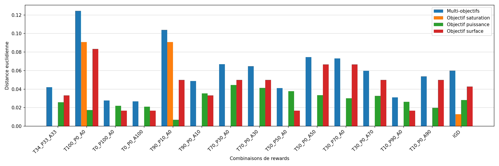

# Grouped bar chart with a computed summary group

The general offset formula for N series per category, and an aggregate appended
as one more category.



## What it demonstrates

- **The grouped-bar offset formula, written once.**

    ```python
    x = np.arange(len(x_labels))
    width = 0.8 / n_series
    for i, (name, values) in enumerate(series.items()):
        offset = (i - (n_series - 1) / 2) * width
        ax.bar(x + offset, values, width, label=name, color=colors[i])
    ```

    `x` is the category centres; `0.8` is the fraction of a slot the group
    occupies, leaving a fifth as the gap between groups; the
    `(i - (n_series - 1) / 2)` term centres the group on its category for any
    number of series, odd or even.
- **The summary group is just another category.** The IGD is appended with
  `np.append(all_dist, all_dist.mean())` per series and `"IGD"` appended to the
  labels — drawn by the same loop, in the same colours, with no second axes and
  no `axvline` separator to maintain.
- **`ax.set_xticks(x)` before `ax.set_xticklabels(..., rotation=45, ha="right")`.**
  Fixing the locator first is what keeps fourteen long labels attached to their
  bars; `ha="right"` makes rotated labels end at their tick rather than
  drifting left of it.

## The code

??? note "figures/igd_compare.py"

    ```python
    --8<-- "assets/code/m-rwgan/igd_compare.py"
    ```

It imports the shared `noc_data.py` data layer, also in this gallery's code
folder — see [the errorbar scatter page](scatter-errorbars.md).

## Run it

```bash
cd figures
python igd_compare.py
```

Needs `numpy` and `matplotlib`. Both inputs live in the repository: a committed
archive of the true Pareto front (57 MB of enumeration baked down to 2 KB), and
fourteen already-normalized `(100, 3)` arrays, 36 KB, tracked in git directly.
`--dse-dir` recomputes the front from the full enumeration if you fetch it.

## Where it comes from

M-RWGAN ([project page](../projects/m-rwgan.md)). **Thesis Fig. 6.20** —
Chapter 6, pages 132–133 (French): "Euclidean distance between the best
generated NoC of each training run and the true Pareto front, with the detail
for each objective. IGD measurement — i.e. mean."

This is a *different, smaller* design-space-exploration study from the 8×8-mesh
headline results the other Chapter 6 figures use: a fully enumerated 4×3 mesh
(12 routers, 3 router classes → 3¹² = 531,441 possible NoCs), simulated for
hotspot traffic and used purely as ground truth. Fourteen training runs — one
per reward-weight combination — each generated 100 NoCs; the script takes each
run's single best (minimum-distance-to-front) NoC and averages those 14 values
into the IGD, computed as a plain mean of the 14 per-run best distances exactly
as the source notebook does, not as a per-reference-point sum over |R|.

[figures/igd_compare.py](https://github.com/mmirka/m-rwgan/blob/main/figures/igd_compare.py)
