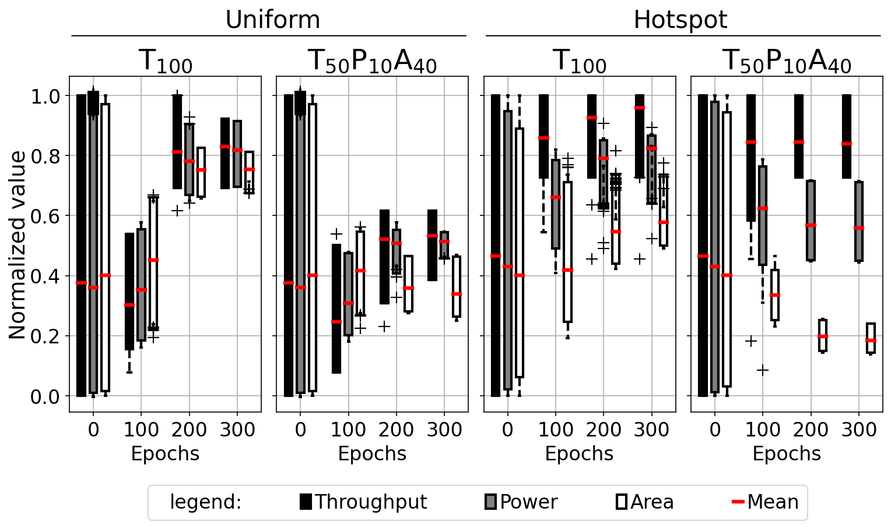

# Box plots built from precomputed statistics with custom whiskers

How to draw box-and-whisker panels when you want percentile box edges other
than the quartiles, several interleaved series per group, and a legend that
`boxplot` will not give you.



## What it demonstrates

- **`ax.bxp` instead of `ax.boxplot`.** `bxp` takes *statistics dicts*, not raw
  samples. The recipe builds them with `matplotlib.cbook.boxplot_stats(x)[0]`,
  then overwrites `stat["q1"]`/`stat["q3"]` with
  `np.percentile(x, [plo, phi])` — a 5th/95th box, which `boxplot` cannot
  express through any keyword.
- **Interleaving series with `positions=` and `widths=`.** Three metrics, three
  `bxp` calls, each with its own positions (`[1, 5, 9, 13]`, `[2, 6, 10, 14]`,
  `[3, 7, 11, 15]`) — one cluster of three per epoch, with `ax.set_xticks` on
  the middle member so the labels read as epoch numbers.
- **A legend for artists that carry no labels.** `bxp` labels nothing, so the
  legend is assembled by hand from `bp["boxes"][0]` plus a proxy handle — a
  throwaway `ax.plot([1, 1], "r-")` hidden with `set_visible(False)` once its
  handle is captured. `patch_artist=True` is what makes the boxes fillable in
  the first place.

## The code

??? note "figures/moustache_boxplots.py"

    ```python
    --8<-- "assets/code/m-rwgan/moustache_boxplots.py"
    ```

The dataset loading and min-max normalization come from a shared vendored data
layer, `noc_data.py`, also in this gallery's code folder — see
[the errorbar scatter page](scatter-errorbars.md) for that file.

## Run it

```bash
cd figures
python moustache_boxplots.py --figure all
```

Needs `numpy` and `matplotlib` (`matplotlib.cbook` for the stats helper). One
invocation writes three figures — the four-panel one above plus a two-panel and
a one-panel variant. Nothing needs downloading:

- **Epoch 0** — the full 10k training set, read from a committed summary
  archive; the raw ~250–320 MB pickles stay git-ignored, and
  `--epoch0-uniform` / `--epoch0-hotspot` summarise one directly if you fetch
  it.
- **Epochs 100 and 200** — git-tracked re-simulated sets, 100 samples each.
- **Epoch 300** — the git-tracked generated sets, byte-identical to the
  epoch-300 files.
- Normalization bounds come from the tracked reference topologies.

## Where it comes from

M-RWGAN — multi-reward generation of heterogeneous 8×8-mesh networks-on-chip
([project page](../projects/m-rwgan.md)). Each panel is one traffic pattern and
one reward weighting; each box is the distribution of a normalized metric
(throughput, power, area) at a training-epoch snapshot.

These are the DATE2022 box-and-whisker training-evolution figures, from the
`picture_DATE2022_moustache` notebook. No thesis or paper figure number is
stated for them in the sources, so none is claimed here.

[figures/moustache_boxplots.py](https://github.com/mmirka/m-rwgan/blob/main/figures/moustache_boxplots.py)
