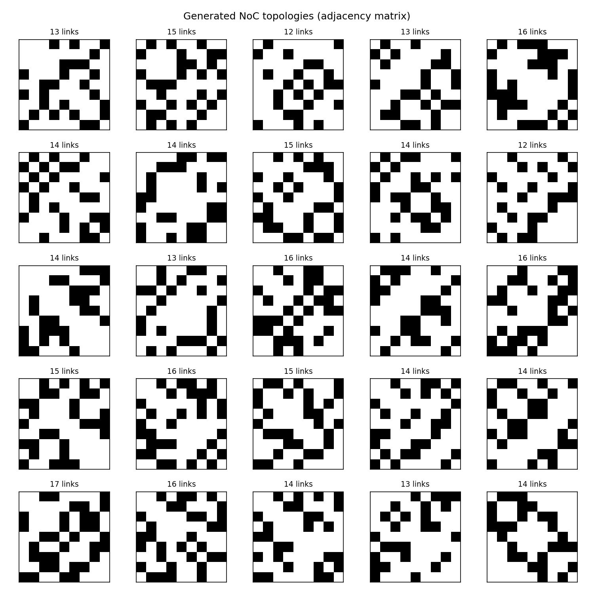

# A square grid of binary matrices with the spare cells blanked

Tiling N small `imshow` panels on an automatically sized grid, each titled with
a statistic computed from its own matrix.



## What it demonstrates

- **`ax.imshow(matrix, cmap="Greys", vmin=0, vmax=1)`.** Pinning the limits is
  what makes a binary matrix render as black and white. Left to autoscale, an
  all-zero matrix would come out solid mid-grey, and two matrices of different
  density would use different greys for the same value.
- **`squeeze=False` and a grid side from the sample count.**
  `side = math.ceil(math.sqrt(len(samples)))` with
  `figsize=(2.0 * side, 2.0 * side)` keeps every cell the same size for 9 or
  36 samples; `squeeze=False` makes `plt.subplots` always return a 2-D array,
  so `axes.flat` works even at 1×1 where the default hands back a bare `Axes`.
  Trailing cells are switched off with `for ax in axes.flat[used:]`, so 20 and
  25 samples on a 5×5 grid both come out aligned.
- **Deterministic sampling with `np.random.default_rng(seed)`** and a sorted
  index, so the same seed always draws the same 25 matrices — reproducible,
  not merely repeatable in spirit. Each cell is titled with its link count,
  computed from the matrix itself, which turns the grid from decoration into
  something readable.

## The code

??? note "figures/topology_grid.py"

    ```python
    --8<-- "assets/code/gannoc/topology_grid.py"
    ```

The link-count helper comes from a small vendored module, also in this
gallery's code folder:

??? note "figures/noc_metrics.py"

    ```python
    --8<-- "assets/code/gannoc/noc_metrics.py"
    ```

## Run it

```bash
cd figures
python topology_grid.py
```

Needs `numpy`, `matplotlib` and `networkx` (the latter only for the companion
[graph view](graph-network-layout.md), which the default `STYLE = "both"`
writes from the same run). The input is a bundled pickle of 446 valid generated
topologies — the same set the [connection histogram](distributions-histogram.md)
uses — so this figure needs no training run and no download. `INPUT`, `STYLE`
(`graph` / `matrix` / `both`), `N_SAMPLES` and `SEED` are the settings at the
top of the script.

## Where it comes from

GANNoC ([project page](../projects/gannoc.md)). The figures README lists this
as the "topology gallery — grid of generated 9-router topologies, titled by
link count", from **RAPIDO 2021 / thesis Chapter 5**. No thesis figure number
is stated for it in the sources, so none is claimed here.

[figures/topology_grid.py](https://github.com/mmirka/GANNoC/blob/main/figures/topology_grid.py)
