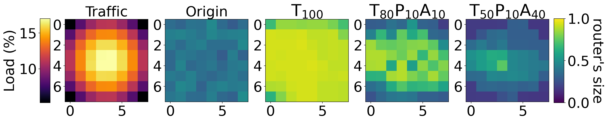

# Two independent colour scales in one row of panels

Hand-placed colorbars in figure coordinates — one on each side of the row —
when the panels do not all share a scale.



## What it demonstrates

- **Two mappables kept, two colorbars made.** The row mixes one panel on
  `inferno` with data-derived limits and four on `viridis` at a fixed 0–1. The
  loop keeps a handle on the first image and the last, and each gets its own
  bar. The moment panels stop sharing a scale a single colorbar becomes a lie —
  this is the alternative to the shared-scale pattern on
  [the row of heatmaps](heatmap-row-over-time.md).
- **`fig.add_axes([x, y, w, h])` for exact placement.** The bars go in *figure*
  coordinates: `[-0.015, 0.25, 0.02, 0.5]` left and `[1, 0.25, 0.02, 0.5]`
  right — both outside the 0–1 figure rectangle on purpose. Then
  `fig.colorbar(im, cax=cbar_ax)`: `cax=` draws into an axes you made, where
  `ax=` would steal space from the panels and re-flow the row. A colorbar does
  not know which side of a figure it is on, so the left one needs
  `yaxis.set_ticks_position("left")`.
- **`fig.savefig(..., bbox_inches="tight")`** — indispensable, since both
  colorbars lie outside the nominal figure and would otherwise be cropped.
  `warnings.catch_warnings()` around `fig.tight_layout()` is the companion:
  `tight_layout` does not know about hand-added axes and warns about them, and
  the warning is suppressed narrowly, at that one call site.

## The code

??? note "figures/router_size_maps.py"

    ```python
    --8<-- "assets/code/m-rwgan/router_size_maps.py"
    ```

It imports the shared `noc_data.py` data layer, also in this gallery's code
folder — see [the errorbar scatter page](scatter-errorbars.md).

## Run it

```bash
cd figures
python router_size_maps.py --traffic uniform
python router_size_maps.py --traffic hotspot
```

Needs `numpy` and `matplotlib`. The traffic map and its normalized-load array
are tracked in git; the three training runs' per-epoch generator batches come
from committed archives (the uniform run alone is ~493 MB raw, baked down to
210 KB), so both rows rebuild from a plain clone. The three `--history-*`
options point at raw copies if you have them.

## Where it comes from

M-RWGAN ([project page](../projects/m-rwgan.md)). Each row is
`[ Traffic | Origin | T100 | T80P10A10 | T50P10A40 ]`. *Traffic* is the
per-router traffic-load map for the pattern — hence its own colour scale and
its own "Load (%)" bar. The remaining four panels are a per-router "size score",
the weighted sum of the class fractions the generator produces (Big = 1,
Medium = 0.2, Small = 0), at a chosen training epoch for three reward-weight
settings, where *Origin* is the earliest logged epoch of the T100 run.

These are the DATE2022 five-panel router-size maps, from the
`picture_DATE2022_4uniform` and `_4hotspot30` notebooks. No thesis or paper
figure number is stated for them in the sources, so none is claimed here.

[figures/router_size_maps.py](https://github.com/mmirka/m-rwgan/blob/main/figures/router_size_maps.py)
