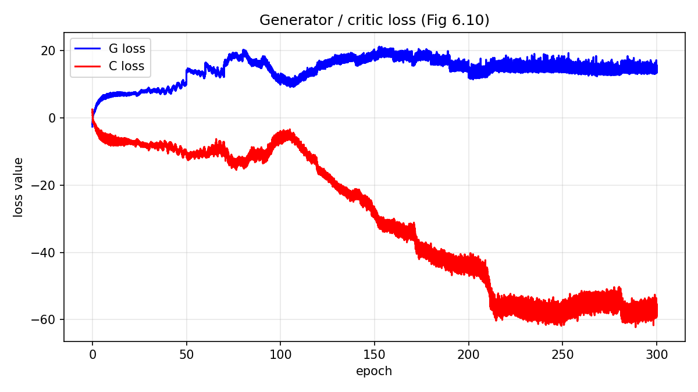
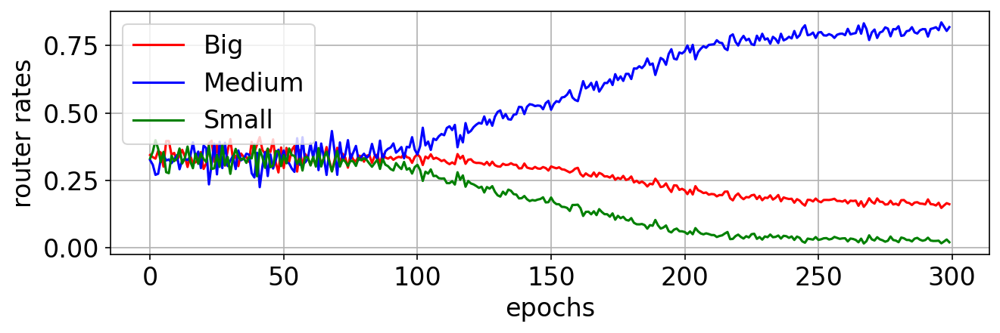
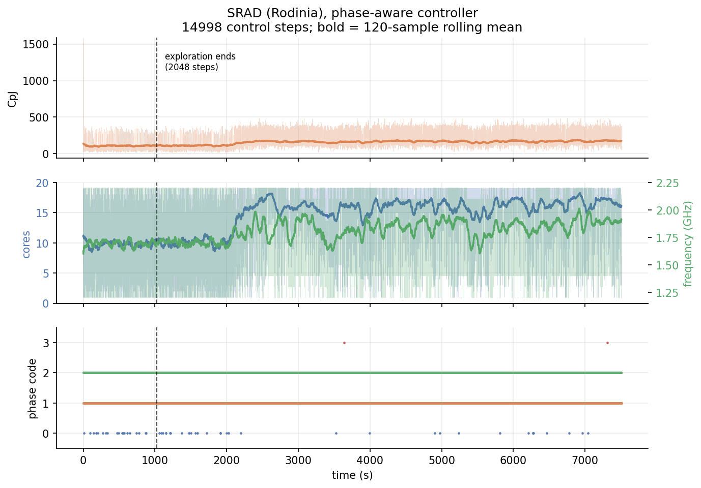
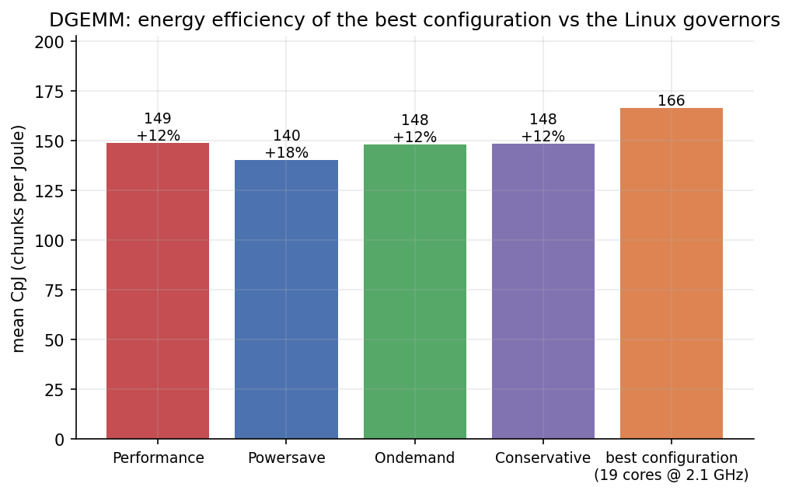
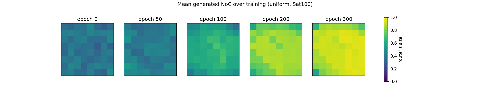

# Plotting recipes

This page is dedicated to **dataviz with python**.

I share the python code to reproduce figures from my research publications mostly.

## matplotlib

### Distributions

Fixed-bin histograms, and box plots assembled from statistics you compute.

[ Two overlaid histograms with their means marked](distributions-histogram.md){ .gallery-item }
[ Box plots from precomputed statistics](distributions-box-whisker.md){ .gallery-item }

### Scatter

Points carrying uncertainty, labels, or a reference curve.

[ Scatter with two-axis error bars](scatter-errorbars.md){ .gallery-item }
[ Annotated scatter with error ellipses](scatter-annotated.md){ .gallery-item }
[ One array split into two series against a frontier](scatter-pareto-front.md){ .gallery-item }

### Lines and time series

Axes rebuilt from mismatched logging rates, one plot restyled five ways, curve
overlays, stacked panels, and colour-by-category.

[ Rebuilding an x-axis from mismatched logging rates](lines-training-curves.md){ .gallery-item }
[ One line plot, five renders from a style table](lines-restyling.md){ .gallery-item }
[ Five-curve overlay with a legend strip above](lines-multi-series.md){ .gallery-item }
[ Stacked panels with a twin y-axis and an event marker](timeseries-stacked-panels.md){ .gallery-item }
[ Colouring a line by a categorical variable](timeseries-categorical-overlay.md){ .gallery-item }

### Bar charts

Labels measured off the bars, and the offset formula for N grouped series.

[ Bar chart with labels measured off the bars](bars-annotated.md){ .gallery-item }
[ Grouped bars with a computed summary group](bars-grouped.md){ .gallery-item }

### Heatmaps and small multiples

Panels made comparable by a shared colour scale, and what to do when they
cannot share one.

[ A row of heatmaps on one shared colour scale](heatmap-row-over-time.md){ .gallery-item }
[ Small-multiple heatmaps over a parameter sweep](heatmap-panel-grid.md){ .gallery-item }
[ Two independent colour scales in one row](heatmap-dual-colorbars.md){ .gallery-item }
[ A grid of binary matrices with the spare cells blanked](heatmap-binary-matrix.md){ .gallery-item }

### 3-D

A `projection="3d"` axes sharing a figure with an ordinary one.

[ A 3-D surface beside its own heat map](surface-3d.md){ .gallery-item }

### Graphs

`networkx` has no figure management of its own. It renders onto a matplotlib
axes, so graph drawings tile on an ordinary subplot grid.

[ Graph drawings tiled on a subplot grid](graph-network-layout.md){ .gallery-item }

## Keras

The one page here that does not go through matplotlib: a network diagram
generated from the model object itself.

[ Rendering a Keras model as a layer diagram](keras-model-diagram.md){ .gallery-item }

