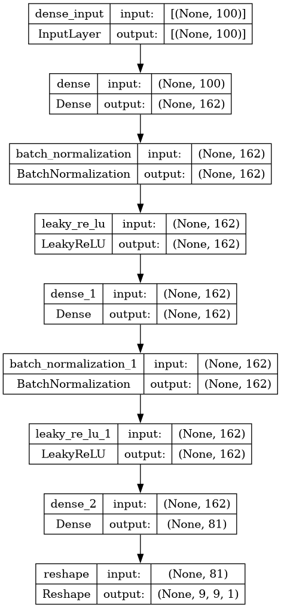

# Rendering a Keras model as a layer diagram

The one recipe here that is not matplotlib: letting `plot_model` draw the
network straight from the built model object, so the diagram cannot drift from
the code.



## What it demonstrates

- **The figure is generated from the model, not drawn.**
  `keras.utils.plot_model` walks the layer graph of a model object and emits
  the diagram. Nothing in the picture is maintained by hand, so it cannot fall
  out of date with the architecture the way a drawn block diagram does — the
  reason to prefer it over a vector-editor illustration for a README or a
  thesis appendix.
- **It reads the layers the code actually built, including ones a summary
  table elides.** The render above shows the batch-normalization and LeakyReLU
  layers between each dense block, which a published dimensioning table would
  compress away, and it carries each layer's name, class and input/output
  shapes — which matplotlib could never know.
- **It needs a rendering backend, and that is a real dependency.**
  `plot_model` goes through `pydot` and Graphviz, so `dot` must be on `PATH`.
  The script treats it as optional: rendering is a `PLOT_DIR` setting, and when
  the toolchain is absent it is skipped with a note rather than failing the
  run. The model is instantiated but never trained — a diagram costs a model
  construction, not a training run.

## The code

The only recipe here that is not a figure script: the diagram is a by-product of
the script that *builds* the models. It assembles the generator, the critic, a
reward network and the composite RWGAN training model, and renders each one when
`PLOT_DIR` is set.

??? note "scripts/build_gannoc.py"

    ```python
    --8<-- "assets/code/gannoc/build_gannoc.py"
    ```

## Run it

```bash
# PLOT_DIR = "figures/plots" at the top of the script; needs pydot + Graphviz dot
python scripts/build_gannoc.py
```

Needs Keras plus `pydot` and Graphviz `dot` on `PATH`. No data at all: the
script instantiates untrained models. With `REWARD_CHECKPOINT = None` the
reward network is fresh and untrained; setting it to a frozen checkpoint path
loads that one and configures the reward-guided composite instead.

## Where it comes from

GANNoC ([project page](../projects/gannoc.md)). This is a `plot_model` render
of the generator as built by the repository, not a figure from a paper — no
thesis or paper figure number applies. It visualises the published dimensioning
(**RAPIDO 2021 §4.3.2** / thesis table `tab:NN:RWGAN`) that the repository
follows: Input 100 → Dense 162 → Dense 162 → Dense 81, `tanh`, reshaped 9×9.

The repository README records where its sources disagree: the reference
implementation's critic dense head is 1024 units, not the 512 of the published
table, and the repository follows the published tables rather than the
reference code.

[scripts/build_gannoc.py](https://github.com/mmirka/GANNoC/blob/main/scripts/build_gannoc.py)
