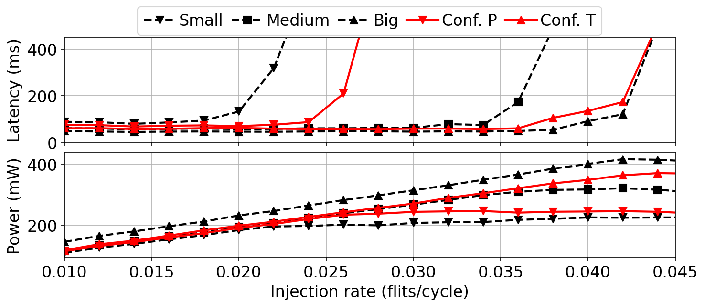

# Five-curve overlay with a style table and a legend strip above

Two stacked panels, five labelled curves in each, and one shared legend laid
out as a single row above the figure.



## What it demonstrates

- **An ordered dict is the series specification.**
  `SERIES_STYLE = {"Small": ("k", "--", "v"), ...}` maps each label to
  `(colour, linestyle, marker)`, and because dicts preserve insertion order
  that one literal fixes plotting order, legend order and styling together.
  Nothing about which curve is which is decided inside the loop.
- **One legend for both panels, built from the first.**
  `handles, labels = ax1.get_legend_handles_labels()`, then
  `ax1.legend(handles, labels, ncol=5, loc="center", bbox_to_anchor=(0.35, 1.01, 0.3, 0.3))`.
  The four-tuple `bbox_to_anchor` is a full bounding box in axes coordinates,
  with `loc="center"` the legend centres inside it, which is how to place a
  legend strip above the top panel without guessing at a two-tuple offset.
- **`plt.subplots(2, 1, sharex=True, sharey=False)`.** Sharing x removes the
  duplicate tick labels between panels; `sharey=False` is passed explicitly
  because the panels are in different units. `labelspacing=0`,
  `handlelength=2`, `columnspacing=0.5` and `handletextpad=0.2` are what let
  five legend entries fit on one line.

## The code

??? note "figures/best_gene_compare.py"

    ```python
    --8<-- "assets/code/m-rwgan/best_gene_compare.py"
    ```

It imports the shared `noc_data.py` data layer, also in this gallery's code
folder. See [the errorbar scatter page](scatter-errorbars.md).

## Run it

```bash
cd figures
python best_gene_compare.py
```

Needs `numpy` and `matplotlib`. All inputs are git-tracked, with nothing baked
and nothing to download: the hand-tuned reference 8×8-mesh topologies (each a
pickled list holding an adjacency matrix, a router-class assignment and
simulated latency/power/area curves) and two generated datasets.

## Where it comes from

M-RWGAN ([project page](../projects/m-rwgan.md)). Latency and power against
injection rate for three homogeneous reference topologies (dashed black) and
two generated heterogeneous configurations in solid red: **Conf. P**, a
low-power pick from the saturation/power sweep, and **Conf. T**, a
high-throughput pick from the three-reward set.

This is the DATE2022 best-configuration comparison, from the
`picture_DATE2022_bestGene` notebook. No thesis or paper figure number is
stated for it in the sources, so none is claimed here.

[figures/best_gene_compare.py](https://github.com/mmirka/m-rwgan/blob/main/figures/best_gene_compare.py)
