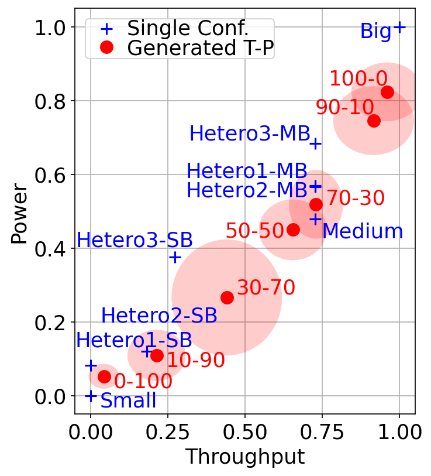

# Annotated scatter with per-point error ellipses

Dispersion drawn as a shaded ellipse behind each marker, and twenty-odd labels
de-collided by a hand-tuned offset table.



## What it demonstrates

- **`matplotlib.patches.Ellipse` as a two-dimensional error bar.**
  `Ellipse((x, y), 2 * std_x, 2 * std_y, angle=0)` added with `ax.add_artist`;
  width and height are full extents in *data* units, hence the factor of two.
  Where error bars draw a cross, this draws the region.
- **`e.set_clip_box(ax.bbox)`.** An artist added with `add_artist` is not
  clipped to the axes by default, so an ellipse near the edge spills over the
  frame. `ax.set_axisbelow(True)` matters for the same reason: without it the
  grid cuts across every shaded region.
- **Label offsets as a lookup table.** Thirteen sweep labels and nine reference
  labels overlap badly at default placement, so the script carries
  `x_off_norm` / `y_off_norm` lists indexed by point. Not elegant, but
  hand-placed labels are the honest answer for a print-destined figure with a
  fixed axis range, and keeping them as data makes each variant a parameter
  set rather than a copied cell.

## The code

??? note "figures/results_analysis_date2022.py"

    ```python
    --8<-- "assets/code/m-rwgan/results_analysis_date2022.py"
    ```

It imports the shared `noc_data.py` data layer, also in this gallery's code
folder. See [the errorbar scatter page](scatter-errorbars.md).

## Run it

```bash
cd figures
python results_analysis_date2022.py --traffic hotspot
```

Needs `numpy` and `matplotlib`. That one invocation writes three figures,
because the three source notebooks reused the same output basenames and the
script prefixes each with its traffic. All inputs are git-tracked (the
reference topologies and the generated sweeps), plus a committed summary
archive for the dataset curve used by the companion figure. Nothing needs
downloading; `--dataset-10k` recomputes that curve from the raw ~250–320 MB
pickle if you fetch it.

## Where it comes from

M-RWGAN ([project page](../projects/m-rwgan.md)). The thirteen-configuration
weight-ratio sweep (a six-point saturation/area run and a seven-point
saturation/power run) plotted against the homogeneous reference topologies,
for hotspot traffic.

These are the DATE2022 results-analysis figures, from the
`picture_DATE2022_resultat_*_Analysis` notebooks. No thesis or paper figure
number is stated for them in the sources, so none is claimed here.

[figures/results_analysis_date2022.py](https://github.com/mmirka/m-rwgan/blob/main/figures/results_analysis_date2022.py)
