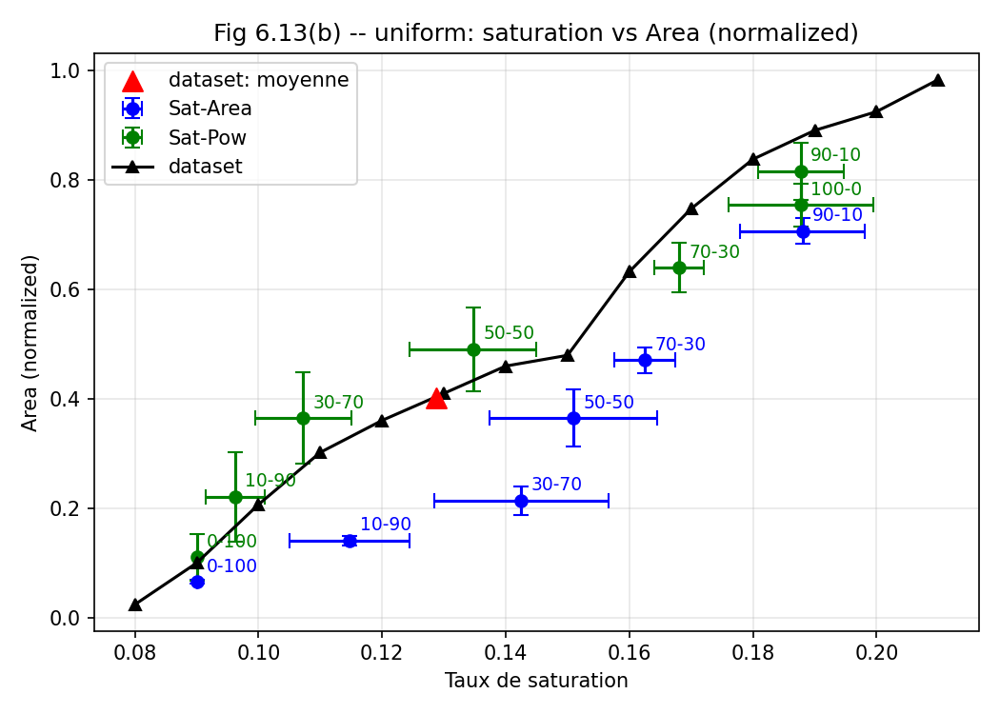

# Scatter with two-axis error bars against a reference curve

Marker-only `errorbar` series carrying both x and y spread, overlaid on a
binned reference curve and a single mean marker.



## What it demonstrates

- **`ax.errorbar(..., linestyle="None", marker="o")` is the scatter you want
  when points carry uncertainty.** `ax.scatter` has no error-bar support at
  all; `errorbar` with the line off gives markers plus `xerr=`/`yerr=` in one
  call, and `capsize=4` makes a short bar legible against a grid. The reference
  curve is the same call with `linestyle="-", marker="^"` and no error arrays,
  so every series produces one consistent kind of legend handle.
- **Per-point labels in offset coordinates.**
  `ax.annotate(name, (x, y), textcoords="offset points", xytext=(5, 5))` places
  a label a fixed number of *points* from its marker; in data coordinates the
  offset would grow with the axis range and break when the limits change.
- **The reference curve is binned, not smoothed.** Every distinct (rounded) x
  value is masked out of the 10k-sample set and its y values averaged,
  `for value in sorted(set(summ["sat"])): mask = summ["sat"] == value`. A
  rolling mean would blur across bins of very different population.

## The code

??? note "figures/pareto_figures.py"

    ```python
    --8<-- "assets/code/m-rwgan/pareto_figures.py"
    ```

Every M-RWGAN figure script shares one small vendored data layer, enough of the
data model to unpickle the historical simulation records and to prefer a baked
artifact over its git-ignored archive, with no TensorFlow. It is in this
gallery's code folder too:

??? note "figures/noc_data.py"

    ```python
    --8<-- "assets/code/m-rwgan/noc_data.py"
    ```

## Run it

```bash
cd figures
python pareto_figures.py Area uniform
```

`python pareto_figures.py Power uniform` draws the companion panel with power
on the y-axis. Needs `numpy` and `matplotlib`. All inputs ship in the
repository: the git-tracked generated sweeps, and a committed summary archive
of the 10k-sample dataset for the reference curve (the bake reduces 308 MB to
103 KB for uniform traffic and 242 MB to 94 KB for hotspot). `--tenk-path`
points the script at a raw archive instead, and wins over the baked artifact.

## Where it comes from

M-RWGAN ([project page](../projects/m-rwgan.md)). **Thesis Fig. 6.13(b)**,
Chapter 6: saturation threshold against normalized area, with the
saturation/area and saturation/power reward sweeps both plotted, against the
binned dataset frontier and its mean. `Power uniform` is Fig. 6.13(a).

Two corrections the sources record, carried over here:

- The figure-number table is verified against the thesis PDF itself (its list
  of figures and body text) rather than against the source notebooks. A
  previous version of that table labelled this uniform-traffic figure
  "6.21/6.22", when it is 6.13.
- The dataset curve is the 10k-sample simulated dataset, **not** the seven
  hand-tuned reference topologies. The source notebooks use the hand-tuned set
  only for other, differently-normalized figures; an earlier version of this
  script incorrectly used it here.

[figures/pareto_figures.py](https://github.com/mmirka/m-rwgan/blob/main/figures/pareto_figures.py)
