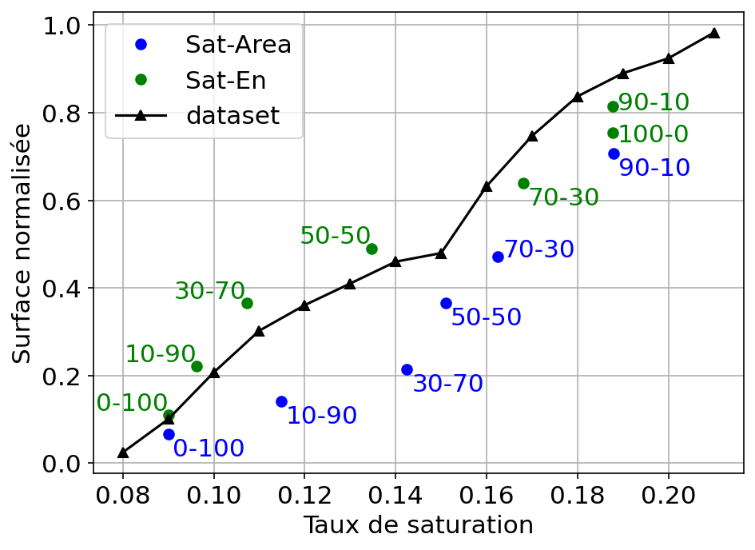

# Splitting one array into two coloured series against a frontier

A single sweep drawn as two colour-coded halves by slicing, over a frontier
curve built by binning the underlying population.



## What it demonstrates

- **Slicing one results array into two series.** The sweep loads as one flat
  array of thirteen configurations; the plot calls
  `ax.errorbar(sweep["sat_mean"][0:6], ...)` and `[6:]` — two calls, two
  colours, two legend entries, one data structure. No grouping column, no
  reshuffling of the loader.
- **`ax.errorbar` with no error arrays, used three ways.** Twice with
  `linestyle="None", marker="o"` as marker-only scatters, once with
  `linestyle="-", marker="^"` as the connected frontier, so every series
  produces the same kind of legend handle.
- **The frontier is a binned average, computed explicitly.**
  `for value in sorted(set(summ["sat"])): mask = summ["sat"] == value` — a
  per-bin mean of a real 10k-sample population, not a fitted or smoothed line,
  which is what the generated points are being compared against.

## The code

??? note "figures/results_analysis_date2022.py"

    ```python
    --8<-- "assets/code/m-rwgan/results_analysis_date2022.py"
    ```

It imports the shared `noc_data.py` data layer, also in this gallery's code
folder — see [the errorbar scatter page](scatter-errorbars.md).

## Run it

```bash
cd figures
python results_analysis_date2022.py --traffic uniform
```

Needs `numpy` and `matplotlib`. The invocation writes this figure and one
other. The reference topologies and generated sweeps are git-tracked, and the
frontier curve reads a committed summary archive of the 10k-sample dataset — so
nothing needs downloading. `--dataset-10k` recomputes it from the raw
~250–320 MB pickle instead.

## Where it comes from

M-RWGAN ([project page](../projects/m-rwgan.md)). The uniform-traffic view of
the thirteen-configuration weight-ratio sweep: saturation threshold against
normalized area, with both sweep halves and the dataset curve.

These are the DATE2022 results-analysis figures, from the
`picture_DATE2022_resultat_*_Analysis` notebooks. No thesis or paper figure
number is stated for them in the sources, so none is claimed here.

[figures/results_analysis_date2022.py](https://github.com/mmirka/m-rwgan/blob/main/figures/results_analysis_date2022.py)
