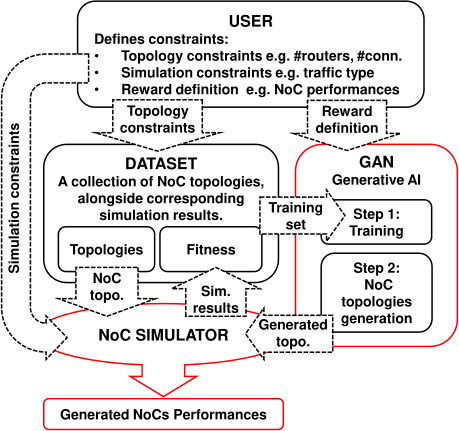
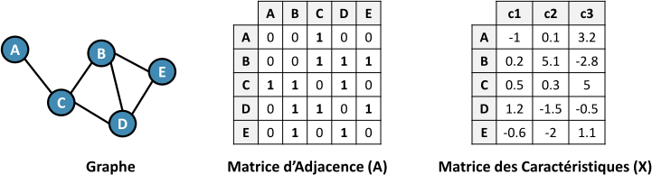
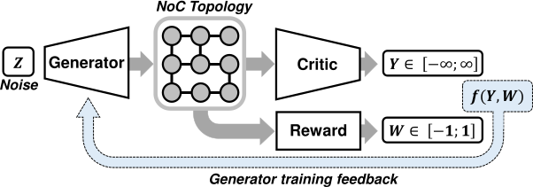
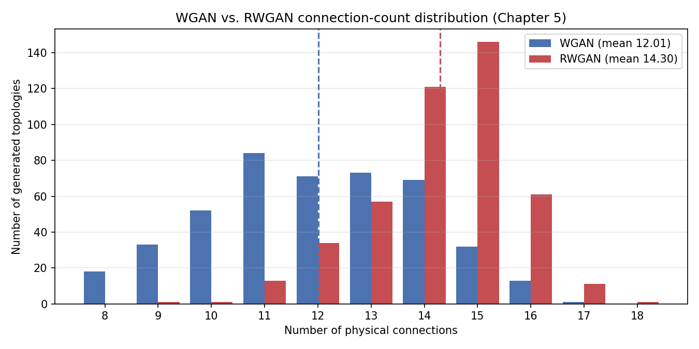

# Reward-guided generation of Network-on-Chip topologies

A Wasserstein GAN that draws Network-on-Chip topologies as 9×9 adjacency
matrices, with a frozen reward network pulling the generator toward the
topologies a designer actually wants.

**Thesis Fig. 5.3** — The GANNoC framework. From
[chapter 5](../thesis/05-gannoc.md).

## The problem

A Network-on-Chip carries traffic between the blocks of a multicore chip, and
its topology — which router is wired to which — sets the latency and much of
the communication energy.

**Thesis Fig. 5.1** — A topology and its adjacency matrix.

A topology over 9 routers is a 9×9 binary symmetric adjacency matrix; a
*usable* one has every router wired, the graph connected, and no router above
degree 4 — a router exposes four external ports (N/E/S/W) plus one local port.

Search is hard twice over. The space satisfying those constraints is far too
large to enumerate, and scoring a candidate for packet latency needs a
cycle-accurate simulator, so exhaustive evaluation is out of reach too.

## The method

The matrix is treated as a single-channel image and generated by a **WGAN-GP**:
MLP generator (100 → 162 → 162 → 81, `tanh`, reshaped to 9×9) against a CNN
critic (Conv 64 9×9 stride 1 → Conv 128 3×3 stride 2 → Dense 512 → Dense 1,
LeakyReLU α = 0.2), Wasserstein loss with a two-sided gradient penalty on
random real/fake interpolates. The `tanh` output is binarized and symmetrized
into a topology, then checked for validity.

**Thesis Fig. 5.4** — The RWGAN and its generator loss.

The **RWGAN** ("Reward-Wasserstein GAN") adds one signal. A separate CNN with
the critic's architecture, pretrained on its own, regresses a topology's min-max
**normalized connection count** into `[-1, 1]`. It is then frozen
(`trainable = False`) and its MSE against a target count is mixed into the
generator loss through a weight `LAMBDA`: 1.0 for epochs 0–100, so training
starts purely adversarial, then annealed by −0.005 every 5 epochs down to 0.9 —
the paper's 10 % reward / 90 % critic split. Restoring the floor to 1.0 recovers
the plain WGAN-GP baseline, the point of comparison. Under uniform traffic
denser topologies correlate with lower latency, so connection count is a cheap
stand-in for the expensive objective.

Training data needs no simulator: valid 9-router topologies built by random
construction (the paper's "Algorithm 1"), stratified by connection count over
8–18 — bare spanning tree up to every router saturated at degree 4 —
deduplicated, roughly 10k unique per count.

## What reproduces

A clean-room reproduction: data representation, dataset generator, both
architectures and their training loops, and the evaluation reporting structural
validity, novelty against the training set and the connection-count
distribution. Training runs with RMSprop 5e-5, `n_critic` 5, gradient-penalty
weight 10, batch 64, 250 epochs.

**Fig.** — The WGAN vs RWGAN comparison, drawn by `connection_histogram.py`.
See [the recipe page](../dataviz/distributions-histogram.md).

The figure folder is self-contained — numpy, matplotlib and a vendored
`noc_metrics.py`, no TensorFlow, no download. It works from two bundled sets of
446 valid generated topologies each, drawn from identical noise seeds, with no
training: `connection_histogram.py` draws the comparison above,
`topology_grid.py` a gallery from the same sets. Two pretrained reward
checkpoints ship, so the RWGAN script runs without training a reward first.

## What does not reproduce

**The latency results.** Thesis Figs. 5.8 and 5.9 plot simulated latency against
injection rate and need an external cycle-accurate simulator (Ratatoskr in the
paper); nothing here calls one, and no dataset it produces carries latency
labels — out of scope for a repo carrying graph structure only.

**The headline numbers.** The trained generator weights are not shipped —
retrain locally — and the published figures are quoted, not re-derived: up to
~82 % structurally valid and 100 % novel for the WGAN-GP; mean connection count
up ~36 % for the RWGAN, validity falling to ~54 % as the degree ≤ 4 constraint
bites. The latency gain is quoted the same way: 45.4 ns → 43.3 ns, normalized
over the roughly 40–54 ns range 0.38 → 0.24, a 37 % improvement. Note the thesis
reports connection count rising from 11 to 15, while the figure script's note on
the bundled sets describes means of about 12 and 14.

## Links

- Repository: <https://github.com/mmirka/GANNoC>
- Paper: *GANNoC: A Framework for Automatic Generation of NoC Topologies using
  Generative Adversarial Networks* (RAPIDO 2021) — see
  [Publications](../publications/index.md).
- Thesis: [Chapter 5 — Optimizing network-on-chip
  topologies](../thesis/05-gannoc.md)
- Successor: [M-RWGAN](m-rwgan.md), the multi-objective generalization
- Figures: [the figure pages](../dataviz/index.md)
