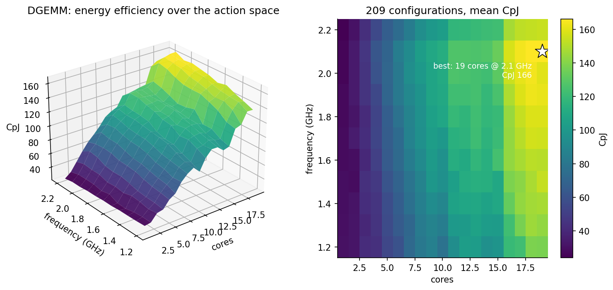
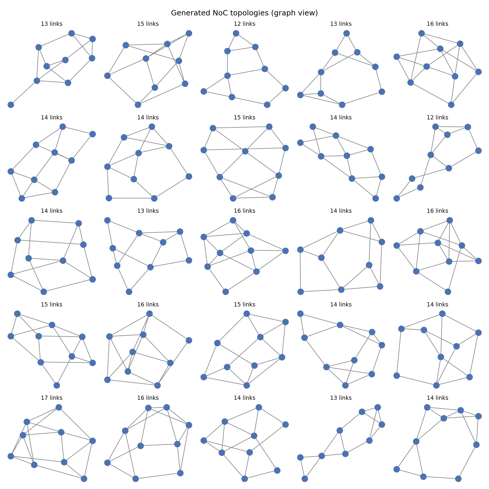
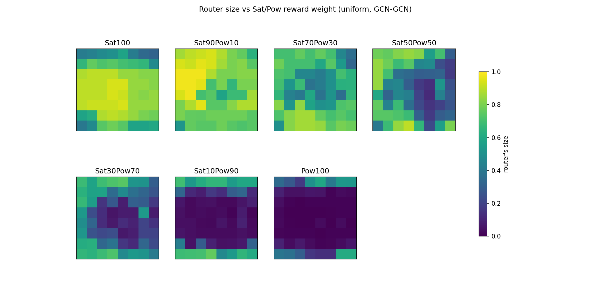

# Projects

Public code, with the work behind it written up. Today that is the three
projects from my PhD.

## From the PhD

Two research axes: applying machine learning to energy efficiency first as
**dynamic control**, tuning a computation while it runs, then as **hardware
design**, generating the interconnect it runs on. The thesis behind them (
*[Machine learning for multi-level adaptive control of distributed
computing](../thesis/index.md)*, Université de Montpellier, defended
12 November 2021 ) is on this site in full.

### Dynamic control

### [Online RL control of OpenMP energy efficiency](omp-energy-rl.md)

Reinforcement learning picking core count and clock frequency for a parallel
program *while it runs*, from a progress metric read inside the OpenMP runtime.

[Thesis chapter 4](../thesis/04-openmp-energy-efficiency.md); [ReCoSoC 2019 and MOCAST 2020](../publications/index.md).

### Generative design

### [GANNoC](gannoc.md)

Network-on-chip topology design cast as image generation: a 9×9 binary
adjacency matrix learned by a WGAN-GP and steered by a frozen reward network toward specific properties.

*[Thesis chapter 5](../thesis/05-gannoc.md); [RAPIDO 2021](../publications/index.md).*

### [M-RWGAN](m-rwgan.md)

TThe same mechanism generalized to several rewards 
(illustrated with three, for throughput, power and area), 
assigning a buffer-size class 
to each of 64 routers in a fixed 8x8 mesh topology.

*[Thesis chapter 6](../thesis/06-m-rwgan.md); [DATE 2022](../publications/index.md).*

Figures from all three have their own pages under
[plotting recipes](../dataviz/index.md), and the papers are listed under
[Publications](../publications/index.md).
