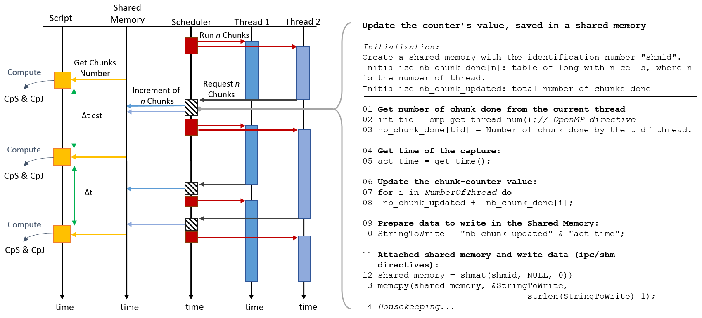
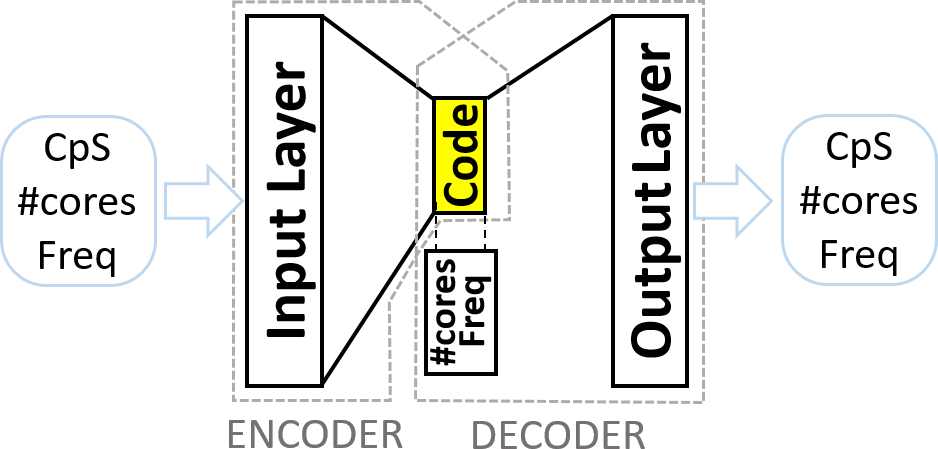
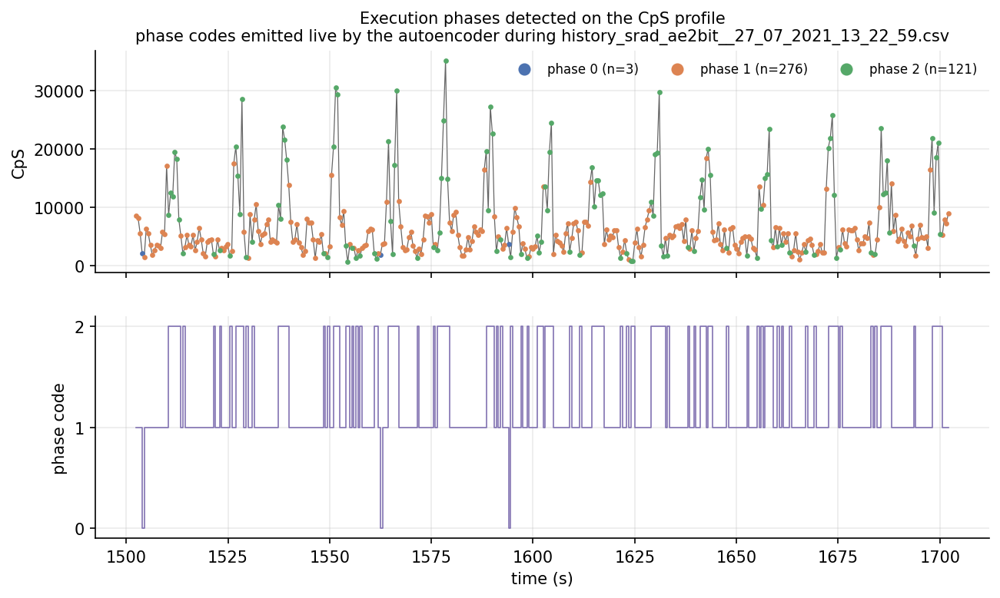

# Online RL control of OpenMP energy efficiency

A reinforcement-learning controller that chooses how many cores and what clock
frequency a running OpenMP program gets, driven by a progress metric read from
inside the OpenMP runtime rather than from hardware performance counters.

**Thesis Fig. 4.17** : The control loop, autoencoder included. From
[chapter 4](../thesis/04-openmp-energy-efficiency.md).

## The problem

Energy efficiency is work per unit energy, and measuring "work" normally means
hardware performance counters i.e. architecture-specific, and counting events
rather than application progress. Deriving it from execution time instead means
profiling first, so nothing uncharacterized can be controlled online.

Choosing a configuration is equally awkward. On the testbed here, a dual-socket
Intel Xeon E5-2630 v4 with 20 cores, a workload can be given any of 19 core
counts crossed with 11 frequencies from 1.2 to 2.2 GHz: 209 configurations, and
the best one changes *within* a single run. Linux's governors tune frequency
only, with no say over core count, and that axis matters: a compute-intensive
workload peaks at **19 cores**, while a memory-intensive one at **a single core**. 
It must be controlled in real time to optimize power and throughput.

## The method

The metric comes from the programming model, not the hardware. OpenMP's dynamic
scheduler hands *chunks* of a parallel loop to threads; counting them measures
the application's own work. Over time that is **CpS** (chunks per second), over
energy **CpJ** (chunks per Joule).

**Thesis Fig. 4.3** : Counting chunks from inside `libgomp`.

A patched GCC 4.8.0 `libgomp` counts inside the dynamic-loop scheduler and
publishes the running total with a timestamp through shared memory, so
applications need no source changes. Energy comes from RAPL registers on Intel Xeon system
and from board current sensors on the Odroid XU3 (used for ReCoSoC 2019).

**Thesis Fig. 4.16** : The phase autoencoder.

Execution phases are found unsupervised. The autoencoder reconstructs
`[CpS, frequency, core count]` through a bottleneck forced to be *discrete* (i.e. a
vector of ±1), each value naming a phase. The configuration is re-injected at
the decoder, so the bottleneck gains nothing by encoding it; what it must carry
is the part of CpS the configuration does not explain. The number of phases is
never supplied.

The controller is a Q-network: state is the configuration plus the phase code,
action is one of the 209 configurations, reward is the resulting CpJ, and it
learns during the run (2048 sampling periods of exploration at 500 ms, about
17 minutes,) on a workload it has never seen. `GAMMA = 0` in every configuration
used, so the Bellman update collapses to `Q[s, a] ← r`; this is deliberate and
the thesis says so. The network generalizes over a large state space, it does
not assign credit over time.

## What reproduces

**Fig.** : Phase detection over an SRAD run, drawn by `phase_overlay.py`. See
[the recipe page](../dataviz/timeseries-categorical-overlay.md).

The phase autoencoder trains on the bundled SRAD sweep (209 configurations ×
1000 samples, 210000 rows) in about a minute on CPU, and its 2-bit code
resolves into two dominant phases (61 % of samples at mean CpS 5713, 38 % at
10181) without being told how many exist. The README notes the caveat visible
in the same figure: near the start of the sweep, in the 1-core blocks, every
sample collapses into one code.

Four scripts rebuild the chapter's figures from bundled data, no hardware and
no training: `cpj_surface.py` (Figs. 4.14, 4.20), `governor_comparison.py`
(Tables 4.2, 4.5), `controller_trace.py` (Figs. 4.18–4.24) and
`phase_overlay.py` (Fig. 4.11). Both benchmarks build with any OpenMP compiler.

## What does not reproduce

**The online control loop.** In reinforcement-learning terms the testbed *is*
the environment; it is 2016-era hardware, no longer available, and the
environment module refuses to construct off-testbed rather than simulating
anything. Chunk counting needs the patched GCC 4.8.0; the modified `iter.c` is
documented precisely enough to re-derive it.

**The published percentages** are quoted and attributed, not regenerated: up to
469 % CpJ gain over the Linux governors on the memory-bound synthetic benchmark,
67 % on a two-phase workload, within 3 % of the best-known configuration on
DGEMM, and 34 % of mean CpJ lost when the phase autoencoder is removed.

**Some components are not included.** The synthetic benchmark sources are
reconstructions. The step fusing the chunk stream into CpS/CpJ is rebuilt
from the thesis definitions.

## Links

- Repository: <https://github.com/mmirka/omp-energy-rl>
- Papers: *Automatic Energy-Efficiency Monitoring of OpenMP Workloads*
  (ReCoSoC 2019) and *Online Learning for Dynamic Control of OpenMP Workloads*
  (MOCAST 2020) , see [Publications](../publications/index.md).
- Thesis: [Chapter 4 : Energy efficiency of OpenMP parallel
  computation](../thesis/04-openmp-energy-efficiency.md)
- Figures: [the figure pages](../dataviz/index.md)
