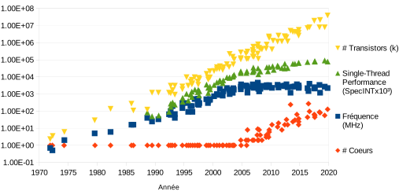
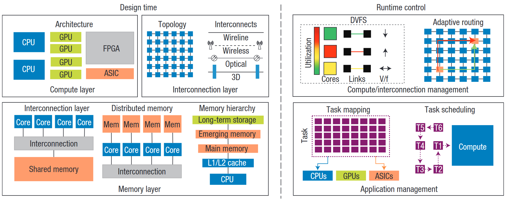
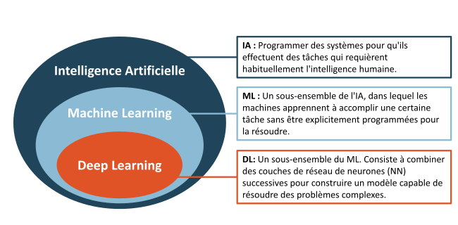

# 1. Introduction

English
[Français](fr/01-introduction.md){ .lang-pill title="Ce chapitre en français" }

## 1.1 Computing systems

### 1.1.1 The pursuit of performance

Since the appearance of the first microprocessors in the 1970s, the performance
of monolithic CPUs has never stopped growing, a direct consequence of the
increase in transistor density following the trend predicted by Moore's law,
i.e. the number of transistors present on a microprocessor doubles every two
years. However, the traditional sources of performance improvement – e.g.
instruction-level parallelizm (independent instructions that can be executed in
parallel by different computing units) and increased clock frequency – seem to
have reached their limit. Indeed, physical constraints such as the heat
dissipated by the system must be respected in order to ensure the integrity of
the system. Thus, owing to these limitations, it proves inefficient to increase
the operating frequency as well as the density of the number of transistors. It
will be noted in figure [1.1](#fig-1-1) that the operating frequency of
commercially available CPUs has stagnated around 4 GHz since 2005, confirming
these limitations.

**Fig. 1.1** : Evolution over 48 years of commercially available
microprocessors. *source:* [\[147\]](references.md#ref-147)

In response to these strong constraints, the design of computing systems
entered, at the beginning of the 2000s, the era of multicore systems
[\[130\]](references.md#ref-130). This transition allowed the performance of
systems to keep growing through the increase in the number of CPUs (i.e.
cores). Thus, the size of the cores is maintained or even reduced, in favour of
a larger number of cores allowing the overall increase in the number of
transistors on the same silicon support (see figure [1.1](#fig-1-1)). The
increase in performance is thus maintained, while respecting the physical
constraints mentioned previously. One moreover notices in figure
[1.1](#fig-1-1) a strong growth in the number of cores implemented on the same
multiprocessor since 2005 – i.e. the end of the increase in clock frequency.

### 1.1.2 Towards the pursuit of energy efficiency

Nowadays, it is no longer only performance that motivates research work on
computing systems, but also energy consumption. Thus, progress tends towards
the improvement of energy efficiency, defined as the quantity of work performed
relative to the energy spent on the task, i.e. $\frac{Performance}{Power}$.
Improving the energy efficiency of a computing system therefore consists in
reducing the quantity of energy consumed and/or increasing the performance of
the system. The development of multicore systems has proved useful in this
pursuit of energy efficiency. For example, studies have shown that using a
dual-core system at 80 % of its maximum frequency makes it possible almost to
double the performance of the system compared with a single-core processor
operating at 100 % of its maximum frequency, for a similar energy consumption
[\[165\]](references.md#ref-165). For these obvious reasons of energy
efficiency improvement, multicore architectures are found on every type of
computing system, ranging from embedded systems to distributed systems such as
computing clusters.

However, to this multi-level use is added a growing complexity of multicore
systems. It is now a matter of *manycore* systems possessing from about ten to
several thousand cores, as well as heterogeneous systems composed of resources
with different performance, needs and uses. Thus, new challenges exist in order
to be able to optimize these computing systems, ranging from design issues to
the challenges related to their use and control.

## 1.2 Optimizing parallel computing

The performance of parallel computing is directly linked to the computing
resources over which the workload is shared and executed. Thus, the complexity
of multicore systems keeps growing, and *manycore* systems – i.e. possessing
hundreds of computing units – could soon become the norm. Indeed, one may cite
the AMD EPYC 7H12 processor, marketed in 2019, possessing 64 physical cores and
128 logical cores, allowing an individual to afford the power of a server on a
single processor. This growth in the number of resources makes it possible to
reach levels of parallelizm until then reserved for computing clusters.
However, in order to make the best use of these growing resources so as to
guarantee an optimal energy efficiency, a set of design and control parameters
must be considered.

### 1.2.1 A growing set of parameters

**Fig. 1.2** : Some of the levers to be considered for the optimization of a
parallel computing system. Figure taken from
[\[87\]](references.md#ref-87)

In figure [1.2](#fig-1-2), taken from the study by Ryan Gary Kim *et al.*
[\[87\]](references.md#ref-87) on the design of manycore systems dedicated to
machine learning, the authors make a classification that is simple but complete
enough to demonstrate the difficulty of optimizing complex computing systems.
Indeed, the optimization levers are classified into two complementary
categories: 1) the optimization of the design of the system, 2) the
optimization of the control of the system during the execution of the
computation.

**The design stage** The design stage of the computing system plays a
fundamental role in the energy performance that the latter will possess. Design
optimization methods can be divided according to the part of the system
addressed. Three parts are generally distinguished in a computing system, with
their respective parameters as illustrated in figure
[1.2](#fig-1-2):

- *Computational part:* This part of the system concerns the computing cores of
  the platform. The design parameters include the number of computing
  resources, the architecture of each of these resources (CPU, GPU, etc.), the
  distribution of these resources (i.e. homogeneous or heterogeneous system),
  or else the instruction set (e.g. *complex instruction set computer* (CISC),
  *reduced instruction set computer* (RISC)).
- *Memory part:* This is the subsystem that coordinates the accesses to data in
  the system. The design parameters include the hierarchy (e.g. the structure
  going from the computing cores to the main memory, number of cache levels,
  etc.), the type of memory management (e.g. distributed or shared memory), or
  else the technologies used, with a particular interest in emerging magnetic
  memories when low consumption is at stake.
- *Communication part:* This concerns the interconnection module of the system,
  ensuring the exchanges between the different components. These exchanges
  allow, among other things, the coordination between the different computing
  cores, and is therefore a particularly sensitive element concerning
  parallelized computation. The design parameters include the topology of the
  interconnection system (bus, ring, mesh, etc.), the architecture of the
  routers (e.g. size and type of buffers, number of pipeline stages) and the
  type of connection (e.g. with or without a physical link, bandwidth, uni- or
  bidirectional).

These sets of solutions are obviously not completely distinct, and it is
possible to address several of these groups simultaneously. For example, the
design of the buffers of a router of the communication layer can be seen as an
issue related to the memory aspect.

**The control stage** In addition to the optimization of the design of the
computing system, the latter must be adjusted in real time to adapt to variable
operating conditions. As illustrated in figure
[1.2](#fig-1-2), the different optimization levers during operation can broadly
be divided into the following categories:

- *Platform management:* This essentially concerns the dynamic control of the
  parameters of the computational and communication parts of the system. For
  the computational part, one finds among other things the dynamic selection of
  the operating frequency/voltage pair (DVFS) per core or per whole processor
  depending on the architecture, dynamic power management (DPM) and the
  reconfiguration of the computing cores. For the communication part, one may
  also cite the management of the operating frequency, but also adaptive
  routing or else the arbitration of the communication.
- *Application management:* This category gathers the management methods that
  make it possible to adapt the application to the characteriztics of the
  system. This includes, among other things, the allocation of resources to
  execution tasks (i.e. *task mapping*) and the scheduling of tasks (*task
  scheduling*).

### 1.2.2 The limits of classical methods

It is now clear that the design space (the combination of design decisions and
of the control and execution policies of the computation) explodes as the
standard number of resources increases. Figure [1.2](#fig-1-2) shows a small
sample of the design levers available today, such as the architecture of the
cores, the architecture of the memory, task allocation and adaptive routing.
Each of these levers possesses a large number of parameters, resulting in a
solution space where the search for the optimal combination is a challenge.
Indeed, exhaustive design space exploration methods are no longer conceivable
with regard to computation time (i.e. NP-hard problems) and the heuristic
techniques meant to answer this problem are sub-optimal. Moreover, heuristic
methods generally rely on a set of hypotheses making it possible to simplify
the problem, and therefore require the work of an expert in order to define
these simplifications. As a result, these methods do not guarantee obtaining
optimal solutions and are potentially subject to definition biases and to
overly large simplifications. For example, task allocation is an interesting
method for optimizing the use of the resources of the system according to the
tasks to be accomplished. However, when it comes to finding the optimal
allocation, one faces an NP-hard problem [\[29\]](references.md#ref-29). In
[\[78\]](references.md#ref-78), Hoefler *et al.* set out a set of heuristic
methods developed for task allocation, and conclude with a non-exhaustive list
of challenges, among which the inability to handle ever larger solution spaces.

Machine learning techniques, and in particular neural networks, show
interesting abstraction and generalization capabilities, potentially able to
overcome the limits of classical methods for the consideration of a large
design space. This observation is shared with the authors of
[\[87\]](references.md#ref-87), who explore the sector of "domain specific"
systems. Machine learning techniques are therefore to be studied in order to
answer the problem of the number of parameters.

## 1.3 Machine learning techniques

### 1.3.1 Basic notions and hierarchy of the techniques

**Fig. 1.3** : AI: an overview

The field of artificial intelligence (AI), and more particularly the use of
machine learning techniques, has developed considerably over the last decades.
To understand the hierarchy of these techniques properly, an illustration is
proposed in figure [1.3](#fig-1-3). AI is represented as a field of science
that consists in programming systems so that they carry out tasks usually
requiring the intervention of human intelligence. Within this field there has
developed a set of algorithms and methods making it possible to teach machines
to carry out tasks without requiring explicit programming dedicated to the
execution of that task – this is the field of machine learning techniques, or
ML for *machine learning*. ML methods rely on the massive use of data, which
explains their recent development, i.e. correlated with the development of
computers. The models take data as inputs and are trained to evaluate and/or
act on these data. Among the applications of ML, one finds regression, making
it possible to predict the output of a learned model (e.g. a complex function),
or else the classification of data. Finally, a particular category of ML with
ever more impressive abstraction and generalization capabilities is deep
learning, or DL for *Deep Learning*. This subgroup of ML techniques is based on
the use of artificial neural networks (NN, for *Neural Networks*), arranged in
layers. DL techniques are used on a very wide panel of applications, ranging
from object recognition (e.g. *Convolutional Neural Networks* (CNN)) to the
processing of serial data (e.g. text translation with RNNs (*Recurrent Neural
Networks*)).

### 1.3.2 Classification of the techniques

ML techniques, and consequently DL techniques, can be classified into four
categories, according to their learning method:

- ***Supervised learning:*** The system learns to evaluate/classify input data,
  on the basis of a set of previously labeled data. The goal is to learn a
  predetermined classification model. **e.g.** Linear regression, SVM, Decision
  tree.
- ***Unsupervised learning:*** The system learns to evaluate/classify input
  data, on the basis of a set of unlabeled data. The goal is for the algorithm
  to build a classification model on its own. **e.g.** K-means clustering,
  autoencoder.
- ***Semi-supervised learning:*** The system builds a model with the help of a
  mixture of labeled and unlabeled data. **e.g.** Generative
  AIs.
- ***Reinforcement learning:*** Reinforcement learning corresponds to the case
  where the algorithm learns a behaviour given an observation. The action of
  the algorithm on the environment produces a return value that guides the
  learning algorithm. This is learning by doing. **e.g.** Q-learning.

### 1.3.3 The potential of DL

Impressive advances have been accomplished thanks to DL and their use of neural
networks. For example, *DeepMind* was able to demonstrate the potential of
reinforcement learning with its *AlphaGo* model
[\[159\]](references.md#ref-159), the first AI to defeat the world No. 1 of the
game of Go. The contributions of *DeepMind* do not stop only at deep
reinforcement learning, but concern the overall use of deep learning to answer
multiple complex problems arising from various fields. One may cite among
others *AlphaFold* [\[82\]](references.md#ref-82), a revolutionary method
answering the problem of protein folding prediction with unprecedented
accuracy.

To explore the potential of neural networks further, figure
[1.4](#fig-1-4), taken from the document by Miles Brundage *et al.*
[\[34\]](references.md#ref-34), shows the evolution of generative AIs, in this
instance GANs (*Generative Adversarial Network*), for the production of
photorealiztic portraits.

**Fig. 1.4** : Example of the progress of the generation capabilities of GANs,
from 2014 to 2017. *source:* [\[34\]](references.md#ref-34)

This field of generative AIs is particularly interesting for its faculties of
data creation, and thus makes it possible to bring solutions to the problems of
enriching a dataset or else of exploring a data space. Moreover, one notices in
figure [1.4](#fig-1-4) that these generative AI techniques (here, GANs) have
improved considerably over the last years.

While the use of machine learning techniques has developed widely, in
particular neural networks and the DL techniques that derive from them, it
seems that there are still benefits to be drawn from them in the field of the
optimization of computing systems, in the broad sense of the term.

## 1.4 Thesis objectives

This thesis therefore has the vocation of exploring the field of machine
learning techniques in order to bring new solutions to the challenges related
to the energy efficiency of parallel computing. Indeed, with the aim of
optimizing the consumption related to parallel computing, a growing set of
parameters must be considered, thus limiting the performance of classical,
mostly heuristic, methods. Yet the current applications of deep learning (DL)
techniques show that these techniques are capable of grasping complex problems
possessing a large number of parameters. We therefore propose to study these
techniques in order to overcome the limits of current methods.

A problem that we will address first is the optimization of computation and its
management in real time. Indeed, when it comes to parallel computing, one of
the first points impacting the consumption of a parallelized application is the
way in which it is distributed among the computing resources. This distribution
must consider both the needs of the application and the characteriztics of the
available resources. Thus, the use of machine learning techniques will have to
make it possible to consider these different parameters in order to propose an
optimal control of the computation.

Next, a parallelized application is an application that makes extensive use of
the communication medium. In order to improve the energy efficiency of parallel
computing, it is therefore necessary to concentrate efforts on the
communication aspect of the computation. In this thesis, we will study in
particular on-chip communication networks and we will address the problem of
the optimization of these networks.

## 1.5 Thesis outline

This thesis manuscript aims to present the work carried out within the ADAC
(*ADAptive Computing*) team of the LIRMM, whose objective is to propose
solutions for improving the energy efficiency of digital systems targeted at
parallel computing, with the help of relevant machine learning tools. This
document is composed of five chapters, not counting the introduction and the
conclusion:

- *[Chapter 2](02-research-axes.md) – Research axes and problems addressed*,
  presents the context and the problems addressed during this thesis. In
  particular, it is a matter of the dynamic optimization of parallel computing
  and of the design of optimized on-chip communication networks, by means of
  machine learning techniques.
- *[Chapter 3](03-state-of-the-art.md) – State of the art*, sets out the state
  of the art of each of the problems addressed.
- *[Chapter 4](04-openmp-energy-efficiency.md) – Energy efficiency of OpenMP
  parallel computation*, presents the work on the optimization of the
  computational aspect of parallel applications. An energy-efficiency metric
  dedicated to OpenMP applications is developed, as well as a tool for
  detecting execution phases of applications exploiting this metric. An
  adaptive mapping method for improving the energy efficiency of OpenMP
  workloads is proposed.
- *[Chapter 5](05-gannoc.md) – Optimizing the topologies of on-chip
  communication networks*, presents a CAD tool developed for the generation of
  optimized NoC topologies.
- *[Chapter 6](06-m-rwgan.md) – Generating optimized heterogeneous
  networks-on-chip*, proposes a complementary use of the tool presented in
  *[Chapter 5](05-gannoc.md)* by addressing the problem of the design of
  optimized heterogeneous networks-on-chip. Whereas in
  *[Chapter 5](05-gannoc.md)* it is a matter of the topology of the NoCs, here
  it will be a matter of their composition (e.g. types of routers).
