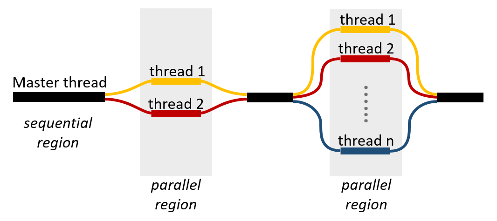
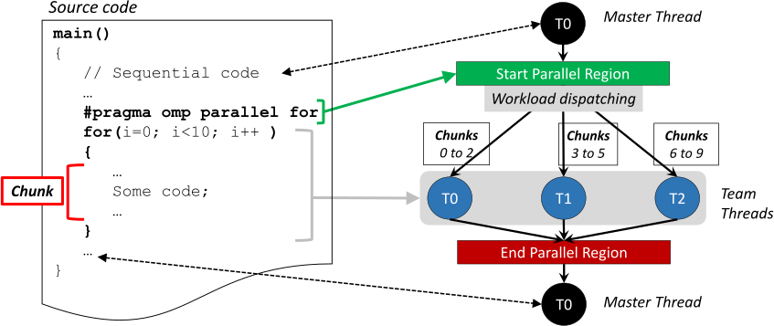
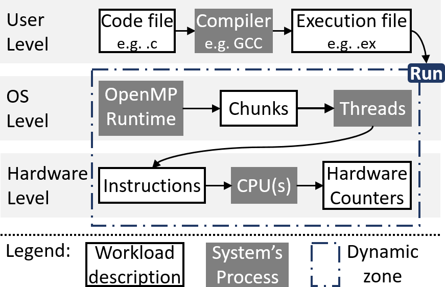
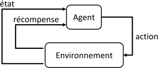
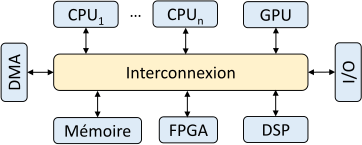
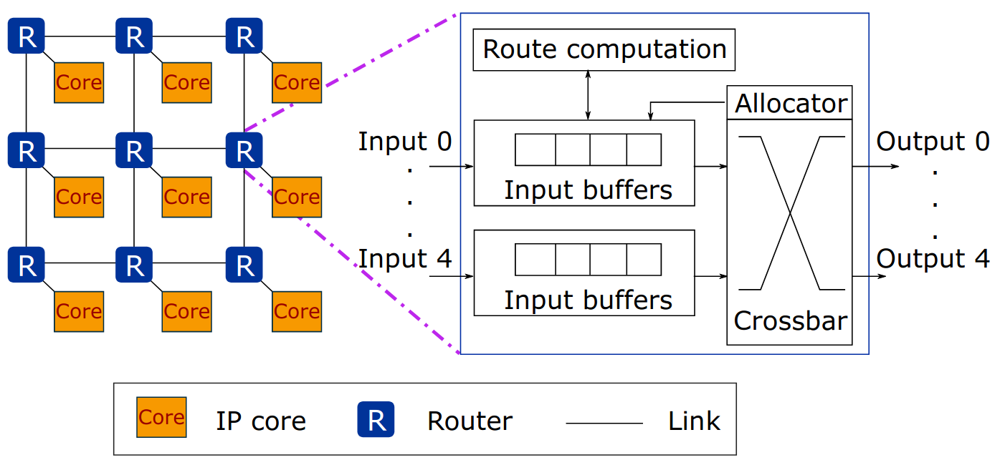
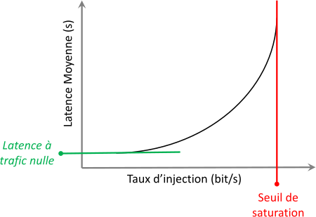
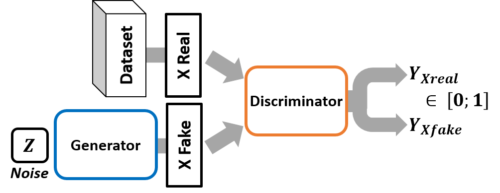

# 2. Research axes and problems addressed

English
[Français](fr/02-research-axes.md){ .lang-pill title="Ce chapitre en français" }

## 2.1 Introduction

Optimizing the energy efficiency of parallel computing carries many challenges
linked, among other things, to the complexity of computing systems, as well as
to the diversity of parallelized applications. Indeed, in order to improve the
energy efficiency of a computation, it is necessary to consider the properties
of the system executing that computation. Then, each computation will have its
own characteriztics impacting its execution on the system considered. Thus,
different challenges appear, linking the design of the computing system and to
the execution of parallel computing on the latter.

As mentioned in the previous chapter, it is possible to classify the existing
optimization methods according to two approaches: optimization at the control
stage (or online) and optimization at the design stage (or offline). The first
approach corresponds to the set of solutions that apply during the operation of
the system. We are more precisely interested in the solutions during the
execution of a computation, intended to adjust the system parameters to the
needs of the computation. These solutions are therefore centred around the
computation and its interaction with the executing system. Among others, one
finds there the analytical models of application codes making it possible to
anticipate and speed up online decision-making, as well as the dynamic
solutions such as DVFS and DPM generally controlled by the operating system.
The second approach concerns the design of the computing system. As described
by J.L. Hennessy and D.A. Patterson in their presentation on the occasion of
their *Turing Award* [\[75\]](references.md#ref-75), the current trend goes
towards a joint design of the computing system and of the applications
executable on the system. We concentrate here on the solutions centred around
the optimization of the support of parallel computing and group together the
set of hardware solutions making it possible to improve the performance and/or
the energy consumption of computing systems. Among others, one finds there the
emerging memory technologies, the optimization of the architecture of the
computing system and of its interconnect module.

With the aim of defining the problems addressed in this thesis, we will mention
in this chapter the points that follow. First of all, we will speak about
energy efficiency and about the metrics used to measure it. Then, we will look
at the software optimization solutions for parallel computing before converging
towards the dynamic control of computation. We will then see how ML can bring
innovative solutions. Finally, before defining precisely the problems
addressed, we will mention the challenges of the design of optimized systems.
We concentrate more particularly on Networks-on-Chip, the main solution chosen
to design the interconnect module of a multicore system, and presenting energy
consumption problems to which we will attempt to bring a solution via ML.

## 2.2 Measuring the energy efficiency of a parallel application

Energy efficiency has been characterized in the literature by different
measures (for example, FLOPS/W and MIPS/W) depending on the computing domains.
In every case, these metrics follow the general definition:

$$
\text{Energy efficiency} = \frac{\text{Quantity of work per unit of time}}{\text{Power consumption}}
$$

### 2.2.1 Existing solutions

Several measurement techniques have been proposed over the last decades to
characterize energy consumption. In this respect the literature surveys
[\[121\]](references.md#ref-121),
[\[10\]](references.md#ref-10) give an overview of the existing methods. They
can be distinguished according to the level of abstraction of the computing
system at which they operate.

The authors of these contributions have reported a certain number of techniques
for acquiring energy consumption data by means of hardware sensors, located at
different physical places in the systems. These techniques have their advantages
and their drawbacks in terms of measurement accuracy, temporal resolution,
deployment cost and how intrusive they are. They include measurement circuits
integrated into hardware components such as GPUs and CPUs; instrumentation
devices inserted into the computing nodes able to probe at the level of the
components or of the power rails; and energy meters that can collect the total
load outside the electrical power supply of the node.

However, these solutions make it possible to measure only the energy
consumption and/or the power consumption, and are therefore not sufficient on
their own to extract an energy-efficiency measurement, which requires a
performance datum. Usually, this performance datum comes from the performance
counters, allowing in particular the extraction of the number of executed
instructions (#inst., a quantity of work) and the extrapolation from it of the
number of instructions executed per second (IPS) or else the number of
floating-point operations per second (FLOPS), two performance data. The hybrid
energy-efficiency measures thus extrapolated are the number of instructions per
second per watt (IPS/W) and FLOPS per watt. However, these measures characterize
the energy efficiency of the computing system as a whole (or partially,
depending on the counters and sensors available) and are therefore noised by
the set of processes executed and do not make it possible to characterize the
energy efficiency of a precise application. Indeed, the performance counters do
not make it possible to identify the process at the origin of the measured
event.

In addition to the hardware sensors and counters mentioned above, software
approaches are also used. The Performance API (PAPI)
[\[33\]](references.md#ref-33) is a well-known library interface
(i.e. a software layer) for hardware performance counters which facilitates the
extraction of various execution statistics. On the other hand, other profiling
tools include the *Tuning and Analysis Utilities*
(TAU) [\[157\]](references.md#ref-157), Score-P
[\[84\]](references.md#ref-84), Scalasca [\[64\]](references.md#ref-64) and
PowMon [\[166\]](references.md#ref-166). Software-level power profiling tools
include pTop
[\[53\]](references.md#ref-53), PowerAPI [\[93\]](references.md#ref-93) and
Jalen [\[120\]](references.md#ref-120). The first is similar to the GNU/Linux
"top" program and provides data on the energy consumption of the processes
being executed. The PowerAPI application programming interface and the
software-level profiling architecture Jalen make it possible to monitor energy
consumption in real time. The information provided by these tools is often
obtained a posteriori, that is to say after the execution of a large part (or
even of the totality) of a given program, which leaves little room for early
optimizations.

J. C. R. da Silva *et al.* [\[48\]](references.md#ref-48) propose a solution
centred on the Android environment allowing a precise measurement of the energy
consumption of an application. In particular, in this contribution the authors
propose a solution making it possible to know the energy consumption of small
parts of code such as loops or function calls. This dimension of a direct link
between the source code of an application and its consumption stands apart from
the classical solutions relying on the performance counters, which do not make
it possible to associate the measurements directly with the executed code.
However, this work remains dedicated to the Android environment, and its use
requires both an additional hardware module and modifications of the source
code, which moves away from our objective of a multi-level and easily
implementable solution.

Finally, solutions exploiting simulation are proposed in order to determine the
energy efficiency of a system executing an application, on the basis of a
model. For example, A. Butko *et al.* [\[35\]](references.md#ref-35),
[\[36\]](references.md#ref-36) propose a complete simulation of the
heterogeneous multicore architecture big.LITTLE in order to explore the system
configurations bringing the best results in terms of performance and energy
efficiency by means of the gem5 environment
[\[26\]](references.md#ref-26). The authors have proposed trace-oriented
simulations [\[37\]](references.md#ref-37),
[\[119\]](references.md#ref-119), in order to speed up the exploration of
large-scale systems. Other solutions concentrate on the analysis of source code
in order to predict the energy consumption of an application depending on a
target computing system. Among others, T. Béziers la Fosse
*et al.* [\[92\]](references.md#ref-92) propose a model of energy
characterization of source code, from measured data, and E. Parisi
*et al.* [\[129\]](references.md#ref-129) present an ML-based solution to
classify a source code according to its energy efficiency. These analytical
approaches, based on high-level estimation models for performance and energy
consumption, could be used for an earlier dynamic optimization. Unfortunately,
these models are not necessarily reliable approximations for all execution
platforms and remain specific to a given computing system.

The approach proposed in this thesis works at the software level, via the
OpenMP runtime. The performance data are collected in real time from the OpenMP
runtime, that is at the boundary between the software layer and the hardware
layer. This allows the implementation of this method on any platform supporting
OpenMP. Moreover, these performance data are specific to the application
considered, unlike the performance counters e.g. IPS. The data on the power and
the energy consumed depend, for their part, on the platform.

### 2.2.2 A dedicated metric through OpenMP

We are therefore looking for a solution making it possible to measure in real
time the energy efficiency of an application. We are more particularly
interested in parallel applications. Thus, our interest focuses on OpenMP
applications.

OpenMP is the most popular programming model for parallel computing on shared
memory systems. Its API supports the C/C++ and Fortran programming languages.
Moreover, OpenMP is supported by the majority of platforms including Windows
and UNIX, which justifies its very widespread use.

**Fig. 2.1** — OpenMP: *Fork* and *Join* mechanisms.

Parallelizm under OpenMP is mostly based on the use of lightweight processes,
also called threads. There has existed, since the OpenMP 3.1 version, the
mechanism for managing communicating tasks, but as the latter is still little
used, we have not taken an interest in it. Threads are the smallest processing
unit that is managed by an operating system. OpenMP offers a set of features
making it possible to control the parallelization and the synchronization of
threads. They are all based on two fundamental principles: *Fork* and *Join*.
As illustrated in figure [2.1](#fig-2-1), the *Fork* mechanism makes the
junction between a sequential region (master thread), and a parallel region
where the instructions of the program are executed in parallel on a set of
worker threads forming a team. Then, the reverse junction making the transition
between a parallel region and a sequential region corresponds to the *Join*
mechanism. It is at that moment that the worker threads of a same team
synchronize and are deleted so as to let only the master thread execute.

**Fig. 2.2** — Explanatory diagram of the chunk concept.

Among the features of OpenMP, we are interested in parallel loops (e.g. the
*for* loop). Inside these loops, the workload is divided into blocks of
instructions called chunks. These chunks correspond to the iterations of the
parallel loop. They are distributed for execution to the different worker
threads created at the launch of the corresponding parallel region. In figure
[2.2](#fig-2-2) the concept of chunk is illustrated. In this diagram is
represented a code composed of a *for* loop. This loop is parallelized thanks
to the single instruction "#pragma omp parallel for". This instruction tells
the OpenMP runtime to start a parallel region containing the worker threads.
The parallel region ends automatically with the end of the execution of the
loop. There exist different scheduling strategies defining the way in which the
chunks are distributed among the threads. They can be of two types: static or
dynamic. In the first case, the workload is shared out equally among the
threads, this is the example illustrated in figure [2.2](#fig-2-2). In the
second, the chunks are assigned dynamically, according to the progress of the
threads. This latter strategy, although inducing a scheduling cost, is proven
effective and is all the more used on heterogeneous systems such as big.LITTLE
architectures.

Thus, we propose to exploit the notion of chunks described in OpenMP as a unit
of measurement making it possible to follow in real time the evolution of the
execution of a parallelized OpenMP application. The applications considered
will therefore be those containing parallelizable *for* loops.

**Fig. 2.3** — Execution steps of an OpenMP workload.

In figure [2.3](#fig-2-3) are described the different execution steps of an
OpenMP workload made up of parallel loops, from the user level to the hardware
level. At each step the granularity of the workload is specified. It therefore
starts with a file containing the source code of the program and the OpenMP
instructions for parallelization, and it ends with the hardware performance
counters updated during the execution of the program. The higher level of
granularity of the chunks is easily visible since it corresponds to the first
level of description of the workload during the execution of the application
(c.f. the *Run* box in figure [2.3](#fig-2-3)). This description highlights the
advantages of using OpenMP, which is compatible with the majority of
programming languages such as C/C++, Fortran, etc, as well as with most
architectures, unlike the hardware performance counters which are specific to
the hardware components (i.e. *hardware-specific*).

## 2.3 Optimizing the execution of parallel computing

The execution of parallel computing can be optimized during different
activities of the life cycle of the computation, and at different levels of
abstraction. Three stages are distinguished during this cycle: design and
implementation, compilation, and the execution stage properly speaking. During
design and implementation, decisions such as the selection of the
language/programming model and the selection of the parallelization strategy
are taken into account. Compilation optimizations include the decisions on the
selection of the compiler optimization flags and of the source code
transformations (such as loop unrolling, loop nest optimization, pipelining and
instruction scheduling) so that the executable program is optimized to reach
certain objectives (performance or energy) in a given context. Execution
activities include the decisions relating to the selection of the optimal data
and to the scheduling of tasks on parallel computing systems, as well as the
decisions (such as DVFS) that help the system to adapt during the execution of
the program and to improve the overall performance and the energy efficiency.
While the software design and implementation activities are carried out by the
programmer, the software activities at compilation time and at execution time
are performed by tools (such as compilers and runtime systems).

### 2.3.1 Optimization at design time and high-level models

A large part of the literature concerns the approaches based on high-level
abstraction models making it possible to simulate the behaviour of an
application executed on a particular computing system. With the growing
complexity of today's computing architectures, simulation has become an
indispensable tool for exploring the design space of systems. Within the
framework of the optimization of the execution of a computation, these models
make it possible to anticipate the behaviour of the computation and to plan for
example particular task schedulings.

An SDF-based (*synchronous dataflow*) approach is proposed by M. Pelcat
*et al.* [\[133\]](references.md#ref-133). The authors propose S-LAM, a simple
and precise model of architecture description at high levels of abstraction,
taking into consideration the data exchanges within a heterogeneous
architecture. This model makes it possible, once included in the PREESM
framework [\[132\]](references.md#ref-132), to carry out the rapid prototyping
of a task deployment – i.e. allocation (or *mapping*) and *scheduling* on a
multicore system-on-chip (MPSoC). The deployment thus generated can be given as
input to a SystemC-based simulator. From this whole
results a fast and precise process of prototyping a parallelized algorithm on a
given architecture.

An analytical approach based on abstract clocks is presented by
X. An *et al* [\[11\]](references.md#ref-11),
[\[12\]](references.md#ref-12). The CLASSY tool
[\[11\]](references.md#ref-11) that is proposed allows the clock-based
description and analysis of the scheduling of applications on systems composed
of cores operating at different frequencies. An algorithm is proposed to carry
out the scheduling automatically, while respecting user constraints. This work
has been deepened [\[12\]](references.md#ref-12) in order to include, among
other things, a design space exploration method, proposing Pareto-optimal
solutions. A method for design space exploration is also proposed by K. Latif
*et al.* [\[94\]](references.md#ref-94) for automotive applications. An
approach oriented towards graphs and automata is also presented by X. An *et al*
[\[13\]](references.md#ref-13) for the design of reliable controllers for the
dynamic reconfiguration of architecture.

The methods described previously essentially concern embedded systems
[\[133\]](references.md#ref-133),
[\[13\]](references.md#ref-13), [\[94\]](references.md#ref-94) and MPSoC
[\[11\]](references.md#ref-11), [\[12\]](references.md#ref-12). However, there
also exists an interest in the modelling of HPC systems. Indeed, as described
by K. Ahmed *et al.* [\[6\]](references.md#ref-6), the modelling and the
simulation of HPC systems are crucial tools for the design of these systems
that are ever more in demand. For example, in
[\[168\]](references.md#ref-168) G. Xu *et al.* propose a model able to
simulate, on a private PC, the execution of an exascale computation on an HPC
system. More specific works are also conducted, such as the contribution of
M. Mubarak *et al.* [\[116\]](references.md#ref-116) on the simulation of
communication within HPC systems.

The whole of these methods shows a definite interest in the high-level
modelling of parallel computing, which makes it possible to simplify the
analysis of nevertheless complex systems. However, in this thesis we are more
specifically interested in lower-level approaches, close to the hardware,
minimizing "offline" efforts. In particular, the modelling methods require work
to describe the programs and the computing systems in new formats (e.g. SDF,
clock events), which are not always compatible with a real-time optimization.

### 2.3.2 Optimization at run time

We are more particularly interested in the solutions addressing optimization
during the execution of the parallelized computation. Indeed, management at the
runtime level opens up prospects of adaptive solutions for a real-time
adjustment. Moreover, one notes a limited choice of runtime optimization on
commercialized computing systems, which are nevertheless subject to parallel
computing. Indeed, one finds on commercialized systems various drivers (e.g.
*intel_pstate*, *acpi-cpufreq*) acting essentially on the operating frequency
of the cores (i.e. *Dynamic Voltage-Frequency Scaling* (DVFS)) or on the power
mode (i.e. *Distributed Power Management* (DPM)). Among others, the Linux
governors are a set of execution managers that make it possible to control the
configuration of the system according to the software needs and the performance
constraints. There exists for example the *performance* governor with the
objective of exploiting the maximum of the capabilities of the system, the
*powersave* which conversely seeks to lower the instantaneous consumption at
the price of a loss in performance, and the adaptive *ondemand* governor
[\[127\]](references.md#ref-127) designed to adapt the performance of the
system according to its current needs. These solutions address only a part of
the optimization levers, managing only DVFS and DPM. The management of the
mapping and scheduling is generally taken care of by the OS, or under the
responsibility of the programmer.

The existing solutions in commercialized systems address on the whole the
optimization of energy efficiency through the prism of the hardware system
(performance and consumption of the cores, operating states of the cores,
etc.). We therefore think that there are gains to be generated via the design
of control systems adjusting the execution parameters of the computation
through the prism of the application (i.e. *application-specific* monitoring).

## 2.4 Towards controlling the energy efficiency of OpenMP applications

With the aim of exploiting the real-time potential of chunks, we will
concentrate our study on the control of OpenMP applications. We therefore
address the problem of the dynamic control of OpenMP applications for the
optimization of energy efficiency. Unlike the methods included in
commercialized systems, we wish to address both the frequency control
(i.e. DVFS) and the allocation of resources (i.e. mapping). More details on the
state of the art are given in section
[3.1](03-state-of-the-art.md#31-energy-efficiency-of-parallel-computing).

### 2.4.1 A multitude of parameters

The combined control of the operating frequency and of the allocation of
resources can quickly prove delicate with the increase of the available
resources. The objective of our control system will be to determine in real
time the best configuration (number of cores assigned, frequency of the cores)
from the point of view of energy efficiency. Now, in the case for example of
the Intel Xeon server used in our experiments, the latter has 20 physical cores
and each of these cores can be controlled to operate between 1.2GHz and 2.2GHz.
That represents a set of 220 different configurations. If one further considers
an individual frequency control of the cores, the number of configurations
explodes.

Faced with this large number of possible solutions, it is not conceivable to
test each of the solutions in order to determine which one optimizes the energy
efficiency of the computation. Moreover, the controller must be able to adapt
to a change in the nature of the computation which will potentially modify its
energy-efficiency characteriztics, and it will therefore be necessary to test
again the whole set of configurations. In this research axis, we propose to
explore ML methods and their generalization and interpolation capabilities in
order to correctly manage these large sets of solutions and quickly propose an
efficient controller.

### 2.4.2 Automatic decision-making and RL

Among the existing methods, the use of reinforcement learning (RL) seems to be
the ideal solution for our controller. Indeed, reinforcement learning (RL) is
proven effective for decision-making problems. It theoretically guarantees the
global convergence towards the best-performing solution among the available
actions, although the convergence time is often prohibitive. It is therefore an
interesting solution for non-intuitive decision problems, that is to say the
problems for which no satisfactory system model can be built.

**Fig. 2.4** — Concept diagram of RL.

In reinforcement learning, the control algorithm (in the sense of the code and
its variables) is defined as the *agent*. The latter interacts with the
*environment* to find the optimal solution. The environment is described by its
*state*. The interactions of the agent on the environment are called *actions*.
Figure [2.4](#fig-2-4) illustrates the operating principle of RL. Learning in
RL consists in learning by experience. The actions carried out are evaluated
via a reward function. Two phases of operation are generally distinguished in
the use of RL: the *exploration* phase during which the agent produces more or
less random actions in order to explore the whole set of solutions and to
memorize a set of data composed of state/action pairs associated with the
reward produced. Then a learning is conducted from this exploration experience
in order to let the agent decide on the best action to carry out according to
the state of the environment so as to obtain the best reward. RL problems
therefore require a meticulous definition not only of the *state* and of the
reward function, but also of the possible actions in order to design a
satisfactory controller, as described in
[\[23\]](references.md#ref-23) and [\[54\]](references.md#ref-54) for which the
action space relies on DVFS and DPM for the first and on task allocation for
the second.

Thus, we propose to explore the use of RL for the construction of a control
system. The objective of this control system will be to learn automatically to
control in an optimal way an OpenMP application in order to guarantee
permanently the best possible energy efficiency. This control will act on the
configuration of the computing system. The details of our solution are provided
in [chapter 4](04-openmp-energy-efficiency.md).

## 2.5 Designing optimized systems-on-chip

The previous sections have made it possible to mention the research on the
online optimization of parallel computing, and to converge towards the problem
of the dynamic control of OpenMP applications. However, the energy efficiency
of a computation also relies on the characteriztics of the system that executes
it. Thus, we discuss here the optimization of the design of computing systems.
After a quick overview of the design parameters, we will concentrate in
particular on multicore systems-on-chip (MPSoC), and on the interconnect module
that ensures inter-core communication.

### 2.5.1 Design parameters

#### 2.5.1.1 Architecture and components

In [\[117\]](references.md#ref-117), R. Muralidhar *et al.* report on the
trends of architectural design guided by the search for the improvement of
energy efficiency, including among others the problem of the management of
*dark silicon* [\[59\]](references.md#ref-59) and the concept of
energy-proportional computing [\[17\]](references.md#ref-17). The authors
describe in particular the micro-architectural techniques specific to the
components present on a computing system (i.e. CPU, GPU, memory, etc.) allowing
an optimization of the latter. The whole of these techniques is vast, as
already mentioned in the introduction ([chapter 1](01-introduction.md))
with the study by Ryan Gary Kim *et al.* [\[87\]](references.md#ref-87). We can
mention in particular the techniques dedicated to memory, an important element
of a computing system when it is a question of energy consumption. Recent
technological advances are widely explored in the literature, such as for
example the integration of non-volatile memories, which is the subject of
various works within the ADAC team
[\[131\]](references.md#ref-131), [\[135\]](references.md#ref-135),
[\[136\]](references.md#ref-136), [\[134\]](references.md#ref-134),
[\[32\]](references.md#ref-32), [\[153\]](references.md#ref-153),
[\[154\]](references.md#ref-154), [\[46\]](references.md#ref-46).

We concentrate here on the design of MPSoC, which are systems generally
subjected to strong energy constraints owing to their common use on embedded
systems. Moreover, these systems are by definition designed on a single silicon
support, which poses numerous design challenges.

#### 2.5.1.2 MPSoC: a set of interconnected IP blocks

An MPSoC, and more generally an SoC, consists of a set of interconnected
intellectual property blocks (in English *IP block*, for *intellectual property
block*). The communication support therefore plays a key role in the
performance of a system-on-chip. The challenges of this module are all the more
important on MPSoC given their growing number of elements to interconnect.
Figure [2.5](#fig-2-5) presents a simplified architecture of a system-on-chip
which consists of a set of components with different functions (e.g. CPU for
the execution of the main tasks and computations such as the operating system,
and DSP for the execution of multimedia applications rich in mathematical
computations), making it possible to diversify the types of executable
applications.

**Fig. 2.5** — Example of a multicore SoC architecture.

The interconnect module is the element making it possible to connect the whole
set of components present in the system and is considered as the keystone of
multicore systems. Studies have moreover shown that as the number of cores
increases, the interconnect becomes a dominant factor, imposing significant
performance and power constraints on the overall performance of the system
[\[31\]](references.md#ref-31). It is therefore essential to have an optimized
on-chip interconnect able to provide a high bandwidth and a low latency for the
transfer of data between the IP blocks.

### 2.5.2 The NoC: an interconnect that remains costly in energy

The Network-on-Chip (NoC) [\[50\]](references.md#ref-50) has become the main
component used for the interconnection of multicore SoC, owing to its
flexibility and its ease of implementation
[\[3\]](references.md#ref-3). With the growing complexity of multiprocessor
systems-on-chip (MPSoC) – i.e. the increase in the number of cores in the chip,
heterogeneous architectures, etc. – finding the balance between the performance
and the power of systems is a difficult task. NoCs represent an important part
of the energy consumption of chips (e.g. 28% of the total power of the Intel
Terascale 80-chip [\[80\]](references.md#ref-80), 36% for the MIT RAW
[\[162\]](references.md#ref-162) and 19% for the *SCORPIO* chip
[\[51\]](references.md#ref-51)). Thus, the design of an energy-efficient NoC
would make it possible to reduce significantly the consumption of multicore
chips [\[8\]](references.md#ref-8).

#### 2.5.2.1 Notions about NoCs

The NoC is composed of routers interconnected by data links. The routers play a
key role in the routing of packets from their source towards their destination,
while the links are sets of connections that connect the routers to one another
and ensure the transfer of data between the routers. The way in which the
routers are laid out in the network is governed by the topology. The most
common topologies are the *mesh*, the *torus* and the *ring*. When one
describes a NoC topology, one generally employs the vocabulary of graphs,
designating the routers as the nodes (or vertices), and the connections as the
links (or edges). We will see in [chapter 4](04-openmp-energy-efficiency.md)
that the analogy with graphs goes further.

**Fig. 2.6** — Example of a *mesh* topology with the architecture of
input-buffered routers. *source:* [\[56\]](references.md#ref-56)

Figure [2.6](#fig-2-6) extracted from the thesis of Charles Effiong
[\[56\]](references.md#ref-56) presents a classical topology of a *mesh*
network, as well as a typical architecture of input-buffered routers similar to
the HERMES router [\[114\]](references.md#ref-114). Within the framework of his
thesis, C. Effiong explored in detail the architecture of routers in order to
propose his own R-NoC architecture inspired by the operation of roundabouts for
road traffic. In our case, the architecture of the routers will not be
explored, and will depend essentially on the simulators used
(see the contribution chapters [5](05-gannoc.md) and
[6](06-m-rwgan.md)). It will therefore essentially be a question of classical
input-buffered routers such as the one presented in figure
[2.6](#fig-2-6). The router has 5 input/output ports, designated {North,
South, East, West, Local}, where the Local port connects the router to the
underlying physical core, via a network interface. The 4 other ports are
dedicated to the inter-router connections.

**Topology:** NoC topologies can be regular or irregular
[\[3\]](references.md#ref-3). Regular topologies are connected according to a
specific model (or pattern), like the *mesh, torus, star, ring* topologies or
else *tree*. Conversely, an irregular topology does not possess any particular
pattern. The topology of the network affects significantly the overall
performance of the network [\[49\]](references.md#ref-49). Indeed, it
determines the length of the path (i.e. number of hops between two routers) to
be travelled by a message from its source towards its destination. A longer
path translates into a higher latency and energy consumption for the sending of
a message. Moreover, reliability is also impacted by the topology, since it
specifies the number of alternative paths making it possible to overcome
possible faults and conflicts. Finally, the topology also specifies the number
of routers present in the network, which directly affects the area and the
power consumption and therefore the cost of the network.

**Routing:** Routing defines the path that a message will take to reach its
destination, from the sending router. The objective of routing is therefore to
ensure the correct transmission of the data. It prevents the situations of
deadlock (*deadlock*), of blocking (*live-lock*) and of starvation
(*starvation*) [\[5\]](references.md#ref-5). Deadlock is a cyclic dependency
between the nodes that access the resources and where no progress can be made.
Live-lock is a situation where a packet circulates in the network but does not
reach its destination. In case of starvation, a packet in a buffer requests
access to an output channel, but the output channel is also allocated to
another packet.

Routing algorithms can be classified into two types: deterministic and
adaptive [\[139\]](references.md#ref-139). A deterministic routing means that
for the same starting and arrival routers, the path taken by two different
messages will be identical. A well-known example is the *XY* routing generally
used in mesh-type topologies. This routing consists in transmitting a message
in the first place on the *X* dimension (generally the East-West axis). Once
the message has reached a router with the same *X* coordinate as the
destination, it is transmitted on the axis of the *Y* dimension (generally the
North-South axis). Deterministic routings are simple to implement, however they
are subject to significant losses of performance when a high level of
contention is reached on the network, since they do not make it possible to
exploit alternative paths. Adaptive routings bring more flexibility by making
it possible to adapt the path of a message according to the different traffic
conditions on the network. While these types of routing make it possible to
improve the reliability of the network, their implementation is much more
complex since it often requires additional control systems to avoid the
situations of deadlock, of blocking and of starvation.

**Switching techniques:** The switching technique refers to the mechanism for
controlling the flow of messages between the routers. The basic switching
techniques used in NoCs are circuit switching and packet switching. Packet
switching is divided into three broad categories: the *wormhole*, the
*store-and-forward* and the *virtual-cut-through*(VCT)
[\[5\]](references.md#ref-5). In the wormhole, the packet is divided into flits
(header flit, body flit and tail flit). The header flit contains the source and
destination information, the body flit contains the data that are transmitted
to the destination and the tail flit contains the end-of-flit information.
Owing to the "pipelined" nature of the *wormhole*, this technique reduces the
latency of messages. In the *store-and-forward* technique, the entire packet is
stored in the router then routed towards the next router. In the VCT technique,
the packet is transmitted to the next router if it makes sure that the entire
packet can be stored there. Owing to the nature of the pipeline and to the low
latency, the *wormhole* switching technique is preferable in the design of
routing [\[138\]](references.md#ref-138).

**Traffics and metrics:** NoC traffics can be classified into two
categories: synthetic traffics and real application traffics. Real traffics are
traces coming from the workloads of real applications. One can cite for example
the telecommunications, networking and consumer applications of the E3S
benchmark suite [\[52\]](references.md#ref-52). On the other hand, synthetic
traffics are experimental traffics used to evaluate the communication
architecture and they attempt to imitate particular behaviours of real-world
application traffics. Synthetic traffic can be regular or irregular. An example
of regular traffic is the random traffic pattern (or uniform traffic), where
each node communicates with all the other nodes with an equal probability of
sending. The *hotspot* is an example of an irregular traffic pattern, where all
the nodes communicate with a same node, i.e. the *hotspot* node of the network.
An irregular traffic creates more contention in the network compared with a
regular traffic, which creates a communication bottleneck in the network,
coming closer to real traffics (e.g. memory accesses). However, these synthetic
traffics struggle to represent real traffics faithfully, leading to poor
dimensioning of NoCs designed solely on the basis of these traffics
[\[15\]](references.md#ref-15).

**Fig. 2.7** — Saturation curve of a network.

In order to evaluate the performance of a NoC in supporting a traffic, one
defines the latency metric which designates the average time that a message
takes to arrive at its destination after its sending on the network (i.e.
injection on the source node). The latency depends on the contention of the
network and on the distance between the source and destination nodes of the
message. One generally displays the latency as a function of the traffic load
(often defined by the *injection rate*) in order to compare the performance of
different NoCs. When the injection rate is modifiable, as in particular with
synthetic traffics, it is possible to plot the saturation curve of a NoC. This
curve makes it possible to visualize the saturation threshold, i.e. the limit
injection rate from which the latency theoretically increases to infinity
(saturated network). Figure [2.7](#fig-2-7) presents a typical saturation
curve, the definition of the saturation threshold which characterizes the
maximum performance of a NoC for a given traffic, and the latency for a zero
traffic which defines the minimum latency reachable on the network.

#### 2.5.2.2 NoC optimization

The load of the traffic crossing NoCs in a realiztic environment is generally
unbalanced [\[69\]](references.md#ref-69). These traffic variations can result:
1) from the heterogeneity of the SoC, that is to say from the type of
interconnected elements of the SoC (System on Chip) (e.g. CPU, GPU, memory
controller, etc.) [\[103\]](references.md#ref-103), and 2) from the workload of
the application itself executing on a heterogeneous or homogeneous SoC, i.e.
inter-task communications [\[169\]](references.md#ref-169). Consequently, an
efficient NoC design must take account of the characteriztics of the traffic in
order to avoid an oversizing of the NoC that is costly in energy.

Numerous research works have been conducted on the optimization of the energy
efficiency of NoCs. They can be classified into two groups:

- Dynamic optimization: comprises all the adaptive solutions that
  modify the characteriztics of the NoC at execution time. This includes
  the adaptive routing algorithms, advanced power management
  and flow control [\[95\]](references.md#ref-95),
  [\[144\]](references.md#ref-144), [\[143\]](references.md#ref-143).
- Static optimization: comprises all the offline optimizations that
  aim to adapt the design of the NoC to the specificities of the targeted SoC.
  This encompasses the deterministic routing algorithms and the design
  methodologies [\[123\]](references.md#ref-123),
  [\[4\]](references.md#ref-4).

The two approaches present advantages and drawbacks. Dynamic optimization often
makes it possible to adjust as well as possible the NoC resources used to the
current traffic load. Unfortunately, online adaptation requires complex means
of monitoring and of exploitation which can deteriorate the performance of the
NoC owing to the wake-up latency, for example. Static optimization is, by
definition, less flexible. The complexity of the optimization is no longer
managed at execution time but during the design of the NoC. To cope with this
complex task, NoC designers must reduce the multiplicity of the problems
leading to non-optimal heterogeneous NoC configurations.

This research axis tackles the question of the design of optimized
heterogeneous NoCs with near-optimal performance. In particular, it is a
question of exploiting generative AIs in order to cover large design spaces
where the classical exhaustive-search methodologies have failed owing to
unaffordable computation time requirements.

### 2.5.3 CAD and generative AI

There exists a large number of learning techniques and of uses of these
techniques. Owing to the problem defined previously, we are interested in
learning techniques for CAD (Computer-Aided Design). It is therefore a question
of generating optimized NoC designs, by means of AI techniques making it
possible to explore a very large design space. For this, one family of
techniques seems relevant to us: generative AIs.

Generative AIs appeared during the last decade and have shown impressive
capabilities for building precise models via unsupervised learning. Within this
family of techniques stemming from deep learning, two main architectures are to
be distinguished: variational autoencoders (VAE for *Variational Autoencoder*)
[\[88\]](references.md#ref-88) and generative adversarial networks (GAN for
*Generative Adversarial Networks*) [\[67\]](references.md#ref-67). The first
architecture is generally used to extract characteriztics from a set of data.
As for GANs, they are used to generate new data, allowing among other things
the enrichment of the database (*Data Augmentation*) and the exploration of a
data space. The GAN architecture has proven effective in different domains for
the generation of data having characteriztics similar to those of the original
dataset. Indeed, from the generation of photo-realiztic portraits
[\[85\]](references.md#ref-85) to medical applications
[\[161\]](references.md#ref-161), GANs always show impressive learning
capabilities, as attested by figure [1.4](01-introduction.md#fig-1-4).

The use of GANs therefore seems to be a relevant path to explore for the
construction of a CAD tool serving for the creation of optimized NoCs.

**Fig. 2.8** — Representative diagram of a GAN.

**Generative adversarial networks:** A GAN is a neural network architecture
proposed for the first time in 2014 by Ian J. Goodfellow et al.
[\[67\]](references.md#ref-67). As illustrated in figure
[2.8](#fig-2-8), a GAN is made up of a *generator* and of a
*discriminator*, two adversarial neural networks. The discriminator is a neural
network whose objective is to distinguish correctly the data coming from the
space of real data from the fake data generated by the generator. And so the
generator is a generative neural network that learns to generate data in the
domain of real data, in such a way that the discriminator classifies them as
real. As described in figure [2.8](#fig-2-8), the discriminator takes as input
the real data and the generated data (respectively *X Real* and *X Fake*). The
real data are extracted from a training dataset, and the fake ones come from
the output of the generator. Being equivalent to a binary classifier, it
outputs a probability value $Y \in [0;1]$. The closer $Y$ is to 1, the more the
input datum is judged realiztic by the discriminator. In figure
[2.8](#fig-2-8), two outputs are distinguished: $Y_{real}$ and $Y_{fake}$,
respectively the outputs of the discriminator for the real data and the
generated data.

During training, the progress of the one will induce the progress of the other.
There is therefore a joint improvement comparable to two players opposed to one
another. Ultimately, we are interested in the generator, which is supposed to
produce realiztic data.

The two networks are therefore trained simultaneously and independently. The
discriminator follows a supervised training, where the data coming from the
database are labeled as *real* and those coming from the output of the
generator are labeled as *fake*. In parallel, the generator follows an
unsupervised training, where its sole goal is that the discriminator recognizes
its generated data as *real*. The generator takes as input a random vector $z$
drawn from a random space $Z$, called *Noise*. From this "noise", it learns to
produce fake data. To formalize this, let us denote by $G$ and $D$ the
generator and discriminator models. We denote by $x$ the real datum at the
input of the discriminator. Our two models each have an objective of their own,
thus forming what can be likened to a two-player game applying the *minimax*
rule described in Eq. [2.1](#eq-2-1) [\[67\]](references.md#ref-67):

$$
\underset{G}{min}~~\underset{D}{max}~  (\underset{x\sim p_{data}(x)}{\mathbb{E}} [log(D(x))] +  \underset{z\sim p_{z}(z)}{\mathbb{E}}[log(1-D(G(z)))]~)
\tag{2.1}
$$

where $\mathbb{E}[X]$ describes the expectation of $X$, $p_{data}$ is the
distribution of the database, $p_{z}$ is the distribution of the input noise
and the notation $y\sim p_{y}(y)$ describes a variable $y$ with probability
density $p_{y}$.

Thus, the generator learns to generate data to fool the discriminator, and the
discriminator learns to differentiate its inputs correctly. Over the course of
training, this process will converge towards a zero-sum game. Each improvement
of one of the networks will cause a deterioration of the learning of the
second.

Such a learning mechanism proves particularly sensitive during the training
period. Because of this, the convergence of the learning is often considered
difficult to obtain. To improve this, Arjovsky *et al.* propose the Wasserstein
GAN (WGAN) [\[14\]](references.md#ref-14) using the Wasserstein distance as
loss function, presented under the name of Wasserstein loss (W-loss). In this
model, the discriminator no longer behaves as a binary classifier. Indeed, by
using the W-loss, the output of this block is no longer comprised between
[0, 1] as in the conventional GAN, but between [$-\infty$, $+\infty$]. This new
output can be interpreted as a measure of the "realizm" or "unrealizm" of the
data evaluated. Because of this change of concept, the discriminator network is
renamed critic network in order to keep a consistent denomination, and will be
denoted $C$.

However, to guarantee its stability, the W-loss must satisfy the Lipschitz
constraint [\[175\]](references.md#ref-175). This constraint was initially
respected thanks to a technique of bounding the weights (i.e. *weight
clipping*) [\[14\]](references.md#ref-14). Unfortunately, this brutal technique
restricts the learning capabilities of the model by limiting the range of
values of the weights of the neural network. Thus, Gulrajani *et al.* have
proposed the *WGAN-GP* [\[70\]](references.md#ref-70), improving the way in
which the Lipschitz constraint is guaranteed in the WGAN. Their method consists
in including a gradient penalty (*gradient penalty*, GP ) in the training. The
loss function of the generator does not change with respect to that of the
WGAN, and the loss function of the critic ($L_C$) is modified as follows:

$$
L_C(x_i,G(z_i)) = \underbrace{C(G(z_i)) -C(x_i)}_{\text{original critic loss}} + \underbrace{ \alpha(\|\nabla_{\hat{x}_i}C(\hat{x}_i)\|_2 - 1 )^2}_{\text{gradient penalty}}
\tag{2.2}
$$

where $G$ and $C$ are the generator and critic models, $\nabla$ is the usual
gradient operator, $x_i$ and $z_i$ represent respectively an element of the
database and of the random space,
$\hat{x}_i = \epsilon x_i + (1-\epsilon)G(z_i)$ with $\epsilon \sim U[0,1]$
a random number. The
coefficient $\alpha$ has the value 10, according to the original paper
[\[70\]](references.md#ref-70).

This improved GAN architecture will be the one used as a starting point to
build our own models.

## 2.6 Problems

We summarize here the problems addressed in this thesis, following the context
developed previously.

### 2.6.1 Real-time optimization of OpenMP applications through RL

The development of runtime optimization methods on parallel computing systems
exposes the management tools to a large number of parameters. For example, for
a heterogeneous multicore system executing a parallelized computation one will
find the following non-exhaustive list of configuration parameters: number of
CPUs, type of CPU, speed of the CPU core, rate of parallelizm, hierarchical
level of the memory access, number of threads, etc. Finding the optimal set of
parameters for a specific context is not a trivial task, which is why the rise
of learning techniques interests us particularly.

As demonstrated by the study of S. Memeti *et al.*
[\[102\]](references.md#ref-102), learning techniques open up prospects for
improving the optimization methods of parallelized computing. From the design
to the execution of the workload, AI makes it possible to facilitate the
exploration and the selection of the optimization parameters. In this axis, we
target the optimization of the execution of parallel computations and we will
be more particularly interested in reinforcement learning techniques making it
possible to implement adaptive and automatic solutions.

Finally, the portability of optimization solutions being a major challenge of
the design of control methods, we choose to study computations parallelized
with OpenMP. Indeed, this programming model is by far the most used, supporting
different programming languages, and supported by the majority of execution
platforms. Thus, by acting at the level of the OpenMP runtime, we guarantee the
portability of the proposed solutions. Moreover, this allows us to take
advantage of the OpenMP scheduler, supporting different scheduling modes
including the dynamic mode designed to reduce the execution time of a parallel
computation, for a negligible additional cost in scheduling time.

In this research axis, we address the problem of the dynamic control of the
execution of a parallel OpenMP workload for the optimization of the energy
efficiency of the system. We choose to explore reinforcement learning in order
to propose an adaptive solution for decision-making. Thus, we will attempt to
answer the following questions:

- *How can chunks be exploited to follow the evolution of the energy
  efficiency of OpenMP applications?*
- *How can reinforcement learning techniques be exploited to
  build an adaptive control of computations parallelized with OpenMP?*

We specify our positioning on this research axis in section
[3.1](03-state-of-the-art.md#31-energy-efficiency-of-parallel-computing) of
[chapter 3](03-state-of-the-art.md). The solutions provided are developed
in [chapter 4](04-openmp-energy-efficiency.md).

### 2.6.2 Designing optimized networks-on-chip through GANs

The optimization of NoC designs is a major challenge in the design of optimized
SoC. Among other things, we note that the optimization of the energy
consumption of systems-on-chip must imperatively pass through the improvement
of NoCs, which are at the origin of a non-negligible part of the energy
consumed by the system. However, by considering irregular topologies and
heterogeneous NoCs, the design space of these communication networks grows
exponentially with respectively the size of the network (correlated with the
number of elements of the SoC) and the number of parameters considered. Also,
we must confront the previous problem: how to search for an optimal solution
when the design space is far too large to be studied exhaustively, knowing that
the simplifications linked to analytical search introduce too significant a
bias for obtaining a strongly optimized solution.

Thus, a solution making it possible to reduce automatically the design space
according to NoC optimization criteria is necessary to make it possible to
design optimized NoCs.

In this axis, we will attempt to answer the following questions:

- *How can the search for optimal solutions be accelerated by reducing the
  design space?*
- *How can the optimization objectives of this reduction of the design space be
  diversified/multiplied?*

We specify our positioning on this research axis in section
[3.2](03-state-of-the-art.md#32-designing-optimized-nocs-at-hardware-level) of
[chapter 3](03-state-of-the-art.md). The solutions provided are developed
in chapters [5](05-gannoc.md) and [6](06-m-rwgan.md).
