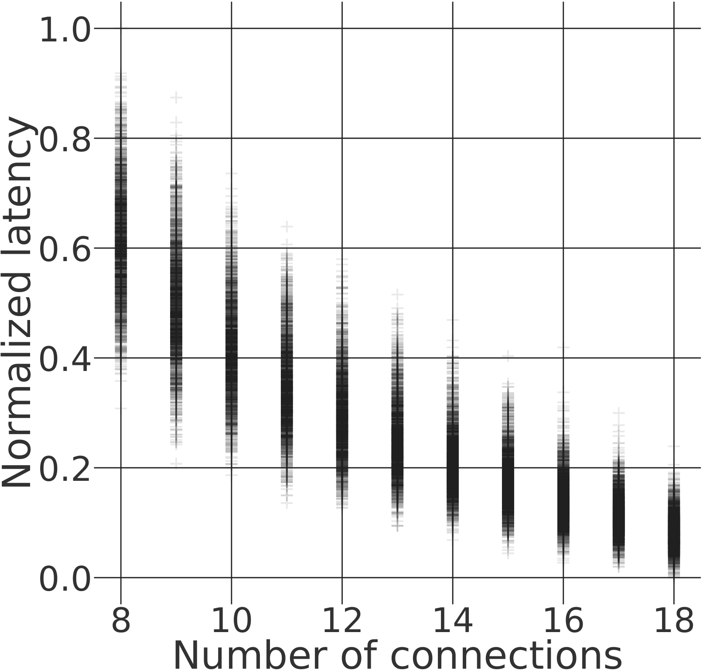
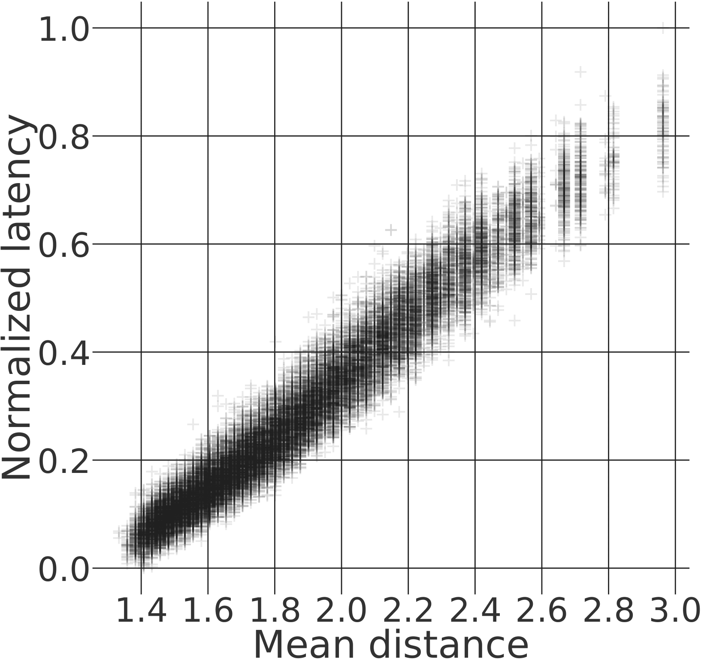
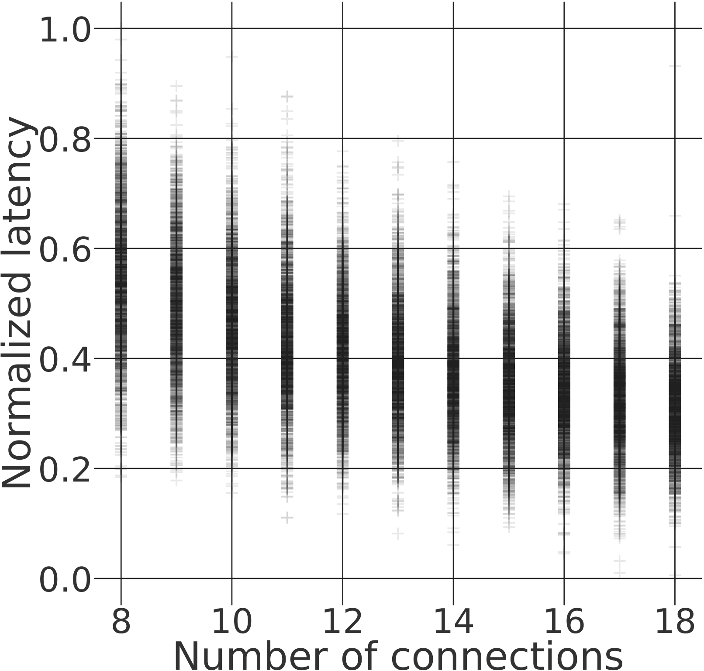
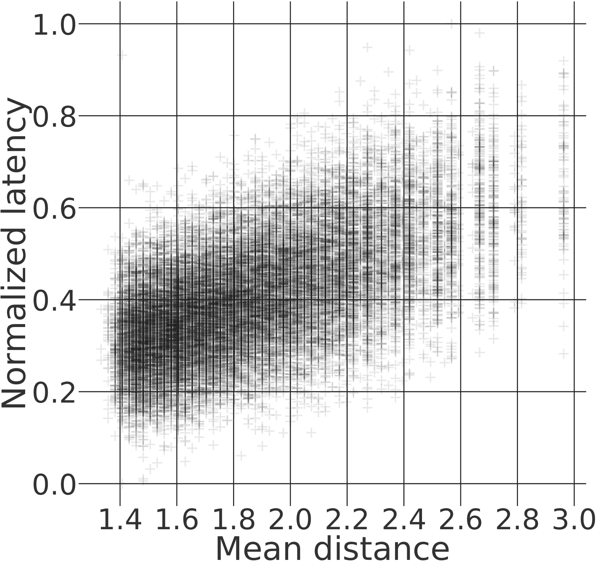
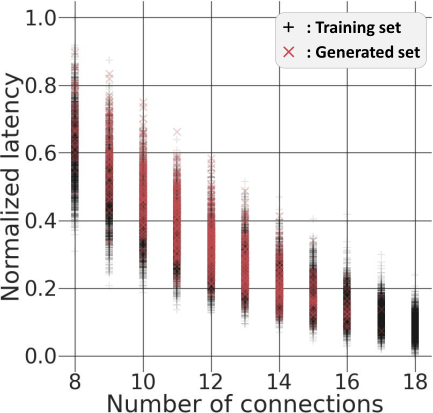
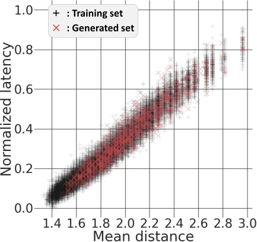
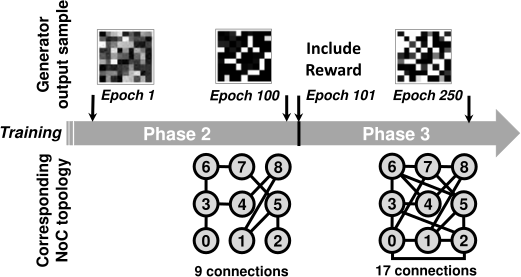
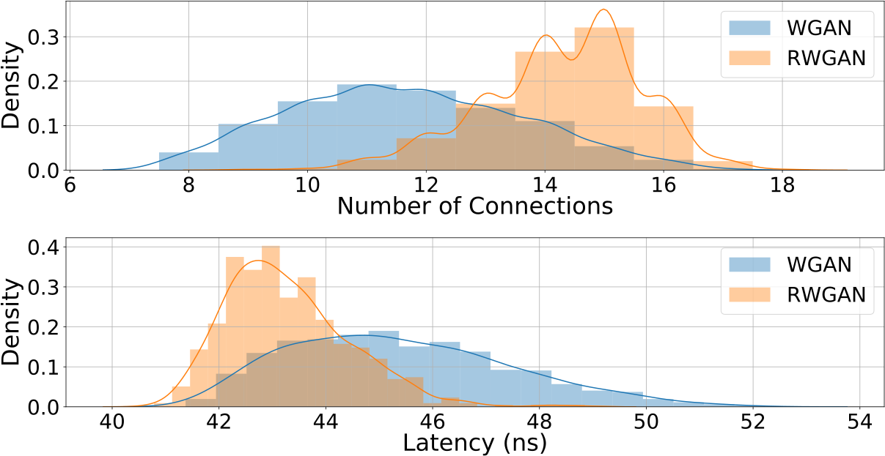
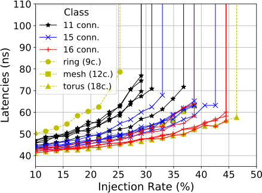
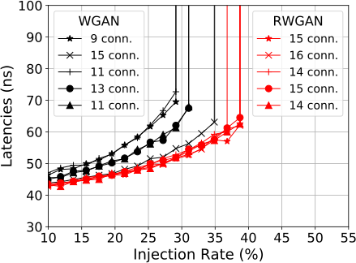

# 5. Optimizing the topologies of on-chip communication networks

<div class="lang-switch" markdown>
<span class="lang-pill is-current">English</span>
[Français](fr/05-gannoc.md){ .lang-pill title="Ce chapitre en français" }
</div>

Having addressed the real-time optimization of parallelized applications, we
now turn to optimizing the hardware design of the platforms that carry those
applications. To this end, we study more specifically the design of
networks-on-chip (NoC, for *Network-on-Chip*), which interconnect the elements
of a single system-on-chip (SoC, for *System-on-Chip*). SoCs are used, among
other things, for embedded systems, and are therefore particularly concerned by
the challenge of energy efficiency.

Here (as well as in [chapter 6](06-m-rwgan.md)) we seek to demonstrate that
deep learning methods can be exploited to improve the design of NoCs and, more
generally, the design of communication networks. By improvement we mean designs
optimized according to criteria defined by the user, energy efficiency being one
of them.

This chapter deals more specifically with the optimization of NoC topologies,
i.e. the structure of the graph. The topology of a NoC on its own plays an
important part in how the NoC operates, since it lays the foundations of the
paths that communication flows may take. This chapter is supported by the
following publication: [\[106\]](references.md#ref-106).

> **Code.** A clean-room reproduction of the method of this chapter is
> available at [mmirka/GANNoC](https://github.com/mmirka/GANNoC).

## 5.1 NoCs and graph theory

In order to design a tool that prunes the NoC design space, it is important to
define the type of the data that will be processed. To that end, we draw an
analogy between NoCs and graphs. The description of a NoC is indeed analogous
to that of a graph, where the connections and routers of the former correspond
to the edges and vertices of the latter. This lets us reduce our NoC generation
problem to a graph generation problem.

Starting from this analogy, we can draw on a number of studies devoted to graph
generation [\[28\]](references.md#ref-28),
[\[60\]](references.md#ref-60), [\[172\]](references.md#ref-172),
[\[71\]](references.md#ref-71). In most of them, a graph is represented by its
adjacency matrix. Such a matrix provides a formal and unambiguous description
of a graph. Key properties, such as the count of edges or the degree of a
vertex, can be read directly from this representation.

<a id="fig-5-1"></a>


**Fig. 5.1** — Graph: representations

Different matrices exist for representing graphs according to different
parameters. There is the adjacency matrix (written $A$), which forms the basis
of any graph representation. This matrix holds the structural information of
the graph, and describes the graph topology by indicating the placement and the
direction of the connections. There is also the parameter matrix (written $X$),
which holds information about the various characteriztics defining a node of a
graph. In our NoC setting, we may speak of the router type or of the buffer
size as so many parameters available in the matrix $X$. Finally, the adjacency
matrix can be enriched with a three-dimensional representation, where the third
dimension may carry information characterizing the connections. This last
possibility is not exploited in our work, but should be known with future work
in mind.

Figure [5.1](#fig-5-1) offers an example of a simple graph in order to
illustrate the notions of adjacency matrix $A$ and feature matrix $X$ (also
called parameter matrix). A NoC of $n$ routers may therefore be represented by
an adjacency matrix of size $n$x$n$, where each of the $n^2$ elements is a
Boolean expressing whether or not a connection exists between two routers. The
parameter matrix $X$ will be of dimension $n$x$f$, with $f$ the number of
parameters describing a router. The type of the elements of $X$ depends on the
parameters that are represented.

## 5.2 NoCs: topology and performance

Our focus here is on the NoC attributes related to topology. These attributes
include the number of routers, the total number of connections, the number of
connections per router (i.e. the router degree), and so on. NoC performance is
moreover evaluated for static routing (see Section
[5.4.1.2](#5412-routing-technique)) and different synthetic traffics. A traffic
is characterized by how its load is spread — e.g. uniform, hotspot — and by its
injection rate (IR) (i.e. the volume of that load). Several metrics can serve
to assess the performance of a NoC. Here we pick network latency, generally
correlated with the throughput and the bandwidth of the network, which makes it
a relevant metric of the performance of a NoC.

<a id="fig-5-2"></a>

| <a id="fig-5-2a"></a>(a) Impact of the number of connections. Traffic = uniform, IR=10% | <a id="fig-5-2b"></a>(b) Impact of the mean distance. Traffic = uniform, IR=10% |
|:--:|:--:|
|  |  |
| <a id="fig-5-2c"></a>(c) Impact of the number of connections. Traffic = hotspot, IR=10% | <a id="fig-5-2d"></a>(d) Impact of the mean distance. Traffic = hotspot, IR=10% |
|  |  |

**Fig. 5.2** — Performance evaluation of NoCs with 9 routers.

In Figure [5.2](#fig-5-2), several plots are presented to demonstrate the
impact of topology attributes on the performance of a NoC. The results shown
correspond to a database of NoCs with 9 routers. They were evaluated with the
Ratatoskr simulator [\[81\]](references.md#ref-81), for uniform traffic (see
Figures [5.2a](#fig-5-2a) and [5.2b](#fig-5-2b)) and hotspot traffic (Figures
[5.2c](#fig-5-2c) and [5.2d](#fig-5-2d)). An injection rate of 10% is
considered. Figures [5.2a](#fig-5-2a) and [5.2c](#fig-5-2c) show latency as a
function of the number of connections of the simulated NoCs. Figures
[5.2b](#fig-5-2b) and [5.2d](#fig-5-2d) display the latency values as a
function of the mean distance between routers. The mean distance of a NoC is
the average number of routers that a message must cross before it reaches its
destination. This value is therefore affected by the routing that is
implemented.

Under uniform traffic, the number of connections and the mean distance are seen
to have a significant impact on network performance. One might expect similar
results (i.e. the more connections available, the better the bandwidth, and the
smaller the mean distance, the lower the latency), yet the same conclusion
cannot be drawn once the network is subjected to hotspot traffic. Although the
overall trend is comparable, hotspot traffic produces a wider spread of latency
for identical attribute values.

While reading the results is intuitive for uniform traffic, the hotspot case
clearly calls for a deeper study. No obvious causal relation can be extracted
between the attributes we consider and the performance of NoCs. It is moreover
easy to accept that comparable conclusions are to be expected for more complex
traffics, all the more so given the heterogeneous nature of SoCs. Hence the
idea of training a generative model able to learn non-intuitive correlations
between NoC parameters and performance.

## 5.3 Problem statement and approach

In this chapter we therefore look at the design of optimized NoC topologies and
attempt to answer the following question: *how can we improve the design of
networks-on-chip, whose design space keeps growing, with the help of deep
learning tools?*

We propose to exploit the concept of the generative adversarial network (GAN)
to build a tool that assists NoC design. Such a tool must be able to provide
the designer with a set of NoCs optimized according to certain criteria, so as
to prune the design space.

### 5.3.1 Data representation

In our approach, we tackle the NoC design problem as a graph design problem.
Moving into the graph domain allows us to identify, with the help of machine
learning techniques, non-trivial graph properties tied to network performance
metrics, e.g. the mean packet delivery latency and the saturation threshold of
the network.

Our interest is focused on the topology of NoCs. We therefore choose the
adjacency matrix $A$ as our data representation. As explained above in Section
[5.1](#51-nocs-and-graph-theory), the adjacency matrix is a compact
representation of the topology of a graph, describing the way in which the
vertices are connected. Various key characteriztics can be extracted from this
representation, such as the number of connections, the degree of the vertices,
the distance between two vertices, and so on. The adjacency matrix is thus a
representation of a graph topology that is at once simple and rich. A further
feature of this matrix is that it has an axis of symmetry along its diagonal
(i.e. top-left to bottom-right). That property follows from our choice of
considering only bidirectional links between routers. It makes the matrix a
particularly apt choice for our first generative-model implementation, since
this will be the very first pattern our neural network learns before it
converges towards finer details. It is, in this respect, an ideal
representation for our problem.

Finally, since the routers we implement have four outward connections —
usually called North, South, East and West, plus the Local port — the maximum
degree of our graphs is fixed at 4.

### 5.3.2 Framework

<a id="fig-5-3"></a>


**Fig. 5.3** — The GANNoC framework.

Our solution rests on two essential parts: (1) a neural network that must learn
to produce NoC designs, and (2) a NoC simulator, employed to evaluate the NoC
designs. As illustrated in Figure [5.3](#fig-5-3), our design diagram starts
the constraints imposed by the user. Three types of constraints are
distinguished:

- The NoC design constraints, describing the initial design space, i.e. the
  type of topology (fixed or variable), the router types available, the
  connection types available, etc.;
- The simulation parameters, defining the execution environment in which the
  NoCs will be evaluated. In our case, this corresponds exclusively to the
  traffic parameters, e.g. traffic type, injection rate;
- The definition of the reward function. Or, put differently, the NoC metrics
  to be optimized, e.g. saturation threshold, power consumption.

A database is built from these constraints. Two steps are needed to produce a
database. First, a set of NoCs has to be defined according to the design
constraints. That set of NoCs is then evaluated through the simulator,
following the simulation constraints imposed by the user. An element of the
database therefore comprises a description of one NoC architecture, plus its
simulation results. We further note that one database corresponds to one set of
user constraints. Should the latter be modified, a new dataset will have to be
generated.

### 5.3.3 The RWGAN for optimized generation

<a id="fig-5-4"></a>


**Fig. 5.4** — Diagram of the Reward-Wasserstein GAN and the generator loss
function $f\left(Y,W\right)$.

The GAN used here extends the WGAN principle mentioned in Section
[2.5.3](02-research-axes.md#253-cad-and-generative-ai). As illustrated in
Figure [5.4](#fig-5-4), the proposed GAN architecture consists of a set of
three neural networks (as against two for a conventional GAN): a *generator*
$G$, a *critic* $C$ and a *reward* $R$. The first two are the basic WGAN
blocks. The purpose of the reward block is to assess the properties of a given
NoC.

The reward network $R$ is trained independently and ahead of the training of
the WGAN ($G \cup C$), so as to estimate a reward function. It is then used
within the WGAN training to guide the learning of the generator. This method of
training the generator is described in Figure [5.4](#fig-5-4). The final
architecture, i.e. $G \cup C \cup R$, is called Reward-WGAN (RWGAN).

**The Generator network** The generator takes as input an element of the set
$Z$, corresponding to a random space. As output, it generates a NoC
description. After learning, this description must match the user criteria
mentioned earlier: the design constraints together with the optimized metrics.
The first criterion is learned through the basic GAN training. The second is
learned by taking the reward output into account in the learning of the
generator. The generator indeed learns to maximize the reward output (i.e.
$W$), which corresponds to the value of the reward function estimated for the
generated NoCs.

The new generator loss function (*loss*) thus obtained is formulated in
equation [5.1](#eq-5-1).

<a id="eq-5-1"></a>

$$
L_G(z_i) = (1-\lambda) L_C(G(z_i)) + \lambda [\beta L_R(G(z_i))]
\tag{5.1}
$$

where $G$ denotes the generator, $z_i$ represents an element of the random
space $Z$, $\lambda$ is the ratio between the loss coming from the reward
($L_R$) and the one coming from the critic ($L_C$), and $\beta$ is a
coefficient that balances the two losses, in addition to $\lambda$. While the
loss function of the critic is in theory not bounded, that of the reward is
limited. Hence the need for an extra coefficient, which has to be modified
according to the way the *loss* values of the critic converge. The generator
loss function is thus a linear combination of the losses coming from the critic
output and from the reward output (i.e. $f\left(Y,W\right)$ in Figure
[5.4](#fig-5-4)). To smooth the transition of the training from learning the
global characteriztics of NoCs towards the desired specific characteriztics,
the linear combination coefficient $\lambda$, initially at 0, is progressively
incremented during training, until it reaches the desired proportion, e.g. 0.9
for a loss function corresponding 90% to that of the reward and 10% to that of
the critic. It is important to keep a non-negligible proportion of the loss
tied to the critic, in order to preserve the learning of the basic
characteriztics of a NoC.

**The Critic network** The loss function of the critic is identical to the one
presented in [2.5.3](02-research-axes.md#253-cad-and-generative-ai) for the
*WGAN-GP* (see equation
[2.2](02-research-axes.md#eq-2-2)). The architecture of the critic will depend
on the use made of it. More details are given in the next section, where the
various experiments carried out are described.

**The Reward network** The reward network has the same architecture as the
critic network. It is used to guide the generator during its training. While
the critic assists the generator in learning the general characteriztics of the
representation of a NoC, so as to produce valid data, the reward refines that
training in order to induce specific properties in the generated NoCs. Those
specific properties correspond to the reward function.

## 5.4 Proof of concept

We propose here to test our framework on the specific study of irregular
topologies of NoCs with 9 routers.

We first describe the experimental setting. We then analyse the generated NoCs.

### 5.4.1 Simulator used

Here we use Ratatoskr [\[81\]](references.md#ref-81) to evaluate NoC
performance for the traffic under consideration. Ratatoskr was created by
J.M. Joseph *et al.*. It is a *cycle-accurate* NoC simulator, both fast and
flexible, which makes it possible to evaluate NoC performance at an accuracy
level similar to the state of the art
[\[39\]](references.md#ref-39). It is an open-source project offering the
possibility of running a variety of NoC simulations, tailored to user needs
through the configuration parameters it exposes. Among other things, it is very
simple to change the topology of a NoC, and certain architectural properties
(e.g. buffer size, number of VCs (virtual channels), etc.). Several traffics
have already been implemented by the authors, such as the *uniform* and
*hotspot* ones, and pre-recorded execution traces can also be injected. The
injection rate is adjustable as well, which widens the field of possibilities.

It is therefore this wide diversity of possible simulations, together with the
speed of the simulator, that led us to adopt it (about 5s for a 100k-cycle
simulation of a $3$x$3$ mesh under uniform traffic, with an injection rate of
10% and XY routing, on an Intel E3-1225 clocked at 3.2 GHz).

#### 5.4.1.1 NoC parameters

In this paragraph we list the global NoC parameters fixed for the Ratatoskr
simulations. We use only the performance measurements produced by Ratatoskr,
which call for no information about the technology used (that information is
nevertheless required for power and area estimates). Ratatoskr uses the
*wormhole* packet switching method. Here we simulate NoCs with packets of
32 *flits*, FIFO buffers holding 4 *flits*, a single VC, and a 1 GHz clock.

#### 5.4.1.2 Routing technique

To evaluate our NoCs, we have to settle on a particular routing algorithm.
Since we consider a large set of irregular topologies, we need to define within
Ratatoskr a universal routing scheme capable of routing every topology. We
therefore implement the routing method proposed by J.C. Sancho *et al.*
[\[150\]](references.md#ref-150). That method yields static routing (i.e.
routing tables) that is efficient and free from deadlock risk. In our
experiments, routing is treated as a constraint and not as a parameter. We
consequently picked this method for how simple it is to implement and for the
effectiveness of its universal routing. We thus take advantage of working with
a simulator to rely on a routing-table-based method. Future research may look
into more sophisticated routing methods, such as table reduction or algorithmic
routing.

### 5.4.2 Datasets

The database we use to train our GAN model is a set of adjacency matrices of
NoC topologies meeting the criteria below: i) the connections of a NoC form a
path between every pair of routers, i.e. a set of router-to-router links that
is connected; ii) every router $r$ must hold strictly fewer than five
connections inside a set $C$ gathering all the connections of a NoC, i.e.
$degree(r, C) \leq 4$; and iii) every connection is bidirectional. Algorithm
[5.1](#algo-5-1) sets out a simple procedure for producing the adjacency matrix
M of a NoC.

<a id="algo-5-1"></a>

```
Input:  nR the number of routers, nC the desired number of connections,
        P the set of all possible NoC connections c=[r0,r1] where r0 and r1
        are routers, MaxTry the maximum number of consecutive unsuccessful
        constructions of a connected set C.
Output: The adjacency matrix M of the NoC to create.

 1  C <- { }                        %initially empty set of NoC connections%
 2  try <- 1                        %first try%
 3  while True do
 4      for nC iterations do
 5          if exists c=[r0,r1] in P, such that (degree(r0, C) < 4)
                                       and (degree(r1, C) < 4) then
 6              select c
 7              add c to C          %this increases the degrees of both r0
                                     and r1 by 1 in the set C%
 8          else goto line 13       %restart the procedure%
 9      if C is connected then
10          Create M from the set of connections C
11          return M
12      else
13          try++
14          if try < MaxTry then
15              C <- { }
16          else return
```

**Algorithm 5.1** — Creation of the adjacency matrix M of a NoC

We implement this algorithm in Python. Our decision to build a database that is
homogeneous with respect to the number of connections present in a NoC stems
from the fact that NoC topology is known to be the leading factor acting on
latency, as our analysis of uniform traffic confirmed. Every NoC in the
database is simulated with Ratatoskr so as to gather its performance (i.e.
latency), and the resulting database is a list of NoCs annotated with their
number of connections and their mean latency. A given database therefore
corresponds to one particular traffic.

### 5.4.3 Results

In this section we present various results obtained, illustrating how well our
framework performs at generating suitable NoC topologies with particular
characteriztics.

#### 5.4.3.1 Training dataset

Our GAN training database consists of a set of NoCs with 9 routers. These NoCs
each have from 8 to 18 connections, with 10000 unique topologies per class
(i.e. number of connections). The database is thus homogeneous with respect to
that characteriztic. The performance data are obtained for uniform traffic at
an injection rate of 10%.

For this proof of concept, we propose to train the reward to assess how many
connections a given topology contains. As shown earlier in Section
[5.2](#52-nocs-topology-and-performance), NoC latency under uniform traffic is
directly correlated with the number of connections. The reward function
estimated by the reward is thus a function that, for a given adjacency matrix,
outputs a reward value matching the number of connections.

#### 5.4.3.2 Neural-network architecture

We build a WGAN and our RWGAN from the same blocks, whose sizing details are
given in Table [5.1](#tab-5-1). The generator is an MLP (*Multi-Layer
Perceptron*, i.e. a dense network) with 2 hidden layers. The output layer is
then reshaped to match the 2D format of the matrices to be generated (here,
$9$x$9$ matrices). It takes a random vector of 100 units as input. The critic
and the reward are each made of 3 hidden layers whose activation function is
LeakyReLU with a slope coefficient of $0.2$ for negative values. The first and
second layers are of CNN type. The third layer and the output layer are dense
layers.

<a id="tab-5-1"></a>

**Table 5.1** — Sizing of the RWGAN.

> Rendered as two tables; the printed thesis shows them side by side (Table 5.1).

**Generator**

| Layers: | Input | L1 | L2 | Output |
|:--|:--:|:--:|:--:|:--:|
| Type | Input | Dense | Dense | Dense |
| Dimensions | 100 | 162 | 162 | 81 |
| Activation function | *–* | *tanh* | *tanh* | *tanh* |

**Critic & Reward**

| Layers: | Input | L1 | L2 | L3 | Output |
|:--|:--:|:--:|:--:|:--:|:--:|
| Type | Input | CNN | CNN | Dense | Dense |
| Dimensions | 81<br>format: 9x9 | 64<br>filter: 9x9<br>stride: 1 | 128<br>filter: 3x3<br>stride: 2 | 512 | 1 |
| Activation function | *–* | *LeakyReLU<br>($\alpha = 0.2$)* | *LeakyReLU<br>($\alpha = 0.2$)* | *LeakyReLU<br>($\alpha = 0.2$)* | *LeakyReLU<br>($\alpha = 0.2$)* |

The dimensions of the networks are determined experimentally. An optimization
method (e.g. hyper-parameter exploration) could be the subject of future work,
for a finer tuning of our RWGAN. Training uses the RMSprop optimizer with
$5\times10^{-5}$ as the learning coefficient, as recommended in
[\[70\]](references.md#ref-70). The neural networks are implemented in Python,
with the help of the Keras library [\[44\]](references.md#ref-44) built on
Tensorflow [\[2\]](references.md#ref-2).

#### 5.4.3.3 WGAN

We first concentrate on training the WGAN alone (without reward). Training as a
whole converges properly. Once trained, the generator can indeed create NoC
topologies carrying the basic characteriztics (number of routers, maximum
degree, connected graph) in as many as 82% of cases.

<a id="fig-5-5"></a>

| <a id="fig-5-5a"></a>(a) Comparison according to the number of connections. | <a id="fig-5-5b"></a>(b) Comparison according to the mean distance between routers |
|:--:|:--:|
|  |  |

**Fig. 5.5** — Comparisons between the original dataset and samples generated
by the WGAN. The latency values are evaluated for uniform traffic at a 10%
injection rate.

Figure [5.5](#fig-5-5) presents a comparison between the training database and
a set of NoCs produced by the trained generator. Every generated topology is
unique, which highlights the creative capacity of the generator. The
distribution of the latencies of the generated NoCs is seen to be similar to
that of the training database, both as a function of the number of connections
(i.e. Figure [5.5a](#fig-5-5a)) and of the mean distance between routers (i.e.
Figure [5.5b](#fig-5-5b)). We can thus conclude that the generator correctly
learns the basic characteriztics of NoCs from the dataset.

The generator nevertheless struggles to produce NoC topologies whose number of
connections is extreme, i.e. 8 and 18. This follows directly from the learning
process itself. During training, the generator learns to produce data with a
higher probability of belonging to the space of the training data. It therefore
converges towards the average trend of the dataset. Since that data space is
homogeneous in number of connections, the average sits around 13 connections.
On top of that, generated topologies with a larger number of connections are
more likely to fall foul of the constraint of a maximum degree of four. Hence
the small proportion of generated NoCs with 18 connections. Conversely, a
topology generated with 8 connections stands a good chance of not being
connected. Hence the scarcity of NoCs with 8 connections.

**Summary:** the WGAN can learn to generate NoC topologies carrying the general
characteriztics. Up to 82% of the topologies it generates are valid. All
generated topologies are unique, i.e. they are absent from the training
database.

#### 5.4.3.4 RWGAN

<a id="fig-5-6"></a>



**Fig. 5.6** — Impact of the reward on RWGAN learning.

As we were able to observe in Section
[5.2](#52-nocs-topology-and-performance), the best performance under uniform
traffic is directly tied to the number of connections, i.e. densely connected
NoCs. With the help of our Reward network, we train the generator to produce
topologies holding a high number of connections. Topologies generated by the
RWGAN should therefore display, on average, better performance than those
generated by the WGAN, i.e. the average of the training dataset.

The experiments carried out on our RWGAN architecture comprise three phases:
(1) the reward network is trained separately to predict the score — here the
number of connections — of a NoC topology given as input, i.e. an adjacency
matrix. (2) the RWGAN is trained without the reward (i.e. $\lambda = 0$), in
the manner of a conventional WGAN, until training stabilizes. This lets the
generator first learn the basic characteriztics of NoCs, through the critic
feedback. (3) the reward output is progressively brought into the training loop
of the generator (see Eq. [5.1](#eq-5-1)). It is important to stress that the
reward is no longer trained after the end of step (1). Figure
[5.6](#fig-5-6) illustrates the impact of the reward on the training of the
generator (step (2) to (3)). Phase (2) covers the period between epochs 0 and
100, and phase (3) starts at epoch 101 and runs until the end of training
(epoch 250). Over that period (3), the split between the critic feedback and
the reward feedback towards the generator is progressively altered, shifting
from 0% and 100% — the reward and critic proportions respectively — to 90% and
10%. For one and the same input, the generator therefore learns to raise the
number of connections as the reward is brought into the learning loop.

<a id="fig-5-7"></a>



**Fig. 5.7** — WGAN vs. RWGAN. Comparison of the distribution of the generated
NoC topologies, according to the number of connections (top) and the mean
packet latency (bottom).

In Figure [5.7](#fig-5-7) we compare the NoC topologies generated by the WGAN
trained on its own, i.e. without reward, and by the RWGAN, after learning for
250 epochs. We start by analysing the number of connections. As expected, the
mean number of connections rises by 36% (from 11 to 15), which amounts to a 36%
increase relative to the min/max possibilities (between 8 and 18). Latency
distributions are then compared in the lower plot of Figure
[5.7](#fig-5-7). The mean packet transmission latency drops from 45.4ns to
43.3ns. Normalized over the whole set of possible latencies (from roughly 40ns
to 54ns), the mean latency falls from 0.38 to 0.24, which represents a 37%
improvement of the mean latency.

We now study the saturation curves of the generated NoCs, for uniform traffic
and for packet latency. These curves come from Ratatoskr simulations that sweep
a range of injection rates until the saturation threshold is reached.

<a id="fig-5-8"></a>



**Fig. 5.8** — Saturation curves of the NoCs generated by the RWGAN and of
conventional topologies. The generated NoCs are split into three groups
according to their number of connections: 11, 15 and 16 connections.

First, in Figure [5.8](#fig-5-8) we compare the performance of three classes of
NoC. These classes differ in the value of their reward function, here the
number of connections. For each class we therefore plot five saturation curves
corresponding to different generated NoCs. The three classes stand respectively
for NoCs of 11 connections (black), 15 connections (blue) and 16 connections
(red). To compare against existing regular topologies, we also plot the
saturation curves of a *ring*, a *mesh* and a *torus* of 9 routers (9, 12 and
18 connections respectively). NoCs with a higher number of connections can be
seen to perform better overall, even though significant overlaps exist. A NoC
with 11 connections is indeed found to have a higher saturation threshold than
a NoC with 15 connections. Likewise, a NoC with 15 connections outperforms one
with 16 connections, and the *torus* with 18 connections performs similarly to
a NoC with 16 connections. This underlines that the number of connections is
not the only performance factor. It also suggests that a reward trained to
approximate a finer reward function (e.g. latency) could make it possible to
produce NoCs with optimized performance. The generator could for instance
produce NoCs with lower latencies, but for a similar number of connections.

<a id="fig-5-9"></a>



**Fig. 5.9** — Saturation curves of the NoCs generated by the RWGAN (red) and
the WGAN (black), after a training of 250 epochs training.

Finally, in Figure [5.9](#fig-5-9) we propose to compare the saturation results
of NoC topologies generated by the WGAN (i.e. black curves) and the RWGAN (i.e.
red curves) after a training of 250 epochs. These curves are obtained by
feeding the WGAN and the RWGAN the same 5 inputs. In Figure
[5.9](#fig-5-9), one marker type denotes one particular input. The topologies
so generated are then simulated with Ratatoskr, yielding the plotted results.

From these results, we can see that, despite identical inputs, the generators
produce NoC topologies whose performance and number of connections differ. The
outputs of the RWGAN in particular achieve better performance than those of the
WGAN. This is a clear illustration of the effectiveness of the reward. We
further note a wider spread among the NoCs generated by the WGAN, coming from
the global training that drives the generator to reproduce the space of the
learning data.

**Results:** The proposed GAN architecture shows significant improvements in
the generated NoCs. Although the count of valid generations drops when the
reward is used, the reward raises the quality of the generated topologies in
terms of the desired performance (i.e. the reward function, here the number of
connections). As the generator learns to raise the connection count, its
ability to satisfy the main constraint — NoCs with a maximum degree of 4 —
deteriorates. We thus have a 54% probability of obtaining a valid topology
(against 82% when the reward is left out, i.e. the WGAN on its own). We
nevertheless obtain a 36% improvement with respect to the reward function
considered, i.e. the number of connections. This significant improvement
demonstrates the reward's ability to steer generator learning towards producing
NoC topologies with the desired characteriztics.

## 5.5 Summary

To conclude this chapter, we proposed to use GANs to carry out a pruning of the
design space towards a set of optimized data. A particular GAN architecture
able to generate such data is presented. This architecture, called RWGAN, thus
makes it possible to produce optimized NoC topologies. We illustrated this use
for the creation of NoCs holding a high number of connections. The continuation
of this work consists in implementing a reward function less obvious than the
number of connections, such as network latency or the energy efficiency of the
NoC.

In the next chapter, we shall explore another way of improving NoC design, by
addressing the problem of generating heterogeneous NoCs. An improvement of the
RWGAN is proposed, allowing the user to implement as many reward functions as
desired, through a multitude of reward blocks. This new architecture is named
M-RWGAN, for *Multi-Reward Wasserstein GAN*.
