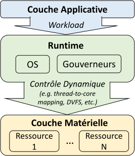
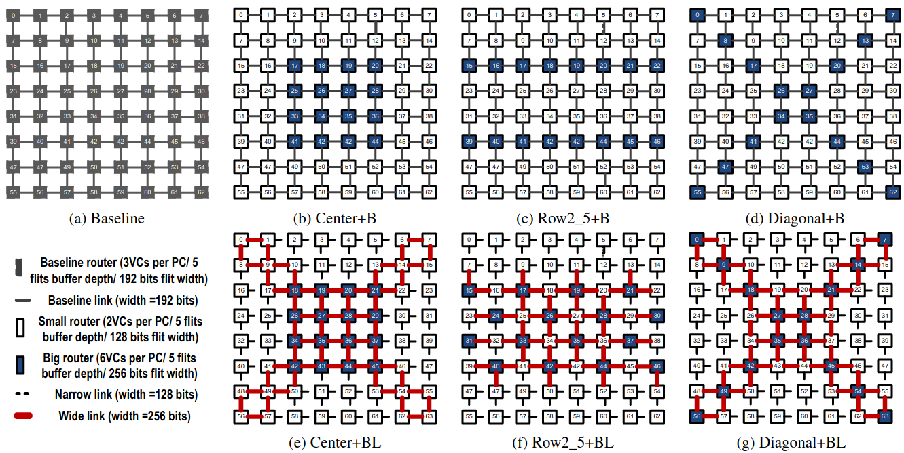
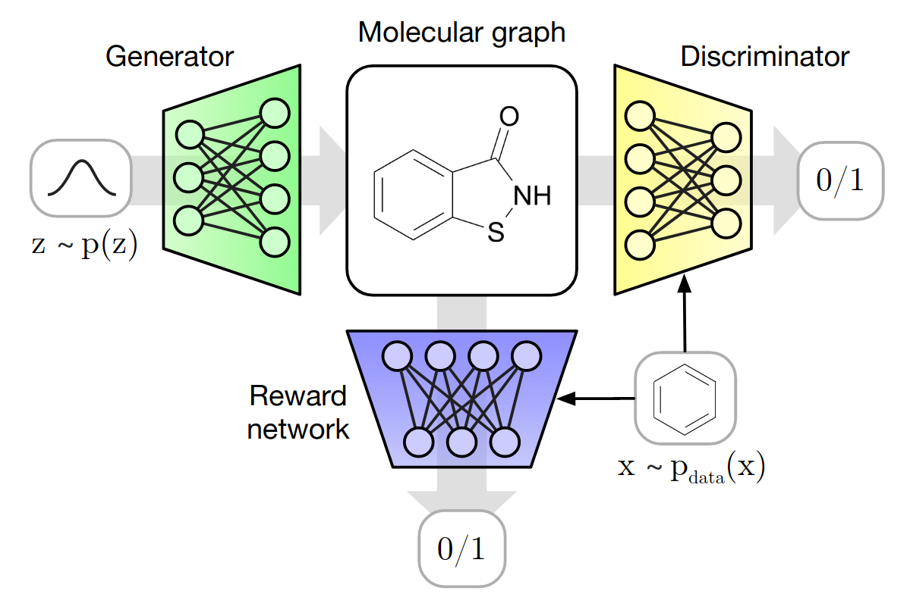

# 3. État de l'art

[English](../03-state-of-the-art.md){ .lang-pill title="This chapter in English" }
Français

## 3.1 Efficacité énergétique du calcul parallèle

Les travaux existant ayant pour objectifs d'améliorer l'efficacité énergétique
de l'exécution de calculs parallèles sont nombreux. En effet, différentes
approches sont possibles, allant de l'optimisation en amont du code définissant
le calcul, à l'adaptation dynamique des ressources de calculs durant
l'exécution du calcul. Comme décrit dans le chapitre précédent, section
[2.4](02-research-axes.md#24-vers-le-contrôle-de-lefficacité-énergétique-des-applications-openmp),
nos travaux s'orientent vers cette dernière approche dynamique par le biais de
l'apprentissage par renforcement. Nous étudions en particulier les applications
parallélisées avec OpenMP, précisant ainsi notre positionnement.

Les approches existantes visant à optimiser l'efficacité énergétique des
systèmes de calcul s'appuient sur diverses techniques de conception déjà
étudiées dans la littérature [\[111\]](references.md#ref-111),
[\[74\]](references.md#ref-74), [\[125\]](references.md#ref-125),
[\[20\]](references.md#ref-20).

### 3.1.1 Les leviers d'optimisation et leur contrôle

Les solutions industrielles se concentrent essentiellement sur l'amélioration
des processeurs et de leurs pilotes. Les processeurs contemporains (i.e.
multi-cœurs) supportent un ensemble de fonctionnalités tournées vers
l'amélioration de l'efficacité énergétique. Parmi ces fonctionnalités, on
retrouve chez Intel la gestion des *P-states* par cœur
(PCP)[\[74\]](references.md#ref-74), la modulation de la fréquence des
composants hors des cœurs (UFS)[\[74\]](references.md#ref-74), les fréquences
"turbo" efficaces (EET) [\[21\]](references.md#ref-21), les *C-state* des cœurs
[\[152\]](references.md#ref-152), le plafonnement de la puissance
[\[146\]](references.md#ref-146), ou encore les limitations thermiques (i.e.
*thermal design power*(TDP)) qui permettent de limiter la consommation
énergétique tout en assurant l'intégrité du système. Ces leviers d'optimisation
se retrouvent tous, ou en partie, dans tout système de calcul. Plus
généralement, on distingue deux principales fonctionnalités
[\[20\]](references.md#ref-20): 1) la mise à l'échelle dynamique de la tension
et de la fréquence – i.e. DVFS –, et 2) la gestion dynamique de l'alimentation
– i.e. DPM.

Ces fonctionnalités sont deux techniques matérielles largement utilisées pour
réduire la consommation d'énergie du CPU. Elles sont toutes deux contrôlées par
le système d'exploitation (OS). En effet, la gestion des C-states et P-states
pour Intel, et plus globalement le DVFS et DPM, se fait par le biais de pilotes
(e.g. intel_pstate et acpi-cpufreq sur Linux) gérés par le système
d'exploitation, et accessible à l'utilisateur par des interfaces dédiées. On
parlera de gouverneur pour parler des différents modes de gestion disponibles
sur ces pilotes (e.g. *ondemand* [\[127\]](references.md#ref-127)). De récentes
architectures tendent à ramener ce contrôle au niveau du processeur. Cependant,
le contrôle au niveau du processeur montre d'importantes limitations, notamment
pour la gestion du calcul parallèle, puisque seule les informations relatives
aux cœurs considérés sont disponibles au contrôleur. Ainsi, les constructeurs
misent sur un contrôle hybride où les processeurs agissent en fonction de
données fournies par l'OS. Par exemple, comme mentionné par R. Schöne *et al.*
[\[151\]](references.md#ref-151), si on étudie l'évolution du *Hardware Power
Management* (HWPM) de Intel on remarque qu'entre l'architecture Broadwell et
Skylab-SP, le HWPM a perdu en autonomie pour plus de flexibilité et de
collaboration avec l'OS. Ainsi, bien qu'un contrôle au niveau du processeur
possède beaucoup d'avantages comme les délais de prise de décision réduits et
l'interruption limitée des workloads, une intervention au niveau de l'OS est
nécessaire pour améliorer la qualité du contrôle.

Enfin, un dernier levier d'optimisation est l'allocation des ressources à une
tâche. Cette fonctionnalité est particulièrement utile pour la gestion de
calcul parallèle puisqu'elle permet d'optimiser la façon dont le calcul est
parallélisé. Cependant, les contrôles implémentés sur processeur par les
constructeurs n'agissent pas encore sur ce levier (i.e. contrôle par cœur, donc
aucune notion d'application parallélisée), et les gouverneurs n'exploitent pas
ce potentiel. En effet, l'allocation des ressources reste à la charge de l'OS,
et dépend essentiellement du code source des applications spécifiant, entre
autres, le nombre de threads à créer pour la parallélisation du calcul.
Cependant, le nombre optimal de threads dépendra du système de calcul. De plus,
selon le système de calcul, le type de ressources utilisées a un impact majeur
sur l'efficacité énergétique (e.g. architecture hétérogène).

Ainsi, la conception de gouverneurs permettant d'optimiser l'efficacité
énergétique de l'exécution d'un workload est une solution adoptée par beaucoup
dans la littérature (voire section
[3.1.2](#312-les-solutions-de-type-gouverneur) pour optimiser les systèmes de
calcul.

### 3.1.2 Les solutions de type "gouverneur"

**Fig. 3.1** — Modèle d'exécution simplifié d'une application.

Nous appelons "gouverneur" tout système de contrôle intervenant sur le système
de calcul au niveau du runtime. La figure [3.1](#fig-3-1) décrit un modèle en
trois couches illustrant les différents niveaux d'exécution d'une application.
On y distingue la couche applicative comprenant la description haut-niveaux des
tâches et de la charge de calcul, la couche du runtime où interviennent les
contrôles temps réel du système d'exploitation et des gouverneurs, et la couche
matérielle où le calcul est réparti pour être traité par les ressources
disponibles. Ce sont donc les solutions opérant au niveau de la couche du
runtime qui nous intéressent. Les actions des gouverneurs peuvent donc se
distinguer selon quatre catégories: 1) DVFS, ou contrôle en fréquence, 2) DPM,
ou contrôle en puissance, 3) Mapping, ou allocation des ressources, et 4)
Scheduling, ou ordonnancement des tâches. La littérature comporte de nombreuses
solutions de contrôle s'apparentant à des gouverneurs. Nous distinguerons donc
les gouverneurs selon les critères suivants:

- **Type d'action,** ou comment le contrôle proposé agit sur le système. e.g.
  DVFS, mapping.
- **Méthode *online*,** ou quelle méthode de contrôle est employée durant
  l'exécution d'un workload. e.g. RL.
- **Activité *offline*,** ou quelle charge de travail est nécessaire en amont
  du contrôle. e.g. entraînement d'un modèle.
- **Besoins,** ou quelles sont les conditions indispensables à
  l'implémentation des solutions.
- **Portabilité,** ou quels sont les systèmes ciblés par cette méthode.

Un tableau comparatifs [3.1](#tab-3-1) des solutions existantes dans la
littérature est proposé. Ce tableau propose de mettre en évidence les
différentes lacunes existantes dans l'état de l'art. La liste des contributions
n'est pas exhaustive, cependant les contributions sélectionnées l'ont été de
façon qualitative, afin de correctement reproduire les tendances de l'état de
l'art. En effet, ce sujet est un *hot topic*, ce qui résulte en un grand nombre
de contributions.

Après une description de ces différentes méthodes, nous développerons notre
analyse autour de trois caractéristiques essentielles qui nous intéressent: la
portabilité des solutions, les actions menées et l'usage de l'apprentissage par
renforcement.

> Wide table; scroll horizontally.

| ***Référence*** | ***Date*** | ***Actions*** | ***Méthode online*** | ***Activité offline*** | ***Besoins*** | ***Support d'application*** |
|---|---|---|---|---|---|---|
| [\[170\]](references.md#ref-170) | 2012 | DPM | Deep Q-learning (RL) | - | Simulateur | Simulateur multi-cœurs (e.g. Intel Atom 4 et 8 cœurs) |
| PoGo [\[100\]](references.md#ref-100) | 2015 | DVFS | Q-Learning (RL) | Modification du code d'application | Compteurs matériels | SE (e.g. beagleboard avec Arm Cortex A8) |
| Sparta [\[54\]](references.md#ref-54) | 2016 | Mapping | Binning-based (*predictor*) Heuristique (*SPARTA Allocator*) | Entraînement du prédicateur (régression linéaire) | Système Hétérogène | Architecture hétérogène (e.g. Arm big.LITTLE et simulation HMP) |
| [\[113\]](references.md#ref-113) | 2016 | DVFS | Q-learning (RL) | Réglage empirique de la fonction de reward Initialisation des valeurs Q | Taux d'utilisation des buffers | MpSoC (e.g. Arm avec 16 cœurs) |
| DyPO [\[73\]](references.md#ref-73) | 2017 | DVFS DPM | Classification du workload Sélection de la configuration (*Pareto-optimal*) | Instrumentation des Application Caractérisation de benchmarks Entraînement du classificateur (*régression logistique*) | Compteurs matériels LLVM PAPI | MpSoC hétérogène (e.g. Arm big.LITTLE) |
| [\[40\]](references.md#ref-40) | 2017 | Mapping | RL | - | Compteurs matériels | Système multi-cœurs (e.g. Intel Xeon E5, 20 cœurs) |
| [\[142\]](references.md#ref-142) | 2018 | DVFS | EWMA (prédiction du workload) Binning-based (DVFS) | Apprentissage des *Bins* | Compteurs matériels | Processeur multi-cœurs (e.g. Intel Xeon E5/Phi) |
| AdaMD [\[18\]](references.md#ref-18) | 2019 | DVFS Mapping | Prédiction des performances (régression additive) Binning-based (DVFS), EWMA (prédiction du workload) | Entraînement du prédicateur de performances Apprentissage du classificateur (DVFS) | Compteurs matériels | MpSoC hétérogène (e.g. Arm big.LITTLE) |
| [\[72\]](references.md#ref-72) | 2019 | DVFS DPM | DQL (RL) | Entraînement de l'oracle Instrumentation des Applications Pré-entraînement offline du DQL | Compteurs matériels | MpSoC (e.g. Arm big.LITTLE) |
| [\[101\]](references.md#ref-101) | 2019 | DVFS DPM | Régression linéaire (*imitation learning*) | Conception d'oracle (Q-Learning) Approximation de l'oracle (régression) Instrumentation des applications | Compteurs matériels | MpSoC hétérogène (e.g. Arm big.LITTLE) |
| RLBMCS [\[145\]](references.md#ref-145) | 2020 | Scheduling | RL | - | Free-RTOS | Simulation multi-cœurs |
| [\[158\]](references.md#ref-158) | 2021 | Scheduling | Deep RL | - | Performance des VM | Simulation IoT |
| **My Work** | 2020 | DVFS Mapping | Deep RL | Entrainement du AE training (si besoin) | Support OpenMP | Système multi-cœurs (e.g. Arm big.LITTLE, Intel Xeon E5) |

**Tableau 3.1** — Comparaison de méthodes récentes de contrôle dynamique du
calcul parallèle.

#### 3.1.2.1 Vue d'ensemble des méthodes existantes

Dès 2012, R. Ye *et al.* [\[170\]](references.md#ref-170) se penchent sur le
potentiel de l'apprentissage par renforcement pour réaliser un contrôle
en-ligne ne nécessitant pas d'analyse hors-ligne. Leur contrôle consiste en un
DPM afin de gérer de façon optimale les périodes d'inactivité des cœurs.
Adressant ce problème pour les systèmes multi-cœurs, leur technique
d'apprentissage se base sur un réseau de neurones (Deep Q-Learning) afin de
supporter le large espace d'états et d'actions. Leur travaux montrent des
résultats prometteurs, cependant ils ne se concentrent que sur le DPM. Or, nous
pensons qu'un contrôle hybride adressant différents leviers tels que le DVFS et
le mapping est nécessaire pour un contrôle optimal. De plus, leur contrôle se
concentre sur l'aspect matériel (état des cœurs), sans exploiter de
corrélations avec l'application en cours de traitement.

PoGo [\[100\]](references.md#ref-100) est proposé par L.A. Maeda-Nunez *et al.*
pour réaliser un contrôle DVFS *application-specific*. Ce travail met le suivi
d'exécution du calcul parallèle au centre du contrôleur, permettant
l'amélioration de l'efficacité énergétique d'une application particulière. Un
apprentissage par renforcement est utilisé pour décider des modifications du
DVFS. Cependant, leur application ne concerne pas un système multi-cœurs, ce
qui rend leur champ d'actions limité à 4 possibilités. Or, nous ciblons des
systèmes multi-cœurs au nombre d'actions plus vastes
[\[170\]](references.md#ref-170). De plus, leur système de contrôle récupère
l'information sur les performances à partir de *flags* disponibles après
modification du code de l'application. Or, pour faciliter l'implémentation de
notre contrôle, nous proposons une solution moins invasive grâce aux chunks.

Sparta [\[54\]](references.md#ref-54) présenté par B. Donyanavard *et al.* est
un système de contrôle du mapping de tâches sur systèmes multi-cœurs
hétérogènes pour améliorer l'efficacité énergétique du calcul. Alors que leur
méthode montre des gains supérieurs aux solutions existantes pour le support
big.LITTLE testé, leur méthode repose sur des apprentissages hors-ligne et donc
non adaptatifs en temps réel. Cette méthode demande donc une conception
minutieuse de la politique de contrôle avant exécution, et ne garantit pas une
adaptation à toute application exécutée.

Dans [\[113\]](references.md#ref-113), A. Molnos *et al.* proposent une
solution basée sur du RL pour un contrôle DVFS du système durant l'exécution
d'une application impliquant des interfaces externes (I/O), afin de garantir
les contraintes de qualité d'exécution (e.g. nombre d'images par seconde traité
pour un traitement vidéo continu). Leurs travaux se concentrent sur le réglage
optimal de l'apprentissage afin de garantir une convergence rapide du
contrôleur DVFS. Cependant, le mapping des tâches n'est pas pris en compte, ce
qui pourrait permettre d'élargir le champ d'actions afin de garantir les
contraintes de qualité à un moindre coût énergétique.

DyPO [\[73\]](references.md#ref-73) proposé par U. Gupta *et al.* est un
système de contrôle hybride DVFS et DPM destiné à adapter la configuration du
système de calcul en temps réel en fonction des phases d'exécution de
l'application traitée. Ce modèle se base sur l'entraînement d'un modèle de
classification de workload à partir de données collectées pour un ensemble
d'applications. Une classification en-ligne du workload exécuté permet ensuite
d'adapter la configuration du système. Contrairement à notre solution, leur
système nécessite une instrumentation de l'application à optimiser pour
extraire les informations de l'avancement de son exécution nécessaires à la
classification. Les auteurs reprennent leur système d'instrumentation dans
[\[72\]](references.md#ref-72), et proposent de réutiliser leur modèle de
classification comme un oracle permettant de pré-entraîner un apprentissage par
renforcement. Ainsi, le modèle final bénéficie des connaissances de l'oracle,
tout en apprenant en temps réel à s'adapter à de nouvelles applications. Enfin,
une dernière amélioration est apportée par les auteurs dans
[\[101\]](references.md#ref-101) où une technique de transfert d'apprentissage
est implémentée pour améliorer l'apprentissage du contrôleur pour le contrôle
d'applications inconnues. Cependant, chaque nouvelle application nécessite une
instrumentation hors-ligne, contrairement à notre méthode.

Dans [\[40\]](references.md#ref-40), G. Chasparis *et al.* proposent un
apprentissage par renforcement pour le mapping intelligent de chaque thread
d'une l'application exécutée sur un système multi-cœurs. Ce système repose sur
les données de compteurs de performance, et ne considère pas le contrôle en
fréquence des cœurs du système.

K. R. Basireddy *et al.* [\[142\]](references.md#ref-142) proposent une méthode
basée sur l'apprentissage hors-ligne de l'attribution de paramètres
tension/fréquence en fonction de la charge de calcul courante. Cette charge de
calcul est déterminée à partir des compteurs de performance. Leur méthode est
appliquée sur un système multi-cœurs et montre des gains importants en
comparaison avec des méthodes existantes. Cependant, leur méthode repose sur un
apprentissage hors-ligne de la loi de contrôle à partir d'un benchmark limité.
Cela ne garantit pas un contrôle optimal pour tout type de workload. De plus,
leur méthode de mesure du workload se base sur les compteurs de performances,
et n'est donc pas spécifique à l'application contrôlée comme ce que nous
proposons. Ce travail est prolongé dans AdaMD
[\[18\]](references.md#ref-18), où la gestion du mapping d'applications
concurrentes vient compléter leur système de contrôle.

Enfin, D.R. Rinku *et al.* [\[145\]](references.md#ref-145) et S. Sheng *et
al.* [\[158\]](references.md#ref-158) sont deux contributions récentes
exploitant l'apprentissage par renforcement respectivement pour des systèmes
multi-cœurs exécutant des applications parallélisées avec Free-RTOS, et pour
des applications IoT exécutées sur des machines virtuelles. Ces deux
contributions traitent uniquement de la planification des tâches (scheduling)
et ne considère pas les contrôles DVFS et DPM plus proches du matériel.

**Résumé:** Cet ensemble de contributions montre la variété des solutions
explorées dans la littérature pour l'optimisation dynamique du calcul
parallèle. Notre contribution se détache principalement par l'exploitation des
chunks qui sont une métrique haut-niveau et *application-specific* disponible
sur OpenMP. Cela permet en particulier de profiter de grande diversité de
supports et applications utilisant OpenMP, et, avec un minimum
d'instrumentation, de mesurer en temps réel la quantité de calcul exécutée.
Nous proposons d'exploiter cette métrique pour un contrôle dynamique du mapping
et DVFS via un apprentissage par renforcement en-ligne.

#### 3.1.2.2 Portabilité

Nous avons constaté dans un premier temps que les solutions proposées sont
généralement conçues pour un seul système (e.g. Odroid XU3 et architecture
big.LITTLE [\[73\]](references.md#ref-73), [\[54\]](references.md#ref-54),
[\[18\]](references.md#ref-18), [\[101\]](references.md#ref-101)), et demandent
donc des efforts significatifs pour être adaptées à un nouveau système. Il faut
noter le nombre important de contributions dédiées aux systèmes embarqués et
plus généralement aux MPSoC, e.g. [\[160\]](references.md#ref-160),
[\[173\]](references.md#ref-173), [\[100\]](references.md#ref-100),
[\[73\]](references.md#ref-73), [\[18\]](references.md#ref-18),
[\[72\]](references.md#ref-72), [\[54\]](references.md#ref-54),
[\[101\]](references.md#ref-101). Cependant, le problème de l'efficacité
énergétique concerne tout type de système de calcul.

C'est donc ce premier point que nous avons décidé d'adresser. Pour cela, nous
proposons une méthode de contrôle basée sur le runtime OpenMP qui est supporté
par la majorité des OS et architectures. Ainsi, notre solution peut s'appliquer
sur tout système supportant OpenMP, allant du système embarqué au serveur HPC,
du multi-cœurs au many-cœurs.

Dans les travaux suivants de l'équipe ADAC [\[122\]](references.md#ref-122),
[\[47\]](references.md#ref-47), il est question d'optimiser l'allocation des
ressources sur des architectures hétérogènes à partir d'informations fournies
directement depuis la compilation d'applications. Cela à l'avantage de
bénéficier des informations sur les caractéristiques des applications, ainsi
que d'automatiquement instrumenter le programme. Agir au moment de la
compilation favorise la portabilité de la solution. A noter l'utilisation de RL
dans [\[122\]](references.md#ref-122) pour optimiser l'allocation dynamique de
tâches. Cependant, les solutions proposées n'adressent que le mapping de
tâches, sans considérer des actions dynamiques telles que les variations de la
fréquence de fonctionnement ou encore des phénomènes dynamiques tels que la
concurrence d'application.

Une approche qu'il convient aussi de mentionner dans cet état de l'art est le
travail de Alessi *et al.* [\[7\]](references.md#ref-7). Les auteurs ont
proposé une approche spécifique à OpenMP qui consiste à étendre l'API OpenMP
existante avec une API spécialisée pour l'économie d'énergie. Elle permet de
prendre des décisions directement au moment de l'exécution pour minimiser
l'énergie. Cependant une modification du code des applications est nécessaire
pour utiliser cette méthode, et cet outil ne semble pas être maintenu à jour.

#### 3.1.2.3 Actions et activités menées

Une majorité des techniques de contrôle visant à améliorer l'efficacité
énergétique proposées dans la littérature adresse le DVFS et le DPM
[\[101\]](references.md#ref-101), [\[72\]](references.md#ref-72),
[\[18\]](references.md#ref-18), [\[142\]](references.md#ref-142),
[\[73\]](references.md#ref-73), [\[113\]](references.md#ref-113),
[\[100\]](references.md#ref-100), [\[170\]](references.md#ref-170),
[\[23\]](references.md#ref-23), [\[141\]](references.md#ref-141),
[\[16\]](references.md#ref-16). D'autres considèrent l'allocation des
ressources de calcul aux tâches et l'optimisation de leur ordonnancement
[\[145\]](references.md#ref-145), [\[158\]](references.md#ref-158),
[\[18\]](references.md#ref-18), [\[40\]](references.md#ref-40),
[\[65\]](references.md#ref-65), [\[54\]](references.md#ref-54),
[\[63\]](references.md#ref-63), [\[61\]](references.md#ref-61). Enfin, il va de
soi que le contrôle de la configuration du système (i.e. DVFS, DPM) et de la
gestion des ressources (i.e. mapping, scheduling) sont complémentaires. Ainsi,
on trouve dans la littérature des contributions adressant plusieurs de ces
approches avec un même contrôleur, en particulier AdaMD
[\[18\]](references.md#ref-18) récemment proposé par K. R. Basireddy *et al.*.
Dans ce travail, différentes techniques d'apprentissage automatique sont
exploitées afin de proposer un contrôle du DVFS ainsi qu'un contrôle de
l'allocation thread-cœur. Les résultats exposés montrent des gains importants
en efficacité énergétique, puisqu'une amélioration de 28% est obtenue sur la
consommation énergétique, tout en respectant les contraintes de performances
des applications étudiées. Finalement, dans [\[62\]](references.md#ref-62), A.
Gamatié *et al.* adressent conjointement la conception de systèmes hétérogènes
et l'allocation des workloads pour l'amélioration de l'efficacité énergétique
des systèmes de type *edge computing*, ce qui rejoint la tendance actuelle du
*domain specific computing* évoquée en introduction.

Nous proposons donc d'adresser le contrôle complémentaire du DVFS et de
l'allocation des ressources, similaire à AdaMD
[\[18\]](references.md#ref-18). En effet, bien qu'efficace, la solution
proposée par K. R. Basireddy *et al.* requiert un travail important en amont du
contrôle dynamique pour créer les modules de prédiction et de classification
des workloads. En effet, la collecte des données et l'entraînement des modules
sont autant de tâches nécessitant du temps CPU. De plus, l'ensemble des données
collectées afin de caractériser les workloads ne garantit pas d'être
représentatif de tout type de workload (base de données non exhaustive). Enfin,
leur méthode dépend d'un accès aux compteurs matériels du système considéré.
Cela demande donc un travail supplémentaire pour intégrer cette solution sur
différents systèmes. Ainsi, nous tâcherons de nous différencier de cette
méthode en proposant une meilleure portabilité de notre solution (voire section
[3.1.2.2](#3122-portabilité)), mais aussi des contraintes plus faibles sur
l'activité offline nécessaire à la mise en place du contrôle.

#### 3.1.2.4 Intérêt pour le RL

On constate ces dernières années un intérêt croissant pour l'utilisation de
l'apprentissage automatique [\[102\]](references.md#ref-102),
[\[142\]](references.md#ref-142), [\[43\]](references.md#ref-43), et plus
particulièrement de l'apprentissage par renforcement
[\[100\]](references.md#ref-100), [\[155\]](references.md#ref-155),
[\[170\]](references.md#ref-170), [\[156\]](references.md#ref-156).

L'utilisation de l'apprentissage par renforcement (RL) s'avère efficace dans le
cadre de problèmes de prise de décision. L.A. Maeda-Nunez *et al.* proposent
PoGo [\[100\]](references.md#ref-100), une approche adaptative de minimisation
de l'énergie utilisée comme gouverneur Linux et testée sur un système embarqué.
Un algorithme Q-Learning est implémenté comme unité de décision, et la
technique globale démontre de significatives économies d'énergie, par rapport
au gouverneur Linux Ondemand existant [\[127\]](references.md#ref-127).

Ce travail a été étendu dans [\[155\]](references.md#ref-155) où la méthode
proposée considère à la fois les changements de workload intra-application et
les changements inter-application impliquant des techniques de transfert
d'apprentissage. Leur méthode continue à montrer de grandes perspectives même
sur les systèmes multi-cœurs avec l'hypothèse d'exécuter une tâche par cœur.
Dans [\[170\]](references.md#ref-170), une approche basée sur le Q-Learning est
proposée pour la gestion des périodes d'inactivité des processeurs
multi-cœurs, montrant la polyvalence des applications RL. Enfin, Basireddy *et
al.* ont proposé dans [\[142\]](references.md#ref-142) une méthode de gestion
du temps d'exécution tenant compte de la charge de travail pour économiser
l'énergie des systèmes HPC. Ils ont implémenté un algorithme d'apprentissage
basé sur le "binning" [\[98\]](references.md#ref-98) pour concevoir l'unité de
décision, et ont utilisé des compteurs de performance matériels pour la
caractérisation du workload.

Récemment, A. K. Singh *et al.* [\[160\]](references.md#ref-160) ont proposé
une étude complète de l'état de l'art des techniques de gestion dynamique de
l'énergie des systèmes embarqués multi-cœurs. Cette étude, plus récente que nos
travaux aux moments de leur publication, met en avant, entre autres, la
difficulté de prendre en considération un nombre croissant de paramètres. En
particulier, les méthodes basées sur du RL et qui reposent sur le Q-learning,
et sont donc particulièrement sensibles à ce problème. Or, nous constatons un
intérêt particulier pour ces méthodes dans notre étude de la littérature (c.f.
table [3.1](#tab-3-1)). En effet, un des avantages majeurs de ces méthodes est
qu'elles permettent la construction d'un contrôleur précis, nécessitant très
peu d'effort offline puisque l'apprentissage se fait online, rendant ces
méthodes flexibles. On peut constater cela sur la table [3.1](#tab-3-1), où les
contributions utilisant du RL nécessitent peu de travail offline. En effet,
hormis [\[72\]](references.md#ref-72) qui pré-entraîne son modèle avant de
l'implémenter en temps réel, il n'est question que d'initialisation
[\[113\]](references.md#ref-113) ou d'instrumentation
[\[100\]](references.md#ref-100) spécifiques aux méthodes proposées, voire
aucun travail offline [\[170\]](references.md#ref-170),
[\[40\]](references.md#ref-40), [\[145\]](references.md#ref-145),
[\[158\]](references.md#ref-158). Cependant, les méthodes classiques de RL se
basant sur une table de consultation (i.e. *look-up table*) telles que le
Q-Learning [\[100\]](references.md#ref-100) se voient limitées par le nombre de
paramètres pouvant être pris en compte. Cette limitation est mentionnée
également par S. K. Mandal *et al.* [\[101\]](references.md#ref-101),
expliquant que la taille de la table-Q croît exponentiellement avec
l'augmentation des paramètres d'entrée ce qui in fine rend la solution
infaisable. Pour profiter des compétences du RL pour la construction de modèles
de prise de décisions complexes tout en palliant le problème de la taille des
tables de consultation, nous proposons d'exploiter une méthode de deep
Q-learning (DQL) [\[170\]](references.md#ref-170), qui consiste à remplacer la
table-Q par un réseau de neurones capable d'approximer une table-Q complexe.

Un défaut de cet apprentissage online est qu'il va être adapté au contrôle du
workload d'entraînement, et sera donc peu flexible pour s'adapter à un nouveau
workload. Cependant, des travaux encourageant montrent qu'il est possible de
pallier ce défaut à moindre effort, par le biais de techniques telles que le
transfert d'apprentissage [\[155\]](references.md#ref-155). Ainsi, le RL reste
une solution particulièrement intéressante pour implémenter un contrôle
complexe.

### 3.1.3 Conclusion

Les travaux mentionnés ci-dessus montrent comment l'énergie peut être économisée
à l'exécution en réalisant une adaptation en fonction du workload. On constate
également un intérêt certain pour l'usage des techniques d'apprentissage, et
plus spécifiquement pour l'utilisation d'apprentissage par renforcement. Cette
méthode permet de construire un système de prise de décision de façon
automatique, pour le contrôle de l'exécution de workloads. Cependant, il en
ressort une absence de solutions adressant, par le biais d'un même système de
contrôle, les différents leviers que sont le DVFS, le DPM et le mapping de
l'allocation des ressources. De plus, les solutions basées sur le RL
n'adressent pas spécifiquement les workloads OpenMP, mais se positionnent à un
plus bas niveau, dépendant de ce fait des compteurs matériels disponibles sur
le système de calcul.

Une partie de nos travaux consistera à explorer cette opportunité en montrant
un ensemble de résultats prometteurs sur l'amélioration de l'efficacité
énergétique par une allocation des ressources appropriée à l'exécution basée
sur l'apprentissage par renforcement.

Nous proposons donc de construire un contrôleur à partir d'apprentissage par
renforcement. Notre système repose sur des données extraites du runtime OpenMP
afin d'avoir une solution multi-niveau et portable. Les actions du contrôleur
comprennent le DVFS et l'allocation de ressources.

## 3.2 Conception de NoC optimisés au niveau matériel

Nous nous intéressons ici aux défis de la conception matérielle de NoC
optimisés, que nous distinguons des défis de contrôle et de gestion
[\[66\]](references.md#ref-66) concernant le niveau logiciel des NoC.

La performance et l’efficacité du NoC dépendent fortement de la conception
matérielle de l’interconnexion. Les routeurs sont les composants actifs qui ont
un impact significatif sur la latence et le débit de la communication sur le
réseau sur puce. De même, les liens supportant le trafic et transmettant les
données entre les routeurs sont en partie responsables des caractéristiques de
performance (e.g. bande passante) des NoC. Ainsi, une allocation efficace des
ressources de routage et une optimisation de l'interconnexion peuvent améliorer
les performances des applications SoC. Par conséquent, l'optimisation de la
topologie du réseau, ainsi que la personnalisation des composants des NoC (i.e.
routeurs et connexions) via des designs de réseaux sur puce hétérogènes sont
deux leviers qui doivent être considérés lors de la conception de NoC
optimisés.

Dans la suite de cette section, nous citons tout d'abord les approches dites
"classiques" (i.e. sans IA) visant à améliorer la topologie et la composition
des NoC. Ensuite, comme évoqué dans la section
[2.5.2.1](02-research-axes.md#2521-notions-sur-les-noc), les NoC peuvent
être décrits comme des graphes. Nous nous intéressons donc aux approches de
conception de graphes optimisés en exploitant cette analogie. Enfin, avant de
conclure sur cet état de l'art, nous présentons les approches existantes de
conception de NoC exploitant les techniques d'apprentissage.

### 3.2.1 Méthodologies de conception classiques

#### 3.2.1.1 Optimisation de la Topologie

**Topologies régulières:** Les topologies régulières de NoC ont déjà été
étudiées dans différentes contributions [\[27\]](references.md#ref-27),
[\[49\]](references.md#ref-49), [\[128\]](references.md#ref-128). En
particulier, I. A. Alimi *et al.* décrivent dans
[\[9\]](references.md#ref-9) les avantages et inconvénients d'une dizaine de
topologies régulières différentes. Ces topologies comprennent entre autres des
topologies 2D telles que le mesh, le torus, le ring, le star et le binary tree,
mais aussi des topologies 3D telles que le cube et l'hypercube. Cette variété
de topologies différentes montre la complexité de la conception de NoC. En
effet, il n'existe pas de topologie unique surpassant en tout point les autres
topologies existantes. De ce fait, selon l'utilisation et l'architecture du SoC
sous-jacent, le choix de la topologie aura un impact important.

Ainsi, la conception d'un NoC demande une attention particulière sur la
topologie du réseau. De ce fait, la personnalisation de la topologie peut être
étendue jusqu'à la considération de topologies irrégulières, plus flexibles.

**Topologies irrégulières:** Les topologies irrégulières sont basées sur
l'intégration de diverses formes, généralement des structures régulières, selon
différentes modalités. Ainsi, une approche hybride, hiérarchique ou asymétrique
peut être adoptée. Les topologies irrégulières visent à augmenter la bande
passante disponible par rapport aux topologies régulières, en s'adaptant aux
trafics considérés. En effet, comme décrit dans
[\[163\]](references.md#ref-163), l'utilisation de topologies irrégulière
permet de réaliser des NoC adaptés aux contraintes du SoC (i.e. applications et
architecture) en optimisant, entre autres, la distance entre les routeurs (e.g.
[\[124\]](references.md#ref-124)). Cependant, le routage de topologies
irrégulières est un défis pour le concepteur du NoC, puisque les algorithmes
déterministes telles que le routage XY s'avèrent inutilisables
[\[124\]](references.md#ref-124), demandant alors un routage dynamique complexe
pour garantir le bon fonctionnement du NoC (e.g. sans inter-blocage) .

**Résumé:** La topologie du réseau détermine la manière dont les nœuds sont
connectés dans le réseau. Bien que plusieurs topologies NoC existent dans la
littérature, seules quelques-unes ont été implémentées dans des puces
industrielles [\[171\]](references.md#ref-171). Par exemple, les processeurs de
la série Intel Xeon Phi [\[137\]](references.md#ref-137) utilisent la topologie
ring. La topologie du NoC affecte les performances
[\[42\]](references.md#ref-42), c'est pourquoi une attention particulière doit
être accordée à la sélection d'une topologie appropriée en fonction de
l'application. Des recherches supplémentaires sont nécessaires pour déterminer
la topologie NoC appropriée pour les systèmes hétérogènes capables d'exécuter
différentes applications, comme étudié dans
[\[126\]](references.md#ref-126). Ainsi, un outil de CAO approprié permettrait
de faciliter cette étape de conception des NoC.

#### 3.2.1.2 Optimisation de la composition des NoC: NoC hétérogènes

L'optimisation des NoC passe par une implémentation optimisée des composants du
NoC. Ces composants sont les routeurs et les connexions. Il existe différentes
architectures de routeurs (e.g. routeurs *bufferless*
[\[115\]](references.md#ref-115) , R-NoC [\[55\]](references.md#ref-55),
[\[57\]](references.md#ref-57), [\[58\]](references.md#ref-58)) ainsi que
différents types de connexions [\[86\]](references.md#ref-86) (i.e. différentes
bandes-passantes, nombre de canaux virtuels, etc.), ayant des caractéristiques
de performance et de consommation énergétique différentes.

Afin d'optimiser au mieux l'architecture d'un NoC en fonction des contraintes
auxquelles il est soumis (e.g. type de trafic), le concept de NoC hétérogènes
se révèlent comme la meilleure solution. En effet, le NoC hétérogène est un
concept flexible où chacun des composants du NoC est déterminé individuellement,
afin d'obtenir un NoC global aux performances optimales. Ainsi, alors que la
charge du trafic est souvent déséquilibrée [\[69\]](references.md#ref-69), un
NoC hétérogène pourra être optimisé pour utiliser un minimum de ressources tout
en garantissant un niveau de performances du réseau.

**Fig. 3.2** — Proposition de NoC hétérogènes par *HeteroNoC*
[\[110\]](references.md#ref-110). source: [\[110\]](references.md#ref-110)

Dans l'article [\[110\]](references.md#ref-110), Mishra *et al.* proposent une
conception *HeteroNoC* qui incorpore deux types de routeurs : de gros routeurs
avec plus de canaux virtuels (VC, pour *virtual channels*) et des liens à large
bande passante, et de petits routeurs avec moins de VC et des liens à faible
bande passante. La conception globale est nettement plus performante qu'un
réseau homogène équivalent, tout en consommant moins d'énergie. Les NoC
hétérogènes proposés sont visibles sur la figure [3.2](#fig-3-2). Cependant, la
proportion de routeurs de chaque type ainsi que leur position sur la grille
maillée sont déterminées par une exploration non exhaustive de l'espace de
conception, et rien ne garantit que les configurations NoC proposées soient
optimales. De plus, la topologie du NoC n'est pas explorée et est fixée à un
mesh. Zhao *et al.* [\[174\]](references.md#ref-174) ont envisagé la mise en
œuvre de routeurs avec et sans mémoire tampon et ont comparé différents
placements de routeurs. Tout comme pour *HeteroNoC*, les auteurs ont réduit
l'espace de conception de la recherche en limitant les types de routeurs
disponibles à seulement deux routeurs différents. L'utilisation du réseau
*Clos* au lieu du réseau crossbar habituel dans les routeurs, ainsi que le
mélange de routeurs avec et sans buffers sont également proposés par Naik *et
al.* dans [\[118\]](references.md#ref-118) pour construire un NoC à commutation
de circuits plus efficace. Enfin, dans le document
[\[30\]](references.md#ref-30), Bokhari *et al.* ont proposé la mise en œuvre de
plusieurs architectures de routeur avec diverses propriétés au sein d'un même
nœud NoC. Les caractéristiques du nœud peuvent ensuite être sélectionnées au
moment de l'exécution en fonction du profil de la charge de travail. Cette
méthode permet une conception adaptative du NoC et donc une amélioration de
l'efficacité énergétique, mais au prix d'une complexité de contrôle
supplémentaire et de matériel additionnel.

Ces travaux soulignent les avantages attendus en termes d'efficacité
énergétique de l'utilisation de NoCs hétérogènes. Cependant, ils soulèvent
également la question de la méthodologie à appliquer pour concevoir des NoCs
hétérogènes optimaux.

### 3.2.2 Génération de graphes optimisés

Comme évoqué précédemment, la création de NoC est similaire à la création de
graphes. Nous faisons donc un premier état de l'art concernant les outils de
conception de graphes reposant sur les techniques avancées d'apprentissage.

La génération de graphes via des techniques d'apprentissage profond fait
l'objet de précédentes recherches, généralement pour de l'apprentissage de
motifs de graphes. Les auteurs de [\[28\]](references.md#ref-28) se sont
concentrés sur l'identification de motifs dans de très grandes structures de
graphes comme les réseaux sociaux. Pour cela, un GAN est proposé, basé sur les
réseaux de neurones *Long Short-Term Memory* (LSTM).

Dans [\[172\]](references.md#ref-172), les auteurs réalisent de la génération
de graphes à partir de la représentation en matrice d'adjacence. Ils
définissent un réseau de neurones qui apprend à produire les connexions d'un
sommet à ses sommets voisins, appartenant à un même graphe. Dans
[\[60\]](references.md#ref-60), les auteurs utilisent un WGAN pour produire des
graphes labellisés. Ils ont obtenu des résultats prometteurs, au vu de la
complexité des données générées. En effet, leur GAN est capable de générer à la
fois la matrice d'adjacence et la matrice des labels. Leur travail est inspiré
du projet MolGAN [\[38\]](references.md#ref-38) où des graphes labellisés sont
produits. Dans MolGAN, les graphes représentent des molécules, et les labels
indiquent le type des atomes et des connexions présents dans les molécules.

**Fig. 3.3** — Architecture de MolGAN pour la génération de molécules. source:
[\[38\]](references.md#ref-38)

L'approche présentée dans MolGAN propose une architecture de GAN possédant un
troisième réseau de neurones appelé réseau Reward. Le schéma du GAN final est
visible figure [3.3](#fig-3-3). Ce troisième bloc est implémenté pour guider
l'apprentissage du générateur pour converger vers la génération de données
appartenant à un sous-espace de solutions correspondantes aux contraintes
utilisateurs. L'apprentissage du générateur en fonction du Reward est similaire
à un apprentissage par renforcement (RL), et l'entraînement du Reward repose
sur l'appel à un logiciel externe durant le processus d'entraînement général.
En ce qui concerne la conception de GAN "guidés", on peut aussi citer le
travail de Lee et Seoh dans [\[96\]](references.md#ref-96),
[\[97\]](references.md#ref-97). Ils ont tout d'abord proposé un GAN contrôlable
[\[96\]](references.md#ref-96) inspiré des GAN conditionnels
[\[109\]](references.md#ref-109), en utilisant un troisième réseau de neurones
comme classificateur. Ils ont ensuite étendu leurs travaux en ajoutant un
quatrième réseau [\[97\]](references.md#ref-97) qui permet au générateur du GAN
de produire des données plus diverses et de meilleure qualité, en se basant sur
le *inception score* [\[149\]](references.md#ref-149).

### 3.2.3 Méthodologies de conception des NoC via l'apprentissage automatique

Pour ce qui est de la conception propre aux NoC, via les techniques
d'apprentissage, on trouve l'approche MLNoC proposée par Rao *et al.* in
[\[140\]](references.md#ref-140). Les auteurs montrent que les techniques
d'apprentissage peuvent se révéler très efficace dans la prédiction de
descriptions générales de NoC, telles que le type de topologie (i.e. mesh,
torus, etc.) ou la méthode de routage, en fonction des propriétés et
caractéristiques du SoC. Cependant, MLNoC n'explore que les techniques
d'apprentissage supervisé, et aucun travaux existant ne propose d'étudier la
génération de topologies de NoC à base d'IA génératives.

Dans [\[143\]](references.md#ref-143), Reza *et al.* adressent le problème de
conception de NoC hétérogènes efficace énergétiquement en explorant les
solutions de contrôle dynamique via de l'apprentissage en-ligne afin d'adapter
en temps réel la configuration du NoC.

On retrouve dans la littérature différents travaux exploitant les techniques
d'apprentissage pour aider à la conception de NoC. Alhubail *et al.* proposent
une méthodologie qui aborde le problème de l'optimisation multi-objectifs de la
conception de réseau sur puce, pour des systèmes hétérogènes (CPU et GPU
confondus) [\[8\]](references.md#ref-8). Leur solution repose sur l'utilisation
d'un algorithme génétique [\[79\]](references.md#ref-79) (GA) et un algorithme
évolutif de recherche de Pareto-optimaux (i.e. SPEA2
[\[176\]](references.md#ref-176)), chacun exploité à une étape différente du
processus de design, pour finalement sortir une architecture de NoC optimisée.
Bien que cette contribution soit probablement la plus complète à ce jour, la
méthode proposée ne produit qu'une seule solution sans garantir que ce soit la
meilleure i.e. utilisation d'approches heuristiques. De plus, les auteurs
implémentent un GA pour réaliser de l'optimisation à objectif unique i.e. pour
minimiser la latence du réseau, et l'optimisation en terme de puissance
consommée (i.e. utilisation du SPEA2) arrive en second plan. Ainsi les
différents objectifs d'optimisation sont adressés de manière séquentielle, et
n'ont donc pas la même priorité sur la conception du NoC final.

L'utilisation d'apprentissage profond est récurrente dans l'état de l'art. Les
capacités de modélisation des réseaux de neurones sont exploitées pour prédire
certaines métriques de NoC (e.g. latence moyenne) et aident donc les
concepteurs dans leur recherche d'optimisation. En effet, ces modèles
permettent des prédictions rapides et précises, rendant possible l'exploration
de larges espaces de designs, impossible à réaliser via les simulations
classiques beaucoup plus lentes. Pour en citer quelques-unes, K. Rusek *et al.*
proposent *RouteNet* [\[148\]](references.md#ref-148), un modèle
d'apprentissage profond entraîné à prédire les performances d'un réseau, dans
le domaine global des réseaux de communication. Ce modèle est utilisé pour de
la modélisation et de l'optimisation de réseaux. Une contribution similaire est
proposée par R. Kirby *et al.* [\[90\]](references.md#ref-90), où le concept de
*graph neural network* (GNN) est exploité pour inférer la congestion de design
de puce physique à très bas niveau (portes logiques).

### 3.2.4 Conclusion

L'étude de l'état de l'art de ce second axe de recherche révèle premièrement
d'encourageantes perspectives quant à l'utilisation de GAN pour la génération
de NoC, aux vues des solutions existantes pour d'autre types de graphes.
Ensuite, il s'avère qu'aucune contribution n'ait encore considérée cette piste
particulière. Ainsi, il y a ici l'opportunité d'explorer une nouvelle voie pour
la CAO de NoC. Enfin, les différents travaux existants dans la littérature
témoignent de la difficulté de créer des NoC optimisés, relevant
essentiellement de l'ampleur de l'espace de conception à considérer. Ainsi,
nous tenterons d'apporter une solution à cette problématique en proposant un
outil de réduction de l'espace de conception, vers un sous-ensemble optimisé.
Notre solution s'inspire grandement de MolGAN, mais contrairement à la solution
proposée dans [\[38\]](references.md#ref-38), notre Reward est entraîné en
amont de l'apprentissage du GAN, ce qui permet un apprentissage global plus
rapide puisqu'il n'est plus nécessaire d'appeler un logiciel (e.g. simulateur
de NoC) externe durant l'entraînement. Bien évidemment, les graphes étudiés
font référence à des topologies de NoC. À notre connaissance, c'est la première
fois que les GAN sont utilisés pour la réduction d'espace de conception de NoC.
Nous proposons ensuite d'étendre ce concept de GAN guidé vers une architecture
avec un nombre illimité de Rewards.
