# 4. Efficacité énergétique des calculs parallélisés OpenMP

<div class="lang-switch" markdown>
[English](../04-openmp-energy-efficiency.md){ .lang-pill title="This chapter in English" }
<span class="lang-pill is-current">Français</span>
</div>

Ce chapitre présente les travaux effectués sur le premier axe de recherche,
tentant de répondre aux questions posées section
[2.6.1](02-research-axes.md#261-optimisation-en-temps-réel-dapplications-openmp-via-le-rl).
Ces travaux sont accompagnés des publications suivantes:
[\[107\]](references.md#ref-107), [\[104\]](references.md#ref-104),
[\[108\]](references.md#ref-108).

Il est donc question d'optimiser un système de calcul exécutant une application
OpenMP parallèle. Cette optimisation se veut dynamique, pour s'adapter au mieux
aux besoins de l'application exécutée, et se fait via la modification de la
configuration du système. Par configuration, nous parlons d'un ensemble de
ressources de calcul attribuées à la tâche, ainsi que de leur fréquence de
fonctionnement.

Dans un premier temps, nous proposons une "boîte à outils" permettant de
récupérer en temps réel différentes informations sur l'efficacité énergétique
d'un système exécutant une application OpenMP, sans requérir aux compteurs
matériels de performance qui dépendent du système utilisé. Dans un second temps,
nous développons une méthode de contrôle reposant sur une technique
d'apprentissage par renforcement. Finalement nous terminons ce chapitre par
quelques résultats démontrant l'efficacité de notre méthode, et discutons des
perspectives.

## 4.1 Suivi de l'efficacité énergétique des applications OpenMP

Afin d'adapter le système en fonction de son efficacité énergétique, il est
nécessaire d'avoir accès en temps réel à la valeur de cette efficacité
énergétique. Pour cela, nous proposons une nouvelle approche, au niveau
logiciel, exploitant l'environnement d'exécution (i.e. *runtime*) OpenMP. Dans
le but d'étudier différentes architectures de calcul, nous nous sommes
intéressés à deux systèmes de natures différentes: une plate-forme Odroid
hétérogène de type big.LITTLE, ainsi qu'un serveur Intel Xeon multi-cœurs.

### 4.1.1 Chunks et métriques associées

Nous proposons ici de définir, à partir des chunks, deux nouvelles métriques
permettant de caractériser les performances et l'efficacité énergétique d'une
application exécutée sur un système multi-cœurs.

<a id="def-1"></a>

> **Définition 1 — Chunks par Seconde - CpS**
>
> Le nombre de chunks exécutés en une seconde, où un chunk est un bloc
> d'instructions attribué à un thread pour exécution. Défini une vitesse de
> travail, i.e., c'est une métrique de performance.

<a id="def-2"></a>

> **Définition 2 — Chunks par Joule - CpJ**
>
> Le nombre de chunks exécutés pour un Joule, où les Joules désignent la
> quantité d'énergie utilisée par le système de calcul. Peut aussi être défini
> comme des CpS par Watt ou CpS/W, le nombre de chunks par seconde exécutés
> par Watt. Défini la quantité de travail par quantité d'énergie, i.e., c'est
> une métrique d'efficacité énergétique.

<a id="ex-1"></a>

**Exemple 1**

On considère un code OpenMP simple décrit sur la Figure
[4.1](#fig-4-1). Il consiste à changer la valeur du $i^{\text{ème}}$ élément
d'un vecteur B, en lui additionnant le $i^{\text{ème}}$ élément d'un vecteur
A. C'est un code simple, parcourant un espace mémoire, faisant un calcul
élémentaire sur chacune de ces cellules mémoires.

<a id="fig-4-1"></a>

```c
00    #include <omp.h>
01  // Initialisation
02    n = 1e9; nthreads = 10;
03    double *A, *B;
04    posix_memalign((void**)&A, 64,
                            n*sizeof(double));
05    posix_memalign((void**)&B, 64,
                            n*sizeof(double));
06    for (i = 0; i < n; ++i) {
07        A[i] = 0.1;
08        B[i] = 0.0;
09    }
10  // Parallélisation
11    omp_set_num_threads(nthreads);
12    #pragma omp parallel for
            schedule(dynamic, 1) // directive OpenMP
13    for (i=0; i<n; i++){                 
14       B[i] = A[i] + B[i];
15    }
16    return 0;
```

**Fig. 4.1** — Exemple d'un code C OpenMP simple.

Les calculs sont donc effectués à l'intérieur d'une boucle *for*, qui
correspond au workload à paralléliser. Pour comprendre comment la
parallélisation est effectuée, on se réfère à la Figure
[2.1](02-research-axes.md#fig-2-1). La commande OpenMP ligne 12
initialise une région parallèle, où les chunks sont distribués
dynamiquement, et un par un (option "schedule(dynamic, 1)"), parmi les
threads travailleurs. L'équipe de threads travailleurs est configurée ligne
11, avec ici 10 threads de créés.

Pour l'exemple, nous nous servons ici d'un processeur Intel Xeon disposant
de 10 cœurs de calcul. Lorsque nous exécutons ce code sur différentes
configurations d'architecture, en termes de nombre de cœurs ou de fréquence
de fonctionnement, nous obtenons différentes valeurs de performances et
d'efficacité énergétique, reflétées par nos métriques CpS et CpJ, comme
montré sur la Figure [4.2](#fig-4-2).

<a id="fig-4-2"></a>

| <a id="fig-4-2a"></a>(a) Configurations ayant différents nombres de cœurs. Fréquence = 1.2GHz. | <a id="fig-4-2b"></a>(b) Configurations ayant différentes fréquences de cœur. #cœur = 1. |
|:--:|:--:|
| 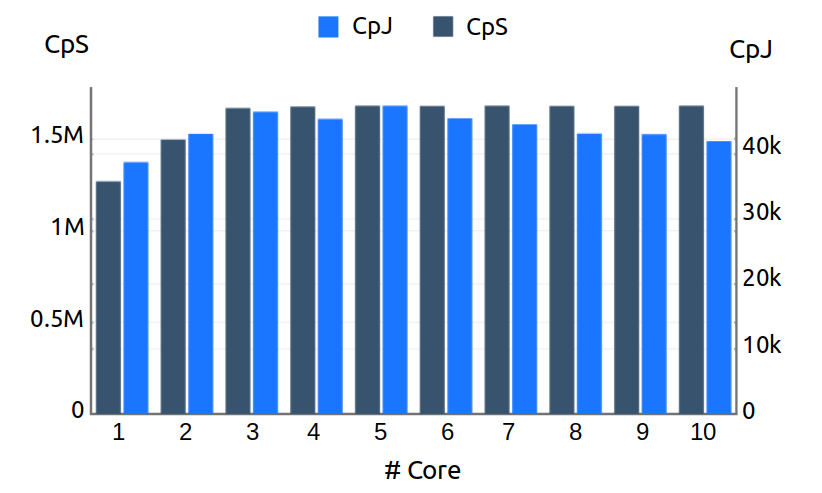 | 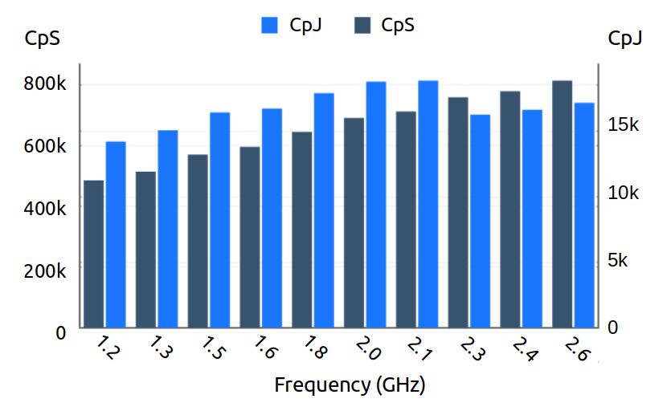 |

**Fig. 4.2** — CpS et CpJ pour différentes configurations du système.

Sur la Figure [4.2a](#fig-4-2a), la performance (i.e. CpS) augmente avant
d'atteindre un plateau à partir de 3 cœurs. Cela s'explique par une
saturation de l'accès mémoire, liée directement à la nature exigeante en
mémoire de l'application. Au-delà de 3 cœurs de calculs, on constate une
dégradation de l'efficacité énergétique. En effet, à partir de ce seuil, la
majorité des cœurs se retrouve en attente de données pour exécution, tout en
consommant de la puissance. Lorsque c'est la fréquence de fonctionnement qui
varie, pour un nombre de ressources de calcul fixe, on observe une
amélioration linéaire de la performance, figure [4.2b](#fig-4-2b).
L'efficacité énergétique, quant à elle, chute à partir d'une certaine
fréquence. Cela correspond au passage vers des fréquences supérieures à la
fréquence de base du processeur Intel Xeon (i.e. 2.2GHz), donnant lieu à une
augmentation de la puissance consommée.

**Discussion et hypothèses d'utilisation:** La métrique des chunks est définie
comme une métrique relative. Selon la terminologie employée dans OpenMP, un
chunk correspond à une itération d'une boucle parallèle. Ainsi, nous
considérerons uniquement des applications composées essentiellement de boucles
*for* parallélisées avec OpenMP. De plus, cette caractéristique (i.e. un chunk
est une itération de boucle *for*) fait que la taille d'un chunk varie en
fonction de la quantité de travail contenue dans une itération. Nous reviendrons
là-dessus par la suite, notamment dans la section
[4.2.2](#422-création-dun-benchmark-synthétique) où il est question de
différents types de calculs.

Il faut également noter que notre méthode de calcul du CpJ est basée sur la
consommation énergétique du système entier. Cela limitera nos expérimentations
au contrôle de l'exécution d'une seule application à la fois, de sorte que les
chunks représentent la majorité du calcul utile du système. Ainsi, dans nos
expérimentations, nous pourrons faire l'hypothèse que la consommation
énergétique du système est majoritairement impactée par les chunks de
l'application considérée.

#### 4.1.1.1 Méthode d'extraction des chunks

<a id="fig-4-3"></a>


**Fig. 4.3** — Diagramme séquentiel de la collecte de chunks (gauche) et méthode
de mise-à-jour du compteur de chunks (droite, pseudo-code).

L'implémentation de l'API OpenMP sur GNU est intégrée dans la bibliothèque
*libgomp* de GCC. En particulier, le mécanisme de planification responsable de
la répartition des chunks parmi les threads y est décrit. Cette bibliothèque est
liée à l'environnement d'exécution après compilation. Le suivi des chunks se
fait à ce niveau là. La bibliothèque *libgomp* est modifiée pour inclure le
mécanisme de collecte automatique des chunks décrit dans la figure
[4.3](#fig-4-3). Ainsi, à chaque allocation de chunks à un thread, un compteur
est mis à jour. Ce compteur est enregistré sur une mémoire partagée, créée via
l'API IPC (Inter-Process Communication) disponible sur le système d'exploitation
utilisé. Les fichiers binaires d'applications liés avec cette version modifiée
de GCC/*libgomp* peuvent ainsi réaliser cette instrumentation automatique. Il
est ensuite possible de suivre en temps réel l'évolution des métriques CpS et
CpJ durant l'exécution d'application, en allant lire dans la mémoire partagée
depuis un autre processus.

Nous avons donc implémenté une bibliothèque qui permet de créer des scripts
ayant accès aux valeurs de CpS et CpJ, et pouvant réaliser un traitement
arbitraire sur ces données. En collectant périodiquement le nombre de chunks, le
CpS est directement mesurable, et on en dérive le CpJ en accédant à la puissance
consommée. Cette donnée de consommation de puissance est accessible de façons
diverses selon les systèmes de calcul utilisés. Ainsi, pour la plate-forme
Odroid, les données de consommation sont obtenues en lisant directement les
sorties des capteurs de courant, alors que pour le serveur Intel, des compteurs
dédiés sont disponibles (i.e. compteurs RAPL). Ces derniers sont accessibles
soit via l'outil Intel PCM, soit en lisant directement les registres concernés.
Ces scripts de collecte peuvent ensuite servir à contrôler dynamiquement
différents paramètres du système, tel que la fréquence de fonctionnement ou
l'attribution des threads aux ressources de calcul du système (i.e.
planification "thread-to-core").

Le concept global est illustré sur la figure [4.3](#fig-4-3). Plus précisément,
elle décrit la lecture périodique de la mémoire partagée par le script de
collecte, pendant que l'outil de planification OpenMP (i.e. scheduler) gère, de
façon asynchrone, à la fois l'attribution des chunks aux threads et la mise à
jour du compteur dans la mémoire partagée. Pour des raisons de robustesse, seul
le scheduler est autorisé à écrire dans la mémoire partagée. De ce fait, il n'y
a pas à gérer de concurrence entre les threads qui, quant à eux, se contentent
de lire dans la mémoire. Enfin, aucun mécanisme de sécurité de la mémoire, tel
que les "mutex", n'est implémenté car la probabilité d'un accès simultané à la
mémoire partagée par le script et le scheduler est très faible. En effet, nous
avons observé qu'un tel évènement est négligeable, car automatiquement annulé
durant l'analyse des données (i.e. donnée aberrante), et leur traitement, e.g.
entraînement de réseau de neurones.

Ces métriques sont donc facilement implémentables et du fait qu'elles soient
extraites directement au niveau de l'environnement d'exécution d'OpenMP, elles
sont exploitables sur tout système et architecture disposant de la librairy
*libgomp*, i.e. la majorité des systèmes. De plus, elles peuvent être utilisées
durant l'exécution d'une application, ce qui ouvre des perspectives d'analyse en
temps réel de l'efficacité d'un système de calcul.

#### 4.1.1.2 Métrique des chunks: Formalisation

Nous venons de présenter la métrique des chunks nous permettant de suivre en
temps réel depuis le runtime l'évolution de l'exécution d'un workload. Nous
proposons ici de formaliser cette métrique.

Cette formalisation se concentre sur les workloads parallèles, les régions
séquentielles sont donc laissées de côté puisqu'elles ne sont pas sujettes à une
exécution en parallèle. Un workload parallèle peut être décrit comme un ensemble
fini de chunks, pouvant être exécutés aussi bien en série qu'en parallèle. On
note $\mathcal{I}$ l'ensemble des instructions supportées par le système
d'exécution considéré.

**Workloads parallèles:** Un workload parallèle $Par = \{C\}$ est un ensemble de
chunks $C = \{i_k\}$. Chaque $i_k$ représente une instance d'une instruction
appartenant à $\mathcal{I}$.

**Architecture:** On définit une architecture d'exécution $Arc = (Proc, Mem)$
d'un système de calcul comme une combinaison d'éléments de traitement $Proc$ et
de ressources mémoires associées $Mem$. On note $\alpha=\{Arc_k\}$ l'ensemble de
toutes les architectures possibles.

Une architecture peut être monitorée à l'aide de compteurs matériels et de
capteurs de consommation énergétique. On considère
$V = \langle v_1, v_2, ..., v_n \rangle$ comme un vecteur dont chaque valeur
$v_k$ correspond à une mesure des compteurs matériels et de la consommation
énergétique. Par exemple, ces valeurs peuvent être le nombre de *cache misses*,
*hits*, d'accès mémoire tels que *read* et *write*, etc. L'ensemble de tous ces
vecteurs est noté $\mathcal{V}$.

**Définition de l'exécution:** On définit la fonction d'exécution
$Ex: \mathcal{I} \times \alpha \rightarrow \mathcal{V}$, qui sort un vecteurs de
métriques, en fonction de l'exécution d'une instruction sur une architecture
donnée.

À partir de cette définition, l'exécution d'un chunk $C = \{i_k\}$ sur une
architecture $a \in \alpha$ produit un vecteur
$V = \langle v_1, v_2, ..., v_n \rangle$ de la façon suivante:
$\forall i_k \in C, Ex(i_k,a) = \langle v^k_1, v^k_2, ..., v^k_n \rangle$ tel
que

$$
v_1 = \sum\limits_{\forall i_k} v^k_1, v_2 = \sum\limits_{\forall i_k} v^k_2, ..., v_n = \sum\limits_{\forall i_k} v^k_n
$$

De ce fait, un chunk est une représentation de la charge de calcul à un degré de
granularité plus grossier que celui des instructions. En effet, le résultat de
l'exécution d'un chunk correspond à la somme des exécutions de toutes les
instructions comprises dans le chunk. Ainsi, mesurer les chunks permet de suivre
l'exécution d'une charge de calcul dans son ensemble, alors que le suivi global
reposant sur les compteurs matériels nécessite un traitement des données de type
"fusion de données", car ces compteurs donnent seulement des informations
spécifiques à des évènements indépendants.

**Exécution parallèle d'un workload:** Au cours de son exécution, une charge de
calcul parallélisé (précédemment noté $Par$) sera dispersée parmi un certain
nombre de threads d'exécution, dépendant de l'architecture ainsi que des choix
utilisateur (e.g. choix de configuration). On définit
$\mathcal{T} = \{th_1, th_2, ... th_n\}$ l'ensemble des threads
$th_{k, (k \in 1..n)}$ utilisés pour exécuter $Par$. On note
$q_{k, (k \in 1..n)} \in \mathcal{P}(Par)$ l'ensemble des chunks attribués pour
exécution à un thread $th_k$, tel que: $q_1 \cup q_2 \cup ... \cup q_n = Par$

**Performance et efficacité énergétique:** Pour un workload parallèle $Par$, le
temps d'exécution $\delta_{Par}$ est donné par la valeur maximale de
$\delta_{th_{k, (k \in 1..n)}}$, où
$\delta_{th_k}= \sum\limits_{C_i \in q_k} \delta_{C_i}$ représente la durée
d'exécution de tous les chunks contenus dans $q_k$ attribué au thread $th_k$.

De la même façon, la consommation énergétique $\epsilon_{Par}$ d'une charge de
travail parallèle est définie par la somme des
$\epsilon_{th_{k, (k \in 1..n)}}$, où
$\epsilon_{th_k}= \sum\limits_{C_i \in q_k} \epsilon_{C_i}$ représente l'énergie
nécessaire à l'exécution de tous les chunks de $q_k$ attribué au thread $th_k$.

La quantité de chunks exécutés par seconde peut être facilement calculée: ce
sont nos *Chunks par Seconde* (CpS). De même, la quantité de chunks exécutés par
Joule consommé peut être dérivée: ce sont nos *Chunks par Joules* (CpJ). Ces
métriques nous permettent de décrire respectivement la performance et
l'efficacité énergétique de charges de travail parallèles OpenMP. Ainsi, on
définit les deux métriques suivantes:

<a id="eq-4-1"></a>

$$
Perf(Par) = \frac{1}{\delta_{Par}} * \sum\limits_{q_k \in \mathcal{P}(Par)} |q_k|
\tag{4.1}
$$

et

<a id="eq-4-2"></a>

$$
EnergyEff(Par) = \frac{1}{\epsilon_{Par}} * \sum\limits_{q_k \in \mathcal{P}(Par)} |q_k|
\tag{4.2}
$$

La formule ([4.1](#eq-4-1)) définit notre métrique de performance basée sur les
chunks (i.e. CpS), pour l'exécution d'une charge de travail parallèle, alors que
la formule ([4.2](#eq-4-2)) décrit sont efficacité énergétique (i.e. CpJ).

**Discussion:** Nous formulons donc les chunks comme une métrique pertinente
pour suivre en temps réel l'exécution de workloads parallèles. De plus, pour le
suivi particulier de la performance et de l'efficacité énergétique, on définit
les métriques CpS et CpJ basées sur les chunks. Il est important de rappeler que
les caractéristiques des chunks varient en fonction de la boucle *for*
parallélisée. Ainsi, les métriques hybrides - i.e. CpS et CpJ - sont des
métriques spécifiques à la boucle parallélisée, et ne peuvent donc pas être
utilisées comme moyens de comparaison entre différents workloads.

Dans ces travaux, nous nous intéressons uniquement aux workloads parallèles.
Cependant, une charge de travail séquentielle peut être interprétée comme une
charge de travail parallèle ne s'exécutant que sur un seul thread i.e.
$\mathcal{T} = \text{singleton}$. De ce fait, en suivant cette formulation, il
est facile d'appliquer les formules ([4.1](#eq-4-1)) et ([4.2](#eq-4-2)) en
remplaçant simplement les termes $|q_k|$ par 1. En effet, une région
séquentielle est analogue à une région parallèle constituée d'un unique chunk.

### 4.1.2 Vers l'analyse de l'efficacité énergétique

La possibilité de suivre l'exécution d'une application et son efficacité peut
être exploitée pour déterminer la configuration système la plus avantageuse, du
point de vue de l'efficacité énergétique. Les codes d'application montrent
souvent différentes phases d'exécution qui diffèrent dans leur comportement, au
regard de leur utilisation des ressources matérielles, e.g. tâche riche en
calcul (*compute-intensive*) versus tâche riche en accès mémoires
(*memory-intensive*). Prenons l'exemple tendance d'une application s'exécutant
sur le cloud pour illustrer notre propos. Comme très bien décrit par
A.Bhattacharyya *et al.* [\[22\]](references.md#ref-22), une application cloud
traverse habituellement une multitude de types de tâches, i.e. workload, allant
du stockage en mémoire avec des périodes de chargement, aux périodes de
traitement gourmands en puissance calcul. Elle peut aussi avoir à réaliser des
tâches de communication, et les problèmes de latence qui en découlent.
Globalement, il y a autant de types de phases que de fonctionnalités présentes
sur l'application. Pour rester dans cette idée, un autre exemple classique sont
les applications pour smartphone. Cette famille d'applications joue le rôle
d'interface entre l'utilisateur et le système d'exploitation. De ce fait, elles
possèdent différentes phases de fonctionnement, comme la gestion des appels ou
l'accès à la galerie d'image, ou simplement rester en veille (*sleep mode*).

Ainsi, un changement de phase se traduit par un changement de type de workload.
Plus particulièrement, dans notre cas d'applications parallélisées, ce
changement signifie une modification des caractéristiques des chunks. En effet,
la métrique des chunks est relative à la charge de travail contenue dans une
itération de boucle. Ces changements causent des variations dans la consommation
énergétique, d'où le besoin d'adapter la configuration du système en fonction de
la phase courante de l'application, pour optimiser cette consommation
énergétique.

#### 4.1.2.1 Exemple d'application multi-phase

On montre le besoin d'adapter la configuration du système à la phase d'exécution
courante en illustrant la différence entre les applications *memory-intensive*
et *compute-intensive*. D'après la définition des chunks, les valeurs de CpS et
CpJ s'interprètent de la manière suivante: plus hautes sont les valeurs,
meilleures sont la performance et l'efficacité énergétique.

<a id="ex-2"></a>

**Exemple 2**

On considère le code OpenMP détaillé figure [4.4](#fig-4-4). Ce programme
est conçu pour avoir deux phases d'exécution, possédant différentes
caractéristiques.

<a id="fig-4-4"></a>

```c
00    #include <omp.h>
01  // Initialization
02    nthreads = 10;
03    double *A, *B, *C, *D;
04    posix_memalign((void**)&A, 64, 
                            n*sizeof(double));
05    posix_memalign((void**)&B, 64,
                            n*sizeof(double));
06    posix_memalign((void**)&C, 64, 
                            n*sizeof(double));
07    posix_memalign((void**)&D, 64,
                            n*sizeof(double));
08    for (i = 0; i < n1; ++i) {
09        A[i] = 0.1;
10        B[i] = 0.0;
11    }
12    for (i = 0; i < n2; ++i) {
13        C[i] = 0.1;
14        D[i] = 0.0;
15    }
16    omp_set_num_threads(nthreads);
17    for (j = 0; j < n; ++j) {
18      // Parallel region
19      #pragma omp parallel for 
            schedule(dynamic, 1) // directive OpenMP
20      for (i=0; i<n1; i++){                 
21          B[i] = A[i] + B[i];
22      }
23      // Parallel region
24      #pragma omp parallel for
            schedule(dynamic, 1) // directive OpenMP
25      for (i=0; i<n2; i++){                 
26          D[i] = fct(C[i], D[i]);
27      }
28    return 0;
```

**Fig. 4.4** — Un programme OpenMP simple en C possédant des phases
alternantes de type compute-intensive et memory-bound.

Ce programme consiste en une seule boucle *for* principale, exécutant
consécutivement deux autres boucles *for*. Ces deux boucles intriquées sont
les deux différentes phases (i.e. deux types différents de chunks) du
programme principal. La première boucle réalise de simples additions, et
effectue donc majoritairement des accès en mémoire. C'est une région de type
*memory-intensive*. La seconde boucle quant à elle est une région
*compute-intensive*, où fct() est une fonction nécessitant beaucoup de
calculs.

Sur la figure [4.5](#fig-4-5) est tracée l'évolution temporelle des CpJ et
CpS, collectés durant l'exécution de ce programme sur une configuration
fixée. La consommation énergétique accompagne ces tracés sur un troisième
graphique. Deux phases peuvent être observées sur les deux tracés des CpS et
CpJ, avec des comportements similaires. De plus, malgré son caractère
bruité, on peut considérer la consommation énergétique comme constante,
puisque qu'aucun motif particulier ne ressort. À partir de ces tracés, on
peut donc affirmer que les deux phases visibles sur les courbes
correspondent aux deux boucles décrites précédemment. Ces résultats montrent
que nos métriques de CpS et CpJ permettent de faire de l'analyse de phase.
*Note:* Ce résultat contre-intuitif (i.e. on peut s'attendre à voir une
variation de la consommation énergétique en fonction du type de workload)
s'explique en partie par le fait que les mesures sont faites pour le système
entier, et qu'elles ont été relevées pour une configuration du système
induisant une forte consommation énergétique - i.e. 19 cœurs à 2.1GHz -
masquant ainsi les variations liées à l'application.

<a id="fig-4-5"></a>

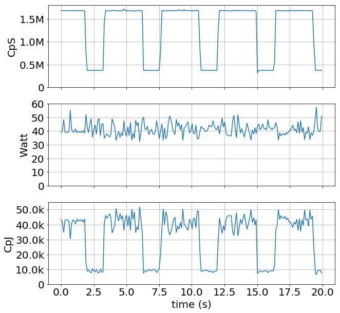

**Fig. 4.5** — Profile de l'application synthétique exécutée sur un serveur
Intel. De haut en bas: CpS, puissance consommée (Watt), CpJ.

Lorsque ce code est exécuté sur différentes configurations d'architecture,
on obtient pour l'efficacité énergétique les résultats visibles figure
[4.6](#fig-4-6).

<a id="fig-4-6"></a>

| <a id="fig-4-6a"></a>(a) Moyenne du CpS globale et par phase | <a id="fig-4-6b"></a>(b) Moyenne du CpJ globale et par phase | <a id="fig-4-6c"></a>(c) Répartition du temps d'exécution des phases |
|:--:|:--:|:--:|
| 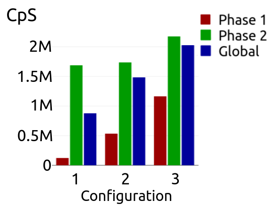 | 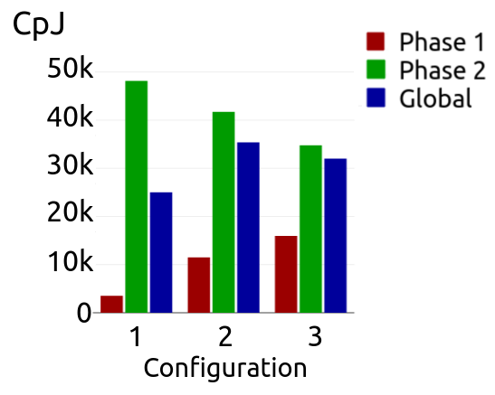 | 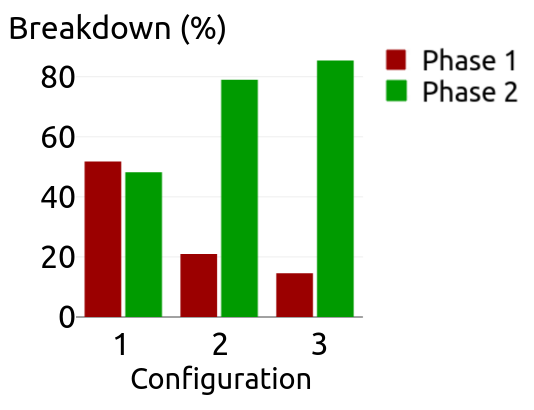 |

**Fig. 4.6** — Comparaison des métriques pour 3 configurations sur un
serveur Intel. 1: 2 cœurs et f= 1.5GHz; 2: 9 cœurs et f= 1.5GHz; 3: 17 cœurs
et f= 2.1GHz.(a): Décrit les valeurs moyennes du CpS, pour l'exécution
globale et pour chaque phase d'exécution, (b): Identique à (a) pour le CpJ,
(c): Répartition des durées des phases

La figure [4.6](#fig-4-6) montre en (a) la performance (CpS) et en (b)
l'efficacité énergétique (CpJ) de l'application dans sa globalité, mais
aussi pour chacune des deux phases d'exécution, pour trois configurations
particulières. La répartition (en %) du temps d'exécution entre les deux
phases est décrite en (c). On définit tout d'abord la configuration optimale
comme celle donnant la meilleure efficacité énergétique. On peut voire que
chaque phase possède une configuration optimale distincte. En effet, suivant
la notation utilisée sur la figure [4.6](#fig-4-6), les configurations 1 et
3 sont optimales respectivement pour la phase 1 et la phase 2. De plus, la
meilleure efficacité énergétique obtenue en considérant l'application dans
sa globalité est pour la configuration 2, différentes des optimums des
phases respectives. À noter que la possibilité d'alterner entre les
configurations 1 et 3 mènerait évidemment à de meilleurs résultats globaux,
comparés à ceux de la configuration 2, cette dernière étant manifestement un
compromis.

Dans cet exemple en particulier, une alternance entre les configurations 1
et 3 suivant les changements de phases d'exécution, plutôt que d'exécuter
entièrement l'application sur la configuration 2, permettrait d'obtenir une
augmentation du CpJ de près de 15% (en considérant un système parfait, sans
coût lié aux changements de configuration).

À partir de l'exemple ci-dessus, on voit que les CpS et CpJ sont des métriques
permettant de capturer aisément l'efficacité énergétique d'un système durant
l'exécution d'une tâche, et en fonction de ses phases. En effet, on observe
différents comportements des CpS et CpJ selon les différentes phases
d'exécution. Cela traduit le fait que ces phases (i.e. types de chunk) ont leur
propres caractéristiques de CpS et CpJ, nous permettant de conclure que ces
métriques permettent de capturer les phases d'application.

Ces phases d'exécution ont été observées, dans le cadre de l'exemple précédent,
a posteriori de l'exécution du programme. Un système en temps réel est donc
nécessaire pour automatiser ce traitement i.e. déterminer le nombre de phases
existantes dans l'application, les énumérer et finalement être capable
d'identifier quelle phase est en cours d'exécution. Cela permettra par la suite
d'identifier la configuration optimale d'une phase, et la sélectionner en temps
réel.

### 4.1.3 Auto-encodeur pour la détection de phase d'exécution

Nous avons donc montré que nos métriques de CpS et CpJ permettent de voir en
temps réel les phases d'exécution d'une application. Nous avons aussi observé
que, du point de vue de l'efficacité énergétique, ces phases peuvent nécessiter
différentes configurations. Ainsi, détecter les phases et identifier leur
configuration optimale sont les clefs d'un contrôle dynamique optimal.

Ici, nous proposons une solution pour détecter automatiquement en temps réel les
phases d'exécution d'applications. Notre solution exploite l'architecture des
auto-encodeurs [\[77\]](references.md#ref-77), une forme particulière de réseaux
de neurones permettant entre autres de faire de l'extraction de
caractéristiques. Ainsi, à l'aide d'un auto-encodeur entraîné, nous réalisons de
la détection de phases avec d'excellents résultats.

<a id="fig-4-7"></a>

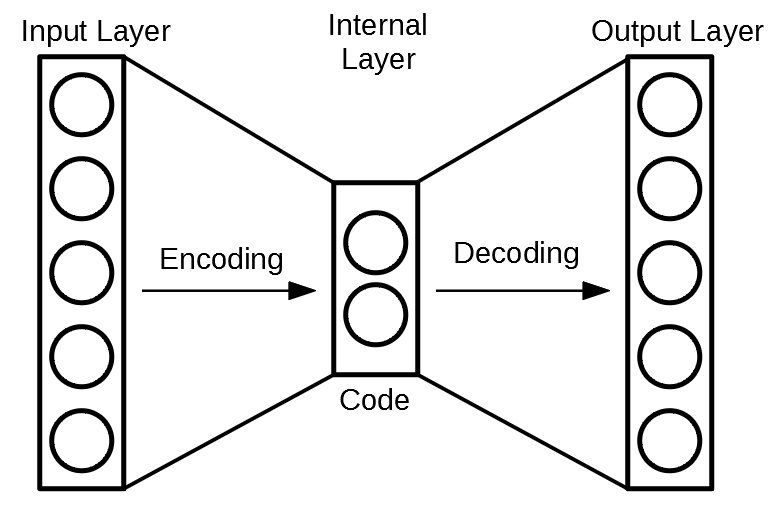

**Fig. 4.7** — Illustration du concept d'auto-encodeur

Les auto-encodeurs sont donc des topologies particulières de réseaux de neurones
profonds qui deviennent de plus en plus populaires. Ils sont utilisés dans
différents domaines d'application, comme le traitement d'images avec la
suppression de bruit [\[167\]](references.md#ref-167). L'objectif d'un
auto-encodeur est de réduire la dimensionnalité de ses données d'entrée, e.g. la
taille des images dans le cas du traitement d'images évoqué précédemment. Cette
compression dimensionnelle est réalisée par la forme en "goulot d'étranglement"
de l'architecture du réseau de neurones, comme illustré sur la figure
[4.7](#fig-4-7). En effet, les auto-encodeurs ont une forme symétrique, avec la
couche interne de neurones comme axe de symétrie, de dimension inférieure à la
couche d'entrée. Ainsi, deux parties distinctes peuvent être identifiées:
l'encodeur et le décodeur. Le premier définit la partie allant de la couche
d'entrée à la couche interne, tandis que le second désigne la partie allant de
la couche interne à la couche de sortie du réseau de neurones. Plusieurs couches
intermédiaires peuvent être implémentées à l'intérieur de ces deux parties, pour
augmenter la profondeur du réseau.

Un auto-encodeur est entraîné pour reproduire en sortie ce qui lui a été donné
en entrée. De cette façon, une représentation compacte de son entrée est
disponible à la frontière entre l'encodeur et le décodeur. C'est la couche
interne évoquée plus tôt, et décrite figure [4.7](#fig-4-7).

Dans notre cas, notre auto-encodeur est entraîné pour reproduire les valeurs de
CpS et les données de configuration système (i.e. *Confiuration data* sur la
figure [4.8](#fig-4-8): nombre de cœurs alloués et fréquence de fonctionnement),
en passant par la couche interne où sera récupérée l'information sur la phase.
L'architecture implémentée pour répondre à cette tâche de détection de phase est
illustrée figure [4.8](#fig-4-8), et décrite section
[4.1.3.1](#4131-auto-encodeur-proposé).

#### 4.1.3.1 Auto-encodeur proposé

<a id="fig-4-8"></a>

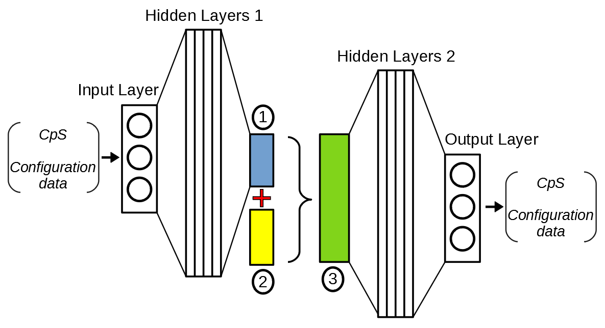

**Fig. 4.8** — Auto-encodeur conçu. 1: couche interne, 2: données de
configuration (#cœurs, fréquence), 3: concaténation de 1 et 2

Dans le but d'extraire une information sur la phase, une couche discrète
(rectangle bleu, numéroté 1), i.e. sorties des neurones binaires, est utilisée
comme couche interne. L'information sur la configuration du système (fréquence
et nombre de cœurs de calcul alloués), représentée par le rectangle jaune
numéroté 2, est donnée directement en entré du décodeur (rectangle vert numéroté
3) en la concaténant aux informations contenues dans la couche interne. De ce
fait, l'auto-encodeur est contraint de se construire une représentation discrète
des CpS, en se basant sur les informations de configuration. In fine, cette
représentation correspondra à l'information sur la phase. Cela correspond donc à
un entraînement non-supervisé d'un classificateur. En effet, le nombre de
classes correspondant aux nombre de phases différentes n'est pas donné a priori
à l'auto-encodeur. Chaque classe déterminée par l'entraînement de
l'auto-encodeur correspond à une phase d'exécution identifiée par le réseau.
L'entraînement nécessite par contre une première étape de collecte de données,
pour balayer les différentes configuration systèmes et collecter les valeurs de
CpS et CpJ correspondantes.

Après l'entraînement, le modèle a seulement besoin des données de CpS et de la
configuration système pour déterminer la phase d'exécution courante du programme
en cours. Ainsi, cela rend possible une détection de phase en temps réel.

#### 4.1.3.2 Preuve de concept sur SRAD (benchmark Rodinia)

Nous avons donc un framework pour du suivi en temps réel de l'efficacité
énergétique d'applications OpenMP, avec une méthode de détection de phase pour
les applications ayant différentes phases d'exécution avec différentes
configurations optimales. Nous proposons d'illustrer l'utilisation de ce
framework avec le benchmark SRAD, issu de la suite de benchmark Rodinia
[\[41\]](references.md#ref-41). Les tests sont effectués sur deux systèmes de
calculs: un serveur Intel-Xeon à deux processeurs (*socket*) multi-cœurs (20
cœurs, 10 par socket), et une plate-forme Odroid XU3 basée sur l'architecture
Armv7 big.LITTLE.

<a id="fig-4-9"></a>

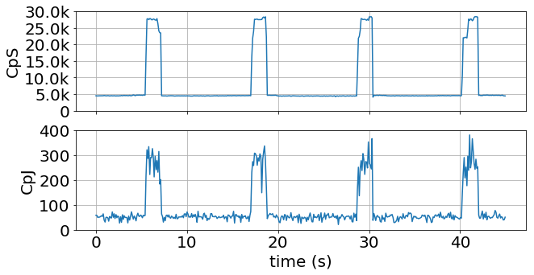

**Fig. 4.9** — Échantillon de l'exécution de l'application SRAD. Profils selon
le CpS et le CpJ.

Dans la suite, le terme de configuration système désigne un ensemble de deux
caractéristiques: le nombre de cœurs de calcul attribués à l'exécution du
programme, et la fréquence de fonctionnement de ces cœurs. Comme illustré sur la
figure [4.9](#fig-4-9), le benchmark SRAD est un choix pertinent pour tester
l'ensemble du framework. En effet, sur cette figure sont tracées les courbes de
CpS et CpJ pour l'exécution de SRAD sur une configuration fixe, et on observe
deux phases d'exécution distinctes.

<a id="fig-4-10"></a>

| <a id="fig-4-10a"></a>(a) CpJ pour le serveur Intel, 95 configurations | <a id="fig-4-10b"></a>(b) CpJ pour le serveur Intel, zoom sur les configurations optimales (soulignées des couleurs des phases correspondantes) |
|:--:|:--:|
| 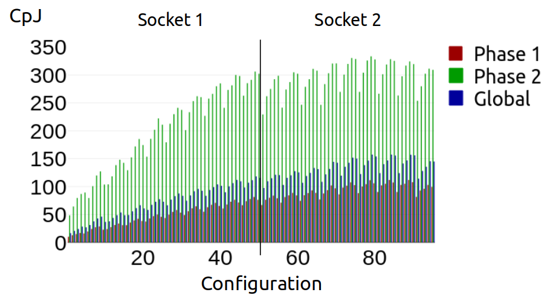 | 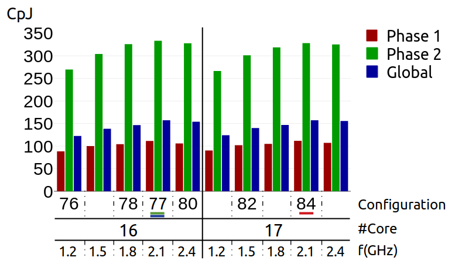 |

| <a id="fig-4-10c"></a>(c) CpJ pour la carte Odroid, 52 configurations | <a id="fig-4-10d"></a>(d) CpJ pour la carte Odroid, zoom sur les configurations optimales (soulignées des couleurs des phases correspondantes) |
|:--:|:--:|
| 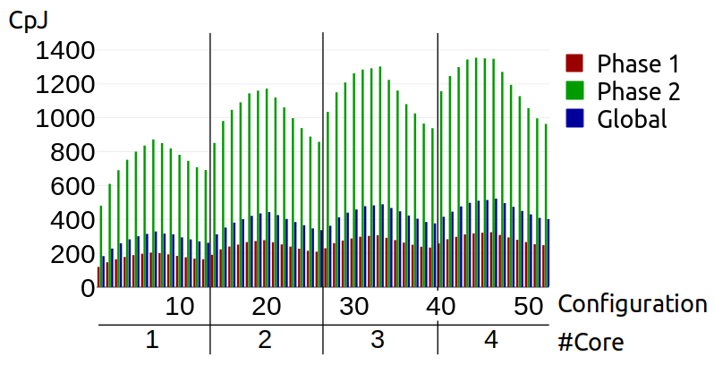 | 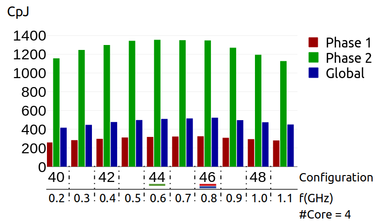 |

**Fig. 4.10** — Caractérisation de l'application SRAD, sur deux architectures:
un serveur Intel possédant 20 cœurs et une plate-forme Arm avec 4 cœurs
hétérogènes.

Une caractérisation de cette application est lancée sur les deux systèmes de
calculs, en explorant toutes les configurations possibles, i.e. toutes les
fréquences et ensembles de cœurs possibles. Les figures
[4.10a](#fig-4-10a) et [4.10b](#fig-4-10b) montrent les résultats pour la
caractérisation sur le serveur Intel. Le panel des configurations démarre à un
seul cœur et augmente progressivement jusqu'à 19, car le cœur dédié à la
collecte des données a été exclu. Pour chaque nombre de cœurs, un ensemble de
fréquences est exploré, allant de 40 à 80% de la fréquence maximale, par pas de
10%. Les fréquences plus élevées ne sont pas utilisées pour notre analyse car
sujettes à une régulation (*CPU throttling*) causée par "l'enveloppe thermique"
(TDP) du processeur. Cela nous donne un total de 95 configurations différentes.

La même expérimentation est menée sur la carte Odroid, et décrite figures
[4.10c](#fig-4-10c) et [4.10d](#fig-4-10d), avec des résultats similaires. À
noter que pour chacun des systèmes les configurations menant aux meilleures
performances sont différentes et identifiées sur les figures
[4.10b](#fig-4-10b) et [4.10d](#fig-4-10d). Ce simple exemple démontre une
nouvelle fois la pertinence des métriques proposées (CpS et CpJ) pour obtenir
des informations sur des applications s'exécutant aussi bien sur des systèmes
embarqués tels que la carte Odroid, que sur des systèmes de calculs
haute-performance (HPC) tels que le serveur Intel.

<a id="fig-4-11"></a>

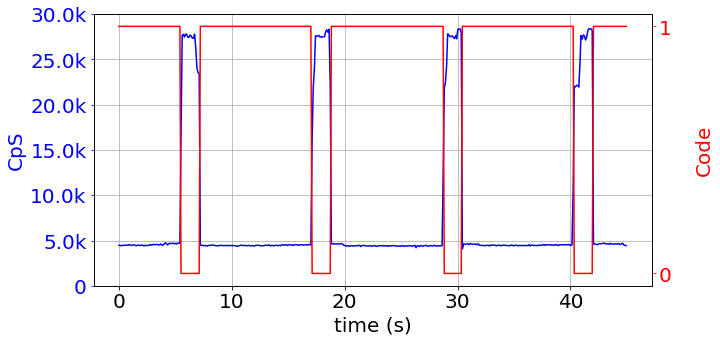

**Fig. 4.11** — Exemple de détection de phase pour l'application SRAD, sur le
profil du CpS.

Sur la figure [4.11](#fig-4-11) sont tracés l'évolution des CpS avec les deux
phases différentes détectées en temps réel par l'auto-encodeur. Cela illustre
les très bons résultats dans l'ensemble de l'auto-encodeur, après une durée
d'entraînement relativement courte. En effet, l'entraînement de l'auto-encodeur
prend entre 1min et 5min pour chaque jeu de données (serveur Intel et carte
Odroid), et converge vers son erreur finale (*loss*) après quelques dizaines de
secondes. Ces entraînements ont tous été menés sur le serveur Intel Xeon,
disposant de CPUs Xeon E3-1225v3. Comme attendu, une fois entraîné, notre
encodeur produit un code correspondant à chaque phase. La valeur du code est
arbitraire et peut varier d'un entraînement à l'autre, et doit donc être
interprétée comme un type énuméré.

## 4.2 Optimisation des CpJ: méthodologie et solution

Nous avons donc à notre disposition une "boîte à outils" composée de métriques
pour suivre en temps réel les performances et l'efficacité énergétique
(respectivement CpS et CpJ) d'une application OpenMP parallélisée, ainsi que
d'un outil de détection automatique de phases via l'exploitation des
auto-encodeurs. Afin de garantir les hypothèses d'utilisation des CpJ définies
section [4.1.1](#411-chunks-et-métriques-associées), les applications
considérées seront composées essentiellement de boucles *for* parallélisées de
sorte que les chunks représentent la majorité du calcul utile du système de
calcul. Ainsi, pour la mesure du CpJ, nous pourrons raisonnablement supposer que
la consommation énergétique du système est impactée majoritairement par les
chunks. Ensuite, les chunks étant spécifiques au workload parallélisé, nous
considérerons le contrôle d'une seule application à la fois.

Dans cette partie, nous proposons une solution d'optimisation de l'efficacité
énergétique, via l'optimisation des CpJ. Cette solution est basée sur
l'apprentissage par renforcement, qui a l'avantage de ne pas requérir de données
collectées en amont de son entraînement.

**Note:** Pour la suite de cette partie, seul le serveur Intel Xeon sera utilisé
pour les expérimentations. En effet, aux vue de l'état de l'art récent ciblant
majoritairement les systèmes hétérogènes (e.g. carte Odroid bib.LITTLE), il
semblait plus intéressant de se focaliser sur un système de type serveur SMP
(*Symmetric Multiprocessing*), à l'architecture homogène.

### 4.2.1 Méthodologie

Tout d'abord, dans cette section est présentée la méthode suivie pour créer,
tester et valider notre solution de contrôle dynamique pour l'optimisation des
CpJ.

**Étape 1: Création d'un benchmark synthétique** Nous avons montré précédemment
que les chunks sont une métrique relative au type de travail effectué, et que la
configuration optimale (i.e. menant la meilleure efficacité énergétique) varie
selon le type de chunks. Nous proposons donc dans un premier temps d'illustrer
plus en détails cet impact du type de chunks sur la configuration optimale en
s'appuyant sur la dualité "compute-intensive vs. memory-intensive" évoquée en
[4.1.1](#411-chunks-et-métriques-associées). Pour cela nous proposons un
benchmark synthétique, développé section
[4.2.2](#422-création-dun-benchmark-synthétique), composé d'applications OpenMP
statiques (i.e. un seul type de chunks et une phase d'exécution). Ce benchmark
nous servira par la suite à démontrer l'efficacité de notre système de contrôle
dynamique, détaillé en
[4.2.3](#423-apprentissage-par-renforcement-pour-de-la-reconfiguration-dynamique).

**Étape 2: Implémentation d'un apprentissage profond par renforcement adapté**
Pour assurer les prises de décision en temps réel (i.e. le cœur du système de
contrôle), nous proposons d'implémenter une IA basée sur l'apprentissage profond
par renforcement. Comme évoquée en section
[2.4.2](02-research-axes.md#242-prise-de-décision-automatique-et-rl),
l'apprentissage par renforcement est privilégiée pour les solutions de prises de
décisions, car il garantit en théorie de converger vers les meilleures solutions
possibles. De plus, le fait ici d'utiliser une méthode d'apprentissage profond
(i.e. réseau de neurones) permet d'avoir une solution prenant en compte un champ
de possibilité très grand. Nous développons ce point section
[4.2.3](#423-apprentissage-par-renforcement-pour-de-la-reconfiguration-dynamique).

**Étape 3: Évaluation du système de contrôle** Enfin, nous évaluerons notre
système sur différentes applications. Dans un premier temps, nous comparerons
les performances de notre système pour le benchmark DGEMM
[\[99\]](references.md#ref-99) avec les différents gouverneurs Linux. Ensuite,
nous nous intéresserons aux applications multi-phases avec une application
synthétique composite de deux applications statiques, et le benchmark SRAD. Les
résultats font l'objet d'une nouvelle partie, en
[4.3](#43-résultats-et-analyses).

Note: de futurs travaux devront valider notre système sur un plus large ensemble
d'applications multi-phases, notamment en se basant sur des suites de benchmarks
connues comme Rodinia et PARSEC.

### 4.2.2 Création d'un benchmark synthétique

#### 4.2.2.1 Benchmark synthétique: Modèle

Pour extraire les gains potentiels en efficacité énergétique du système de
calcul choisi (i.e. serveur Intel), nous avons conçu un modèle paramétrable de
benchmark synthétique à partir duquel on peut dériver des benchmarks aux profils
différents. Le modèle est construit autour de deux blocs de code consécutifs et
paramétrés, permettant de couvrir les opérations de type *memory-intensive* et
de type *compute-intensive*. De ce fait, les applications ainsi créées possèdent
différents comportements, selon leur intensité en termes d'accès mémoire et de
besoin en calculs. Le modèle est décrit sur la figure [4.12](#fig-4-12).

<a id="fig-4-12"></a>

```c
00  #include <omp.h>
01  // Initialization
02  Some environment definitions
03  // Parallelization
04  omp_set_num_threads(nthreads);
05  // OpenMP directive 
06  #pragma omp parallel for schedule(dynamic, 1)
07  for (i=0; i<n; i++){  
08      for (j=0; j<100; j++){
09          if (j < coef){
10              MEM-intensive code fragment
11          }
12          else{
13              CPU-intensive code fragment
14          }
15  }
16  return 0;
```

**Fig. 4.12** — Modèle du Benchmark.

Le segment de code de type *memory-intensive* exécute un ensemble d'opérations
sur de grands vecteurs telles que des additions, copies et permutations.
L'intensité du recrutement mémoire dépend donc de la taille des vecteurs, de
leurs dimensions, et du comportement aléatoire des différents accès aux vecteurs
(i.e. augmente la probabilité des *cache-misses*). Le segment
*compute-intensive* quant à lui exécute un ensemble de calculs mathématiques
relevant de l'algèbre linéaire et de combinaisons de fonction arithmétiques et
trigonométriques, faisant appel à des méthodes calculatoires intenses telles que
l'analyse en série de Fourier et différentes opérations en virgule flottante. La
charge de stress appliquée au(x) CPU(s) dépend alors du nombre d'appels à ces
fonctions, et de leurs caractéristiques. De ce fait, ces deux blocs sont des
codes basiques représentatifs des deux caractéristiques que l'on souhaite mettre
en relief. Enfin, pour dériver un benchmark, le ratio entre l'intensité CPU et
l'intensité Mémoire est fixé par la variable "coef".

#### 4.2.2.2 Caractérisation des applications synthétiques

À partir du modèle décrit plus haut, 6 benchmarks sont produits: *C100M0*,
*C98M2*, *C96M4*, *C90M10*, *C80M20*, *C0M100*. La notation *CxMy* traduit les
proportions entre les deux modes de contraintes que l'on souhaite cibler: *x*
est le pourcentage d'intensité CPU et *y* celui de l'intensité Mémoire. Ainsi,
les benchmarks *C0M100* et *C100M0* sont respectivement exclusivement
*memory-intensive* et *compute-intensive*. On attribue jusqu'à 19 cœurs de
calcul aux threads d'exécution, parmis les 20 disponibles sur notre serveur
Intel (c.f. section
[4.1.3.2](#4132-preuve-de-concept-sur-srad-benchmark-rodinia)).

<a id="tab-4-1"></a>

| **CPU intensity oriented** | **Memory intensity oriented** |
|---|---|
| IPC = instructions per CPU cycle | RW = MEM Read and Write |
| EXEC = instructions per nominal <br> CPU cycle | L3MB = L3 cache external memory <br> bandwidth |
| L3HIT = L3 (read) cache hit ratio | L2MPI = number of L2 (read) <br> cache misses per instruction |
| INST = Instructions retired | L3MPI = number of L3 (read) <br> cache misses per instruction |

**Tableau 4.1** — Description des compteurs Intel PCM.

Toutes les valeurs décrites dans la suite de cette partie sont collectées à
partir des compteurs matériels de performance Intel, via l'outil Intel PCM
[\[1\]](references.md#ref-1), et décrites à travers les graphiques radars
présentés sur la figure [4.13](#fig-4-13). Le tableau [4.1](#tab-4-1) liste
toutes les métriques considérées (i.e. compteurs de performance), triées en
fonction de leur nature, selon si elles relèvent de comportements calculatoires,
ou d'utilisations mémoires. La figure [4.13](#fig-4-13) montre que chaque
application possède son propre profil, et stimule différemment le CPU et la
mémoire, avec différents impacts sur les compteurs. En effet, le benchmark
"CPU-intensive" *C100M0* possède tous les compteurs concernés à leur valeur
maximale. À l'inverse, le benchmark "memory-intensive" *C0M100* possède tous les
compteurs orientés mémoire à leur maximum.

<a id="fig-4-13"></a>

| <a id="fig-4-13a"></a>(a) C100M0 | <a id="fig-4-13b"></a>(b) C98M2 | <a id="fig-4-13c"></a>(c) C96M4 | <a id="fig-4-13d"></a>(d) C90M10 |
|:--:|:--:|:--:|:--:|
| 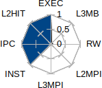 | 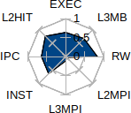 | 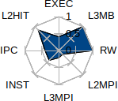 | 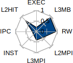 |

| <a id="fig-4-13e"></a>(e) C80M20 | <a id="fig-4-13f"></a>(f) C0M100 |
|:--:|:--:|
| 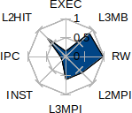 | 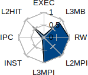 |

**Fig. 4.13** — Profil des applications selon les compteurs PCM.

<a id="fig-4-14"></a>

| <a id="fig-4-14a"></a>(a) C100M0 | <a id="fig-4-14b"></a>(b) C98M2 | <a id="fig-4-14c"></a>(c) C96M4 | <a id="fig-4-14d"></a>(d) C90M10 |
|:--:|:--:|:--:|:--:|
| 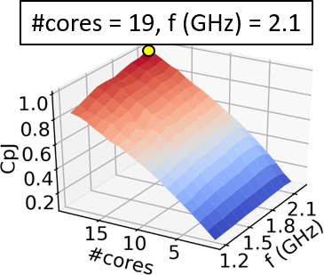 | 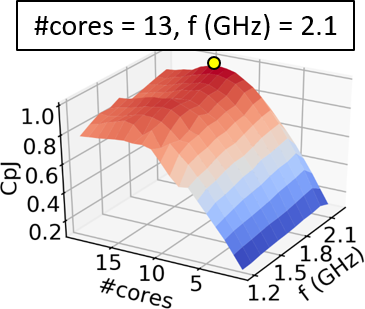 | 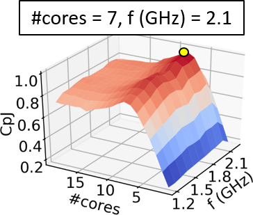 | 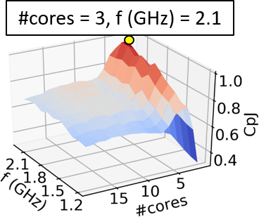 |

| <a id="fig-4-14e"></a>(e) C80M20 | <a id="fig-4-14f"></a>(f) C0M100 |
|:--:|:--:|
| 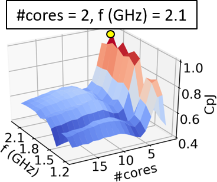 | 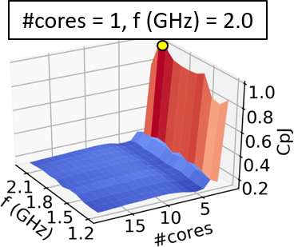 |

**Fig. 4.14** — Caractérisation de l'efficacité énergétique des applications
(i.e. CpJ) et configuations optimales.

#### 4.2.2.3 Efficacité énergétique

<a id="tab-4-2"></a>

| **Benchmark** |  | C100M0 | C98M2 | C96M4 | C90M10 | C80M20 | C0M100 |
|---|---|---|---|---|---|---|---|
| **Best Conf.** | CpJ | 3866 | 2505 | 1581 | 818 | 517 | 336 |
| i.e. Reference | CpS | 303k | 170k | 90k | 40k | 25k | 12k |
| **vs.** | CpJ | 10% | 25% | 29% | 95% | 60% | 442% |
| **Performance** | CpS | -12% | -11% | -19% | 21% | 1% | 151% |
| **vs.** | CpJ | 16% | 24% | 33% | 44% | 75% | 469% |
| **Powersave** | CpS | 75% | 59% | 49% | 56% | 92% | 355% |
| **vs.** | CpJ | 10% | 20% | 32% | 18% | 75% | 433% |
| **Ondemand** | CpS | -12% | -14% | -17% | -1% | 50% | 193% |
| **vs.** | CpJ | 10% | 20% | 29% | 32% | 56% | 469% |
| **Conservative** | CpS | -12% | -14% | -19% | -16% | 1% | 160% |

**Tableau 4.2** — Gains en efficacité énergétique (CpJ) et performance (CpS) des
configurations optimales des benchmarks, en comparaison avec les gouverneurs
Linux: Powersave, Performance, Ondemand et Conservative.

Pour chacun des 6 benchmarks proposés, nous réalisons une caractérisation
exhaustive, i.e. nous exécutons l'application pour chaque configuration possible
(fréquence et nombre de cœurs) et reportons le CpJ moyen sur l'ensemble de la
durée d'exécution. *Note:* La mesure de la consommation énergétique utilisée
pour calculer les CpJ est directement extraite des registres spécifiques au
modèle (MSR) RAPL d'Intel [\[74\]](references.md#ref-74).

Les résultats sont présentés figure [4.14](#fig-4-14), où la meilleure
configuration est étiquetée. On remarque la diversité des configurations
optimales parmi les applications, qui souligne la dualité entre l'intensité des
contraintes CPU et l'intensité des contraintes Mémoire au sein des applications.
En effet, les deux applications extrêmes (*C100M0* et *C0M100*) possèdent deux
configurations optimales (en terme de CpJ) opposées, au regard du nombre de
ressources de calcul attribuées, i.e. 1 cœur pour l'application
*memory-intensive* contre 19 cœurs pour l'application *CPU-intensive* (nombre
maximum de cœur attribué, avec 1 cœur par thread).

Pour observer l'impact que peut avoir l'attribution de la meilleure
configuration d'une application, durant son exécution sur le système de calcul
concerné, on compare les valeurs de CpJ et CpS moyennes pour des exécutions
soumises aux gouverneurs Linux suivant: Powersave, Performance, Ondemand et
Conservative. Les résultats sont reportés dans le tableau [4.2](#tab-4-2).

Nous obtenons des gains potentiels en efficacité énergétique allant de 10% à
469%, en comparaison avec les gouverneurs Linux. Des pertes de performance sont
observées sur la majorité des applications de type *CPU-intensive*, mais sont
toujours inférieures à 20%, ce qui reste raisonnable comparé aux considérables
améliorations en efficacité énergétique. Le principal problème avec les
gouverneurs Linux est l'absence de gestion des ressources, en termes de contrôle
*thread-to-core*. Cela met en valeur les avantages de pouvoir contrôler
l'attribution des ressources de calcul aux applications parallélisées. D'où
l'utilisation d'apprentissage "en-ligne" décrite plus tard pour adapter de façon
dynamique la configuration du système.

### 4.2.3 Apprentissage par renforcement pour de la reconfiguration dynamique

Comme déjà évoqué, la solution proposée pour réaliser le contrôle dynamique de
la configuration du système pour maximiser son efficacité énergétique se base
sur l'apprentissage par renforcement. Plus précisément, nous nous inspirons du
Deep Q-learning (DQL) [\[112\]](references.md#ref-112), une technique
d'apprentissage profond développée par DeepMind en 2015.

Ainsi, le système de contrôle que nous proposons réalise à la fois
l'entraînement de son réseau de neurones et le contrôle des configurations en
temps réel, durant l'exécution de l'application contrôlée.

Ce système est décrit figure [4.15](#fig-4-15).

<a id="fig-4-15"></a>

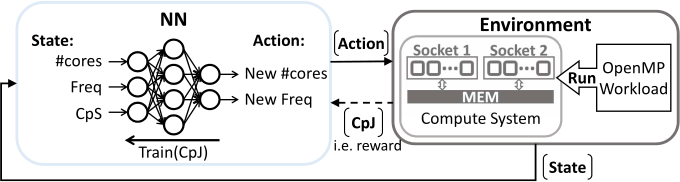

**Fig. 4.15** — Système de contrôle.

Il est basé sur le principe de récompense utilisé dans l'apprentissage par
renforcement (RL pour *Reinforcement Learning*). Ici, le réseau est seulement
entraîné pour réaliser de l'inférence combinatoire, ce qui signifie que ses
prises de décision sur les actions à réaliser dépendent uniquement de l'état
courant du système, i.e. ce n'est pas fonction des états précédents comme
originalement dans le DQL. Notre modèle a tout de même été développé de façon
générique pour supporter le DQL d'origine, mais ce n'est pas l'objet de cette
contribution. L'environnement représente le système de calcul multi-cœurs
exécutant les applications OpenMP. Pour chaque état possible, la qualité de
chaque action (i.e. configuration système) est évaluée via la fonction de
récompense (i.e. reward) qui est directement fonction du CpJ. Ainsi, notre
approche pour obtenir un contrôle efficace repose sur une définition compacte de
l'état de l'environnement, permettant d'assurer une certaine rapidité
d'exploration et de convergence. De ce fait, l'état est défini à partir de la
configuration du système de calcul (i.e. fréquence courante et nombre de cœurs
actifs) et de la valeur du CpS.

#### 4.2.3.1 Processus de prise de décision

La prise de décision "en-ligne" repose sur l'apprentissage par l'expérience i.e.
*learning-by-doing*. En suivant la terminologie du RL, les décisions sont
appelées *actions* et l'environnement est défini par son *état*. Le système
commence à prendre des décisions à la fin de son apprentissage, appelé *phase
d'exploration*. Durant cette phase d'exploration, des actions aléatoires sont
prises afin de déterminer la meilleure action pour chaque état. Les actions sont
récompensées en fonction des bénéfices qu'elles apportent (ici, en fonction de
la valeur du CpJ). L'avantage d'utiliser ici un réseau de neurones (NN pour
*Neural Network*) repose sur ses capacités d'interpolation i.e. la capacité de
prédire une action en fonction d'un nouvel état inconnu, en se basant sur le
savoir accumulé durant la phase d'exploration.

Dans notre contexte, l'état est défini par la configuration du système couplée
avec la valeur du CpS, i.e. l'ensemble des états n'est pas un ensemble discret.
Une action est une nouvelle configuration à appliquer au système, et la
récompense est la valeur du CpJ résultante de ce changement. L'API Tensorflow
[\[2\]](references.md#ref-2) est utilisée pour construire le réseau de neurones,
via l'interface Keras [\[44\]](references.md#ref-44).

Globalement, ce système est efficace pour le contrôle d'applications statiques
(i.e. à une seule phase d'exécution). Nous illustrons ses performances dans la
section [4.3.1](#431-applications-omp-statique) sur le benchmark DGEMM
[\[99\]](references.md#ref-99). Cependant, ce système a plus de difficultés pour
contrôler l'exécution d'applications possédant différentes phases
d'entraînement. En effet, même en utilisant toutes les ressources du DQL (avec
la prise en compte des états passés), le système n'apprend pas correctement à
identifier les phases de fonctionnement. Ainsi, nous proposons d'inclure dans
notre boucle de contrôle l'outil de détection de phases présenté plus haut.

#### 4.2.3.2 Inclusion de l'auto-encodeur pour les applications multi-phases

<a id="fig-4-16"></a>


**Fig. 4.16** — Auto-encodeur proposé.

Nous proposons donc d'inclure au système de contrôle l'auto-encodeur présenté
section [4.1.3.1](#4131-auto-encodeur-proposé) en figure [4.8](#fig-4-8) et
résumé ici figure [4.16](#fig-4-16). Il est entraîné hors-ligne à reproduire
l'état de l'environnement (i.e. valeur de CpS et configuration du système).
Ainsi, on peut extraire de sa couche interne des informations relatives à la
phase de l'application en cours d'exécution, désignées par le terme *code* sur
la figure [4.16](#fig-4-16).

Ainsi, le système de contrôle final est décrit figure [4.17](#fig-4-17).
L'auto-encodeur permet de récupérer directement l'information de la phase. De ce
fait, la valeur du CpS devient obsolète pour l'apprentissage, et est directement
remplacée par l'information sur la phase. Nous illustrons le bon fonctionnement
du système en section [4.3.2](#432-applications-omp-variables), où une
application synthétique à deux phases nous sert de preuve de concept.

<a id="fig-4-17"></a>

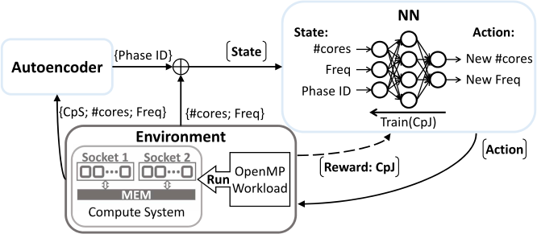

**Fig. 4.17** — Système de contrôle avec l'auto-encodeur.

#### 4.2.3.3 Détails d'implémentation des réseaux de neurones

Tous nos réseaux de neurones sont implémentés en Python. Nous utilisons plus
précisément l'API Tensorflow [\[2\]](references.md#ref-2), avec Keras
[\[44\]](references.md#ref-44) comme frontend. Les apprentissages utilisent
l'optimiseur *Adam* de Keras, paramétré par défaut. Les dimensionnements des
réseaux n'ont pas fait l'objet d'une optimisation particulière. Ils sont basés
sur les tendances relevées dans l'état de l'art, et nos résultats expérimentaux.

**Agent ("NN" figure [4.15](#fig-4-15)):** Notre agent est décrit dans le
tableau [4.3](#tab-4-3). Il est constitué de 3 couches cachées (i.e. L1, L2 et
L3) de type *Dense*. La dimension correspond au nombre de neurones. La couche
d'entrée est de dimension 3, i.e. la dimension de l'état de l'environnement, et
la dimension de la couche de sortie est de 209, i.e. le nombre d'actions
possibles.

<a id="tab-4-3"></a>

| **Couches:** | Entrée | L1 | L2 | L3 | Sortie |
|---|:--:|:--:|:--:|:--:|:--:|
| Type | Input | Dense | Dense | Dense | Dense |
| Dimensions | 3 | 8 | 64 | 256 | 209 |
| Fonction d'activation | *–* | *Linear* | *Linear* | *Linear* | *Linear* |

**Tableau 4.3** — Dimensionnement du réseau de neurones de l'Agent.

La période d'exploration prend 2048 itérations. Ce nombre d'itérations a été
déterminé expérimentalement pour garantir un apprentissage correct de notre
agent tout en minimisant la quantité de données collectées (i.e. temps
d'exploration réduit). L'apprentissage prend moins de 100ms par itération. Afin
de permettre un l'apprentissage en temps réel, nous choisissons une période
d'échantillonnage du contrôleur de 500ms par itération. Enfin, une inférence est
réalisée en moins de 2ms.

**Auto-encodeur:** L'auto-encodeur est décrit dans le tableau
[4.4](#tab-4-4). Il est composé de 7 couches cachées successives, réparties
comme suit : 3 pour la partie encodage (i.e. L1, L2, L3), 3 pour la partie
décodage (i.e. L4, L5, L6), et une pour le code interne. Le code interne est une
couche dense binaire de dimension 2, de sorte que le code de phase peut prendre
4 valeurs. La binarisation est assurée par l'utilisation de la fonction
d'activation *binary tanh*. L'apprentissage se fait en 50 époques, et prend
moins de 5s par époque. Par conséquent, il est réalisé hors-ligne. Enfin, il
faut moins de 5ms pour prédire l'ID de la phase, ce qui permet de réaliser
l'inférence durant l'exécution.

<a id="tab-4-4"></a>

| **Modules:** | Encodeur | Encodeur | Encodeur | Encodeur |  |  | Décodeur | Décodeur | Décodeur | Décodeur |
|---|:--:|:--:|:--:|:--:|:--:|:--:|:--:|:--:|:--:|:--:|
| **Couches:** | Entrée | L1 | L2 | L3 | Interne | Interne | L4 | L5 | L6 | Sortie |
| Type | Input | Dense | Dense | Dense | Dense | Dense | Dense | Dense | Dense | Dense |
| Dimensions | 3 | 100 | 100 | 100 | 2 | 2 | 100 | 100 | 100 | 3 |
| Fonction d'activation | *–* | *Linear* | *Linear* | *Linear* | *binary tanh* | *binary tanh* | *Linear* | *Linear* | *Linear* | *Linear* |

**Tableau 4.4** — Dimensionnement de l'auto-encodeur.

## 4.3 Résultats et analyses

Dans cette dernière partie sont exposées les différentes expérimentations et
leurs résultats. Elles sont menées sur le serveur Intel Xeon présenté
précédemment. Ici, le driver utilisé est le CPUFreq par défaut sur le noyau
Linux, à la place du driver d'Intel, le *Intel P-State*. Il permet entre autres
d'accéder aux gouverneurs Linux tel que *ondemand*
[\[127\]](references.md#ref-127).

Les configurations possibles vont donc de 1 à 19 cœurs, répartis équitablement
sur les deux sockets, pour une fréquence de fonctionnement allant de 1.2GHz à
2.2GHz, par pas de 100MHz. Nous n'explorons pas les fréquences supérieures à
2.2GHz, car ces dernières sont soumises à "l'étranglement thermique" (TDP) et il
n'est donc pas possible de garantir leur constance.

### 4.3.1 Applications OMP statique

Dans cette première partie des résultats, nous nous intéressons au contrôle
d'applications statiques, c'est-à-dire ne possédant qu'une seule phase
d'exécution équivalant à un seul type de chunks. Nous utilisons donc la version
du système décrite figure [4.15](#fig-4-15), ne possédant pas l'auto-encodeur,
détecteur de phases.

Ce design est évalué avec le benchmark DGEMM [\[99\]](references.md#ref-99). Une
recherche exhaustive ad-hoc a permis de déterminer que la configuration optimale
de cette application est de 18 cœurs à 2.1GHz, pour un CpJ moyen de 166. La
période d'échantillonnage est fixée à 500ms, pour la collecte des données ainsi
que la prise de décision.

<a id="fig-4-18"></a>

| <a id="fig-4-18a"></a>(a) Évolution de l'efficacité énergétique. |
|:--:|
| 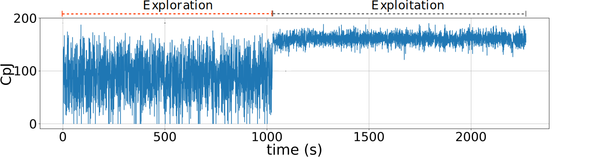 |

| <a id="fig-4-18b"></a>(b) Actions du contrôleur i.e. configuration. |
|:--:|
| 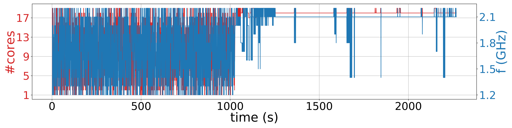 |

**Fig. 4.18** — Évolution des variables du systèmes durant l'apprentissage
en-ligne, pour le contrôle du benchmark DGEMM.

Pour notre expérimentation, la phase d'exploration est fixée arbitrairement à
2048 itérations (i.e. 1024s) ce qui est relativement court en comparaison aux
quantités habituelles de données utilisées en général pour entraîner un réseau
de neurones. De plus, aucune technique d'augmentation du jeu de données n'a été
utilisée pour améliorer la qualité du dataset. On observe néanmoins sur la
figure [4.18](#fig-4-18) que cela suffit à notre système pour atteindre des
performances quasi-optimales. Figure [4.18a](#fig-4-18a) montre le tracé des CpJ
durant l'exécution. On note la valeur globalement stable du CpJ, restant dans
les 3% de la valeur connue pour la configuration optimale. On remarque quelques
fluctuations, dont des modifications sporadiques transitoires de la
configuration sur la figure [4.18b](#fig-4-18b). Cependant, la configuration
moyenne imposée par notre système de contrôle après entraînement est de 18.05
cœurs à 2.09GHz, que l'on peut raisonnablement considérée comme égale à la
configuration optimale pré-déterminée.

**Gains:** En comparant avec les gouverneurs Linux disponibles sur notre serveur
Intel Xeon, notre méthode produit les gains suivants: 10%, 17%, 11% et 10%,
respectivement comparés aux gouverneurs *Performance, Powersave, Ondemand,
Conservative*. Ces résultats sont similaires à ceux obtenus pour le benchmark
*C100M0*, ce qui est cohérent avec le caractère *compute-intensive* de DGEMM.

**Validations complémentaires:** En complément, nous proposons de valider ce
contrôleur sur l'ensemble des applications du benchmark synthétique.

<a id="fig-4-19"></a>

| <a id="fig-4-19a"></a>(a) C100M0 | <a id="fig-4-19b"></a>(b) C98M2 | <a id="fig-4-19c"></a>(c) C96M4 | <a id="fig-4-19d"></a>(d) C90M10 |
|:--:|:--:|:--:|:--:|
| 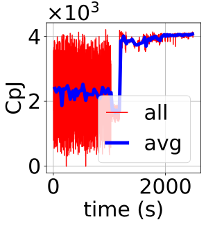 | 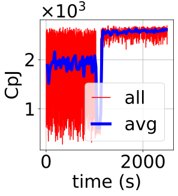 | 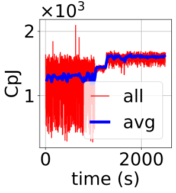 | 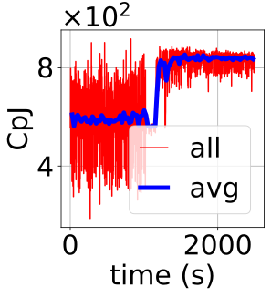 |

| <a id="fig-4-19e"></a>(e) C80M20 | <a id="fig-4-19f"></a>(f) C0M100 |
|:--:|:--:|
| 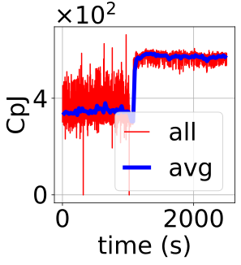 | 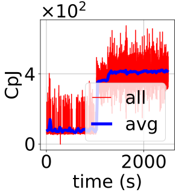 |

**Fig. 4.19** — Efficacité énergétique pour chacune des applications du
benchmark synthétique, durant l'utilisation du contrôleur.

Figure [4.19](#fig-4-19) montre l'évolution de l'efficacité énergétique pour
chacune des six expérimentations (une par application). La remarque globale que
nous pouvons faire est que, pour chaque expérience, l'efficacité énergétique en
fin d'entraînement (après les 1024s d'exploration pure) est maximisée i.e.
supérieure ou égale au maximum vue durant l'exploration.

Le tableau [4.5](#tab-4-5) résume ces résultats, en comparant les configurations
déterminées par le contrôleur avec les configurations optimales mesurées en
amont des simulations. Les configurations moyennes finales du système
correspondent globalement aux configurations optimales des applications
respectives. Des gains sont même obtenus lorsque nous comparons les valeurs de
CpJ en fin d'entraînement avec celles obtenues pour les configurations
optimales.

<a id="tab-4-5"></a>

| **Benchmark** |  | C100M0 | C98M2 | C96M4 | C90M10 | C80M20 | C0M100 |
|---|---|---|---|---|---|---|---|
| **Best Conf.** | CpJ | 3866 | 2505 | 1581 | 818 | 517 | 336 |
|  | #cores, freq(GHz) | 19, 2.1 | 13, 2.1 | 7, 2.1 | 3, 2.1 | 2, 2.1 | 1, 1.9 |
| **vs. Results** | CpJ | 4051 | 2580 | 1603 | 839 | 575 | 405 |
|  | Gains (CpJ) | 4.8% | 3.0% | 1.4% | 2.6% | 11.2% | 20.5% |
|  | #cores, freq(GHz) | 19, 2.1 | 13, 1.9 | 8, 1.9 | 4, 2.1 | 3, 2.1 | 1, 1.9 |

**Tableau 4.5** — Résultats du contrôleur pour chacune des applications du
benchmark synthétique.

Il faut cependant être vigilant concernant ces gains. En effet, nous obtenons
ces résultats très positifs allant jusqu'à 20% en comparaison avec les
configurations optimales. Or, par définition, les configurations optimales sont
celles délivrant les meilleures valeurs d'efficacité énergétique. Ce résultat
contre-intuitif demande des investigations supplémentaires pour expliquer son
origine. Il est probable que des variations expérimentales entre la
caractérisation des applications et les tests de notre contrôleur soient venues
altérer les performances du serveur. Néanmoins, l'impact positif du contrôleur
ne fait aucun doute sur la figure [4.19](#fig-4-19) et permet de définitivement
confirmer son bon fonctionnement pour les applications statiques.

### 4.3.2 Applications OMP variables

Nous nous intéressons maintenant au contrôle d'applications variables,
c'est-à-dire possédant plusieurs phases d'exécution. Nous utilisons donc la
version du système décrite figure [4.15](#fig-4-15), possédant la détection de
phases. Le reste du set-up expérimental est le même que pour la section
[4.3.1](#431-applications-omp-statique).

#### 4.3.2.1 Évaluation sur SRAD

<a id="fig-4-20"></a>

| <a id="fig-4-20a"></a>(a) CpJ pour les 209 configurations du serveur | <a id="fig-4-20b"></a>(b) Zoom sur les configurations optimales: 208 et 203 respectivement pour la phase 1 et la phase 2. |
|:--:|:--:|
| 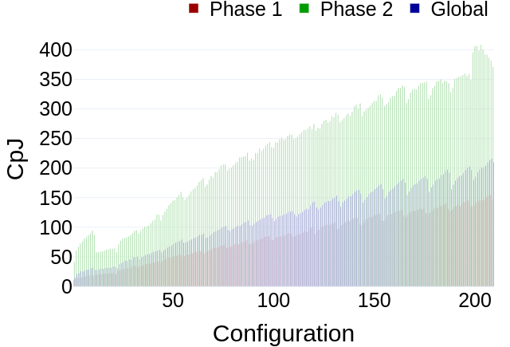 | 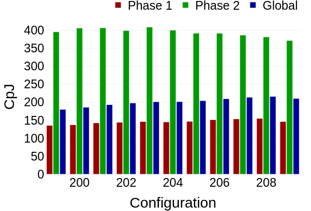 |

**Fig. 4.20** — Caractérisation de l'application SRAD, sur le serveur Intel, en
répartissant les ressources équitablement parmi les sockets.

Nous évaluons notre système de contrôle sur une application multi-phase connue:
SRAD, issue de la suite de benchmark Rodinia [\[41\]](references.md#ref-41).
Cette application possèdent deux phases, et nous proposons une nouvelle
caractérisation de cette application (i.e. différente de celle proposée figure
[4.10](#fig-4-10)), prenant en compte la répartition homogène des ressources
attribuées parmi les deux sockets du serveur Intel. Les résultats de la
caractérisation sont décrits sur la figure [4.20](#fig-4-20). Les configurations
optimales sont {19 cœurs, f=1.6GHz} et {19 cœurs, f=2.1GHz}, respectivement pour
la phase haute et la phase basse.

<a id="fig-4-21"></a>

| <a id="fig-4-21a"></a>(a) Évolution de l'efficacité énergétique. |
|:--:|
| 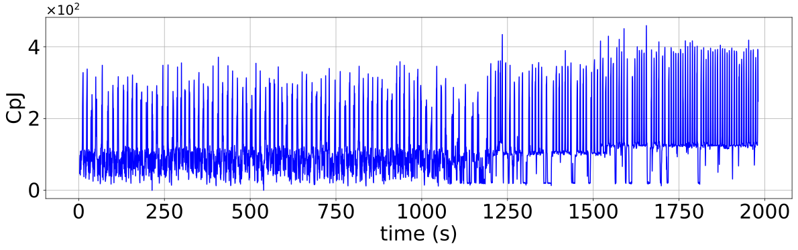 |

| <a id="fig-4-21b"></a>(b) Actions du contrôleur i.e. configuration. |
|:--:|
| 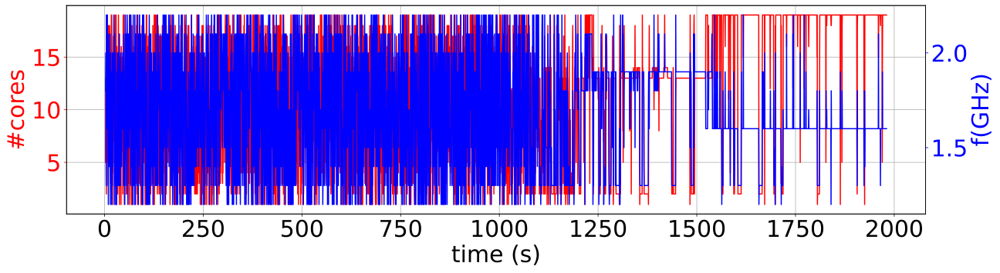 |

**Fig. 4.21** — Traces de fonctionnement du contrôleur, pour SRAD.

Les résultats obtenus avec notre système de contrôle sont exposés sur les
figures [4.21](#fig-4-21) et [4.22](#fig-4-22). Tout d'abord, une vue d'ensemble
de l'entraînement est proposée figure [4.21](#fig-4-21), où sont clairement
visibles les périodes d'exploration et d'exploitation de l'apprentissage,
respectivement de 0 à 1024s pour l'exploration pure, et de 1024s à environ 2000s
pour l'exploitation. On peut également observer la transition entre ces deux
périodes, entre 1024s et 1700s environ, durant laquelle le taux d'actions
aléatoires décroît progressivement de 100% à 5% au profit des actions décidées
par l'agent. Les 5% restant d'actions aléatoires permettent de maintenir un
certain niveau d'apprentissage afin d'ajuster les comportements appris durant la
courte période d'exploration. Ce pourcentage peut sur le long terme être mis à
0.

<a id="fig-4-22"></a>

| <a id="fig-4-22a"></a>(a) Évolution de l'efficacité énergétique. |
|:--:|
| 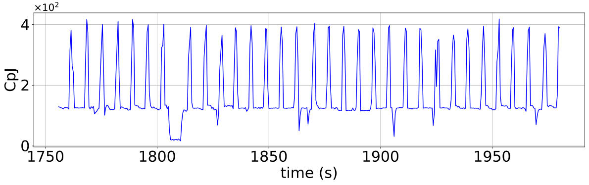 |

| <a id="fig-4-22b"></a>(b) Évolution des performances, et sortie de l'auto-encodeur i.e. ID de phase. |
|:--:|
| 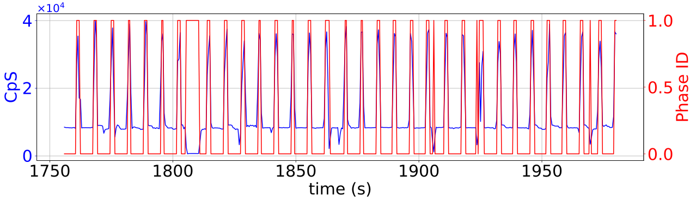 |

| <a id="fig-4-22c"></a>(c) Actions du contrôleur i.e. configuration. |
|:--:|
| 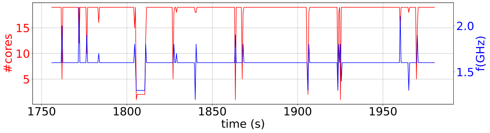 |

**Fig. 4.22** — Zoom post-entraînement _ Traces de fonctionnement du contrôleur,
pour SRAD.

La première remarque que nous pouvons faire est que le système converge vers une
configuration particulière: {19 cœurs, f=1.6GHz}, la configuration optimale de
la phase haute. Bien que ce résultat montre une certaine qualité
d'apprentissage, on note l'absence de changement de configuration en fonction de
la phase d'exécution de l'application. Pourtant, on peut noter sur la figure
[4.22b](#fig-4-22b) que l'information sur la phase est correctement extraite par
l'auto-encodeur. Plusieurs raisons peuvent expliquer ce défaut de
fonctionnement, et nécessitent de futures investigations:

- L'apprentissage n'est pas suffisamment long pour différencier les deux phases
  et converger vers les deux configurations optimales.
- La valeur du CpJ de la phase haute étant largement supérieure à celle de la
  phase basse, l'apprentissage est biaisé par cet écart. En effet, la fonction
  de récompense étant directement proportionnelle au CpJ, l'apprentissage sera
  plus important pour la phase haute. Une nouvelle police de reward pourrait
  améliorer cela.

**Gains:** En comparant avec les gouverneurs Linux disponibles sur notre serveur
Intel Xeon, notre méthode produit les résultats suivants: -12.3%, 7%, -12.9% et
-12.8%, respectivement comparés aux gouverneurs *Performance, Powersave,
Ondemand, Conservative*. Ces résultats sont inférieurs à nos attentes, et
s'expliquent par le fait que l'IA n'a pas appris correctement à assigner la
configuration optimale de la phase basse. Lorsque nous comparons les résultats
pour chacune de ces phases dans le tableau [4.6](#tab-4-6), on constate ce
manque à gagner. En effet, à part en comparaison avec le gouverneurs
*Conservative* où nous sommes légèrement inférieur (-3.6%), nous obtenons des
gains en efficacité énergétique pour la phase haute (i.e. phase 2), pour
laquelle la configuration sélectionnée par notre contrôleur est sa configuration
optimale. Ensuite, excepté pour le gouverneur *Powersave* pour lequel nos gains
vont jusqu'à 16.6%, nous obtenons des résultats négatifs sur la phase basse
(i.e. phase 1). Or, cette phase basse a une durée d'exécution plus longue que la
phase haute (visible sur la figure [4.22b](#fig-4-22b)), ce qui réduit
logiquement nos gains moyens.

<a id="tab-4-6"></a>

| **Phases** |  | Phase 1 | Phase 2 | Global |
|---|---|---|---|---|
| **Résultats** | CpJ | 121.3 | 386.0 | 169.6 |
| **vs. Performance** | $\delta$ | -11.5% | 6.0% | -12.3% |
| **vs. Powersave** | $\delta$ | 3.7% | 16.6% | 7% |
| **vs. Ondemand** | $\delta$ | -11.8% | 1.5% | -12.9% |
| **vs. Conservative** | $\delta$ | -10.6% | -3.7% | -12.8% |

**Tableau 4.6** — Différences ($\delta$) en efficacité énergétique (CpJ) de notre
contrôleur, en comparaison avec les gouverneurs Linux: Powersave, Performance,
Ondemand et Conservative.

Afin d'apporter des éléments de réponse sur le problème de l'apprentissage des
configurations optimales des phases, nous proposons de tester notre modèle sur
une application synthétique aux caractéristiques différentes de SRAD. Cette
application synthétique possède également deux phases, une phase haute et une
phase basse, aux durées d'exécutions similaires, mais ayant des configurations
optimales éloignées.

#### 4.3.2.2 Évaluation sur une application synthétique

Nous évaluons maintenant notre design avec une application synthétique à deux
phases. Elle est dérivée de deux applications statiques synthétiques. L'une des
phases est de type *compute-intensive*, similaire à *C100M0*, et sa
configuration optimale est {19 cœurs, f=2.2GHz}. La seconde phase est de type
*memory-intensive*, et possède la configuration optimale suivante: {4 cœurs,
f=1.3GHz}. Ainsi, les 2 phases possèdent des caractéristiques très différentes,
contrairement aux phases de SRAD dans la section précédente.

<a id="fig-4-23"></a>

| <a id="fig-4-23a"></a>(a) Évolution de l'efficacité énergétique. |
|:--:|
| 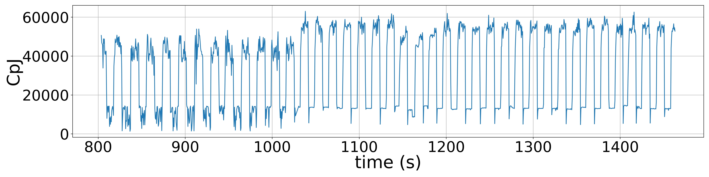 |

| <a id="fig-4-23b"></a>(b) Actions du contrôleur i.e. configuration. |
|:--:|
| 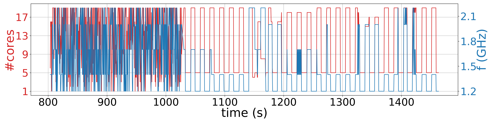 |

**Fig. 4.23** — Traces de fonctionnement du contrôleur, pour le benchmark à 2
phases.

Comme visible sur la figure [4.23a](#fig-4-23a), les deux phases sont clairement
identifiables à travers le tracé des CpJ, reflétant les différents types de
charges de travail exécutées. Bien que non représenté sur ces graphiques,
l'auto-encodeur génère les informations relatives aux phases dès le début de
l'exécution. Ainsi, le réseau de neurones du contrôleur en-ligne est entraîné
directement avec cette donnée. Comme précédemment, cet entraînement est réalisé
durant les 1024 premières secondes.

Dès le début de la phase d'exploitation (i.e. à partir de 1024s), on observe que
le contrôleur identifie seulement 2 phases, et adapte la configuration en
fonction, validant le fonctionnement de l'auto-encodeur. Le contrôle en-ligne
sélectionne 19 et 5 cœurs respectivement pour les deux phases, ce qui correspond
aux configurations optimales connues. Quant à la fréquence, cette dernière
oscille entre 1.2GHz et 1.4GHz ce qui n'est pas suffisamment proche des
configurations connues, laissant suggérer qu'une durée d'entraînement plus
longue permettrait d'améliorer l'efficacité énergétique.

**Gains:** En comparant avec les gouverneurs Linux disponibles, notre méthode
produit les gains suivants: 51%, 7%, 51% et 50%, respectivement comparés aux
gouverneurs *Performance, Powersave, Ondemand, Conservative*. Les gains
potentiels de chaque phase ont été mesurés individuellement via une
caractérisation hors-ligne, et une amélioration de l'entraînement pourrait à
terme produire des gains allant de 34% à 136%, toujours en comparant aux
gouverneurs Linux.

<a id="fig-4-24"></a>

| <a id="fig-4-24a"></a>(a) Évolution de l'efficacité énergétique. |
|:--:|
| 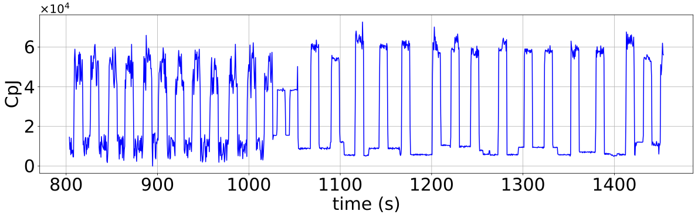 |

| <a id="fig-4-24b"></a>(b) Actions du contrôleur i.e. configuration. |
|:--:|
| 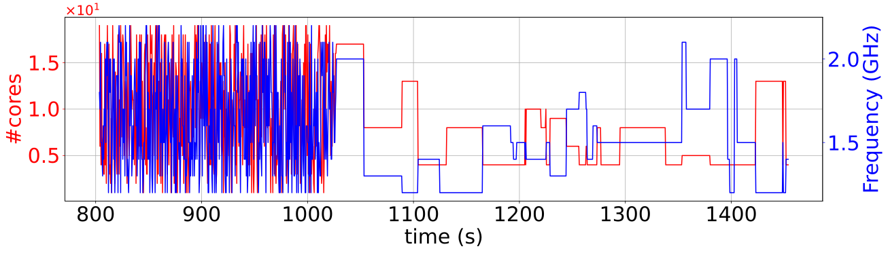 |

**Fig. 4.24** — Traces de fonctionnement du contrôleur, pour le benchmark à 2
phases.

**Vérification:** Enfin, nous proposons ici de valider l'intérêt de
l'auto-encodeur en renouvelant la dernière expérience mais en implémentant le
modèle du contrôleur sans l'auto-encodeur. Comme visible sur la figure
[4.24](#fig-4-24), contrairement à la figure [4.23](#fig-4-23), rien ne met en
évidence une corrélation entre les actions menées et les changements de phase.
De plus, nous obtenons une valeur moyenne du CpJ après entraînement inférieur de
34% comparé à l'expérience précédente (i.e. avec auto-encodeur). Ainsi,
l'auto-encodeur et plus généralement l'information sur la phase d'exécution
permet comme attendu d'améliorer l'apprentissage du contrôleur.

#### 4.3.2.3 Discussion

Globalement, nous pouvons donc confirmer que notre système de contrôle enrichi
d'un module de détection de phase est capable d'apprendre à reconnaître les
phases de fonctionnement d'une application, et d'ajuster la configuration du
système en fonction de cette information afin d'optimiser l'efficacité
énergétique du calcul.

L'auto-encodeur proposé se montre particulièrement efficace pour réaliser cette
détection de phase en temps réel. Cependant, dans la solution actuelle,
l'auto-encodeur est entraîné pour une seule application et avant d'être inclus
dans le système de contrôle. Cela va donc à l'encontre de l'avantage premier de
l'apprentissage temps réel amené par le RL. Plusieurs solutions à cette
limitation peuvent faire l'objet de futurs travaux, telles que la conception
d'un auto-encodeur généraliste, ou l'inclusion de la détection de phase dans le
RL.

Ensuite, des limitations apparaissent quant aux degrés de précision que peut
tolérer notre modèle. En effet, on remarque que pour l'application SRAD dont les
phases possèdent des configurations optimales similaires, notre modèle ne fait
pas de distinctions entre ces deux configurations, menant à des pertes en
efficacité énergétique. Au contraire, lorsque les configurations optimales sont
éloignées, comme pour notre application synthétique, l'apprentissage converge
correctement et permet de gagner en efficacité énergétique. De futurs travaux
consisteront à définir précisément ces limitations, et modifier en fonction les
paramètres et la politique d'apprentissage du contrôleur.

Enfin, aux hypothèses d'utilisation de départ s'ajoute la contrainte de la
période d'échantillonnage devant permettre à la fois de réaliser les différents
traitements du contrôleur (i.e. entraînement du RL, inférences des réseaux de
neurones, etc.), ainsi que de suivre l'évolution d'une application (i.e. période
supérieure à la durée d'exécution d'un chunk). Ces différentes contraintes
posent des difficultés pour sélectionner des applications réelles éligibles pour
notre contrôle, expliquant le nombre limité de résultats. De futurs travaux
consisteront à repousser ces limitations, afin de pouvoir appliquer notre
méthode à un plus grand ensemble d'applications.

## 4.4 Résumé

Après avoir montré le potentiel des chunks comme métrique fiable pour le suivi
des performances et de l'efficacité énergétique, nous nous sommes intéressés à
l'exploitation des solutions de type réseau de neurones pour proposer une
méthodologie de contrôle des applications OpenMP.

Ainsi, un outil basé sur les auto-encodeurs est présenté pour détecter et
identifier, si existantes, les phases d'exécution d'une application. Cet outil
se montre particulièrement efficace sur des applications à deux phases, mais de
futures études devront être menées pour valider ce fonctionnement sur des
applications possédant un plus grand nombre de phases.

Ensuite, une méthode de contrôle de configuration système est proposée pour
optimiser à la fois le nombre de ressources attribuées au workload et leur
fréquence de fonctionnement. Ce contrôle est construit autour d'un apprentissage
par renforcement inspiré du DQN, et permet une optimisation automatique de la
configuration durant l'exécution de l'application à optimiser sans entraînement
préalable (hormis pour l'auto-encodeur si utilisé). Cette méthode est validée
sur un ensemble d'applications synthétiques conçues pour représenter la dualité
*memory-intensive vs. compute-intensive*. Des gains significatifs en efficacité
énergétique ont été obtenus en comparant notre méthode aux gouverneurs
classiques de Linux. De futurs travaux devront confirmer ces résultats sur des
benchmarks d'applications réelles. En effet, bien que probantes, nos validation
reposent principalement sur des applications synthétiques. Il sera donc
nécessaire de montrer la robustesse de notre solution sur des benchmarks
reconnus. Enfin, au vu de la littérature récente (e.g. AdaMD
[\[18\]](references.md#ref-18)), un développement de notre solution vers la
gestion multi-tâches sera intéressant à explorer. En effet, notre solution est
par essence *application-specific* du fait de l'utilisation des chunks, or la
tendance se veut plus généraliste, avec un contrôle dynamique qui soit efficace
pour toute nouvelle application exécutée sur le système. Des techniques telles
que le transfert d'apprentissage [\[155\]](references.md#ref-155) pourraient
permettre de pallier ce défaut.

Enfin, le contrôle multi-phase a été testé sur une application réelle ainsi
qu'une application synthétique. Les résultats confirment que le RL peut
permettre un contrôle adaptatif du calcul parallèle. En particulier, l'ajout
d'un module d'identification de phases permet au système d'apprendre les
différentes actions à mener pour optimiser l'efficacité énergétique du système
de calcul. De plus, cet apprentissage ne nécessite que 2048 données, ce qui est
peu au regard des bases de données connues (ex. 70000 données pour MNIST).
Cependant, ces résultats ne sont pas optimaux et nécessitent de futurs travaux
afin de rendre le système plus précis et plus robuste. En effet, on a remarqué
un défaut d'apprentissage du contrôleur pour l'application SRAD qui possède deux
configurations optimales similaires. Ainsi, des recherches plus approfondies
permettront d'ajuster la politique d'apprentissage du contrôleur, ainsi que le
système de contrôle global. Un point d'amélioration important est la fréquence
de fonctionnement du contrôleur. En effet, ce dernier fonctionne à 2Hz, soit une
action toutes les 0.5s. Cette période d'échantillonnage limite le nombre de
phases d'exécution détectables à des phases d'une durée minimale de 1s. De plus,
bien que le nombre de données nécessaires pour un apprentissage correct soit de
seulement 2048, cela équivaut à 1024s d'exécution et représente donc une limite
supplémentaire à l'usage de notre méthode i.e. contrôle d'application
s'exécutant durant plusieurs heures afin de négliger cette période de pur
apprentissage.

Ce chapitre concernait les travaux effectués dans le cadre de notre premier axe
de recherche. Le chapitre suivant adresse notre second axe centré sur
l'optimisation de la conception matérielle. Plus précisément, il est question
d'optimiser les designs de NoC afin d'améliorer leur efficacité énergétique, ou
tout autre métrique considérée. En effet, bien que motivée par l'optimisation de
la consommation des systèmes, la solution proposée se voudra généraliste et non
limitée à un seul levier d'amélioration.
