# 6. Génération de réseaux sur puce hétérogènes optimisés

[English](../06-m-rwgan.md){ .lang-pill title="This chapter in English" }
Français

Nous nous intéressons dans ce chapitre à la génération de NoC hétérogènes. Ici,
contrairement au chapitre précédent, nous considérons des NoC à la topologie
fixe – i.e. mesh – et nous nous focalisons sur le type des routeurs implémentés.
Nous avons pu constater que notre solution GANNoC présentée précédemment est
suffisamment généraliste pour pouvoir s'appliquer à différents problèmes. Ainsi,
nous proposons d'appliquer cette méthode pour la production de NoC hétérogènes,
c'est-à-dire possédant des routeurs de nature différentes, et d'étendre le
concept de RWGAN pour considérer plusieurs fonctions de récompense à la fois,
i.e. apprentissage multi-objectif. Ce chapitre est appuyé par la publication
suivante: [\[105\]](references.md#ref-105).

> **Code.** Une reproduction en clean-room de la méthode de ce chapitre est
> disponible sur [mmirka/m-rwgan](https://github.com/mmirka/m-rwgan).

## 6.1 NoC hétérogènes: motivation et enjeux

### 6.1.1 Des trafics asymétriques

Dans le but de simplifier le processus de conception des NoC, ces derniers sont
généralement conçus en se basant sur des trafics synthétiques uniformes ou très
réguliers, e.g. *transpose*, *bitreverse*, etc.
[\[49\]](references.md#ref-49).
Cependant, la nature des applications exécutées sur un SoC est souvent bien
différente [\[69\]](references.md#ref-69).
Malheureusement, une compréhension insuffisante du trafic attendu peut mener
vers un dimensionnement du NoC non optimal et coûteux.
Ainsi, pour illustrer ce propos, nous avons réalisé une étude sur de réelles
applications.
Nous avons analysé des traces venant de l'outil Netrace
[\[76\]](references.md#ref-76). Ces traces sont extraites de l'exécution
d'applications PARSEC [\[24\]](references.md#ref-24) sur le simulateur M5
[\[25\]](references.md#ref-25) pour un système multi-cœurs homogène de 64 cœurs
et à mémoire partagée. Les entrées de type *Simmedium* sont utilisées sur
l'ensemble de applications PARSEC, mis à part pour les benchmarks *Bodytrack* et
*Swaption* pour lesquels les entrées de type *simlarge* sont utilisées.

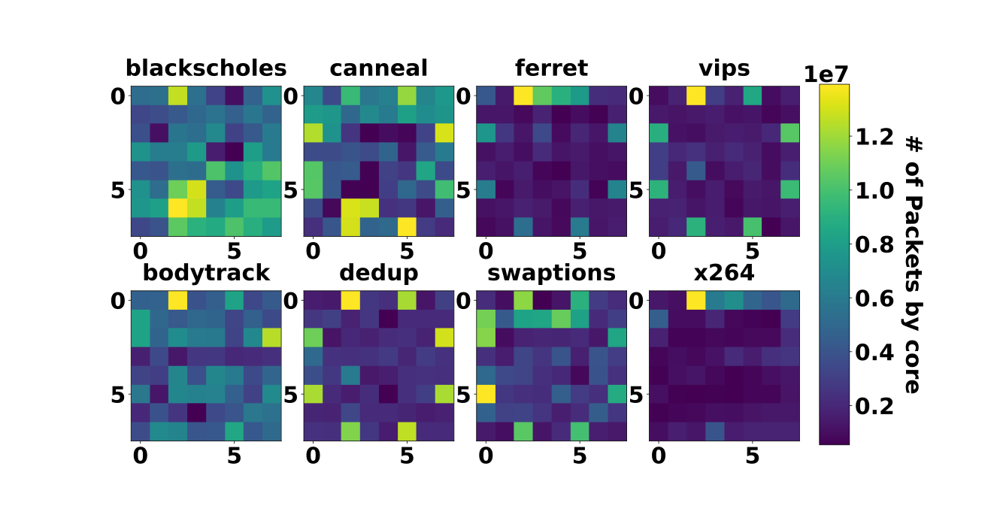

**Fig. 6.1** : Nombre de paquets reçus par cœur pour 8 applications du benchmark
Parsec exécuté sur 64 cœurs

La figure [6.1](#fig-6-1) expose le nombre de paquets reçus durant
l'exécution de huit applications du benchmark PARSEC.
Les 64 cœurs du SoC sont organisés en un *mesh* de taille 8 par 8, avec leurs ID
traduits en coordonnées X-Y.
Pour chacune des applications, on remarque une large disparité dans le nombre de
paquets reçus par les cœurs, sans aucun motif particulier de trafic symétrique.
Ces différences montrent que certains routeurs sont plus sollicités que
d'autres, et révèle l'utilisation inefficace des ressources du NoC homogène.
Il faut noter que ces hotspots sont observés pour un SoC également homogène.
Cependant, les SoC conçus de nos jours sont de plus en plus hétérogènes (CPU,
GPU, accélérateurs, ...) pour des raisons d'efficacité énergétique, ce qui
apporte de nouvelles sources d'asymétrie dans le trafic.
De ce fait, une solution pour améliorer l'efficacité énergétique des SoC est de
concevoir des NoC hétérogènes adaptés aux contraintes de trafic.

### 6.1.2 Un espace de conception immense

Ce travail adresse donc le problème de la conception de NoC hétérogènes
optimisés. En particulier, nous proposons une solution permettant de couvrir de
grands espaces de conception pour lesquels les méthodes classiques de recherches
exhaustives ne sont pas envisageables, dû à un temps de calcul trop important.

En effet, les espaces de conception augmentent rapidement étant donnés
l'ensemble des paramètres définissant un NoC hétérogène. Par exemple, prenons un
réseau de type mesh 8x8, et considérons seulement le type des routeurs. Pour $n$
possibilités de type de routeur, on obtient le nombre de combinaisons $C =
n^{64}$. Ainsi, pour seulement 3 types de routeur, i.e. $n=3$, nous obtenons $ C
= 3^{64} \approx 10^{30}$ combinaisons de design possibles. De plus, le type de
connexion et la topologie du réseau sont d'autres paramètres pouvant être
considérés, menant à une espace de conception immense.
De ce fait, une évaluation exhaustive de l'espace de conception par un
concepteur de NoC n'est pas concevable.

## 6.2 Un apprentissage multi-objectif

### 6.2.1 Données générées

Toujours pour faire le lien avec le domaine des graphes, dans le
[chapitre 5](05-gannoc.md) précédent nous générons des matrices d'adjacence, et
dans ce chapitre nous générons les matrices de paramètres (soit $X$, pour
reprendre la notation dans le domaine des graphes, voire section
[5.1](05-gannoc.md#51-noc-et-théorie-des-graphes)).
De ce fait, nous considérons ici la génération de NoC hétérogènes pour une
topologie fixe (matrice d'adjacence $A$ constante). L'hétérogénéité vient donc
des propriétés des routeurs implémentés.

Dans ce travail, nous considérons uniquement comme paramètre le type des
routeurs. Ainsi, la matrice $X$ décrit la classe de chacun des routeurs
implémentés. Pour décrire la classe des routeurs, une description en vecteur
*one-hot* est utilisée. En classification, un vecteur one-hot est une
représentation binaire de la classe et fonctionne de la manière suivante: pour
$n$ classes possibles de données, le vecteur one-hot possède $n$ éléments,
appelé bit. Chaque bit représente une catégorie possible. Ainsi, pour encoder la
classe d'une donnée avec un vecteur one-hot, il suffit de mettre à 1 le bit
correspondant à la classe, et laisser les autres à 0. Cette méthode de
classification se différencie des méthodes d'encodage numérique (e.g. classeA =
1, classeB = 2, classeC = 3) qui contiennent de manière intrinsèque un
ordonnancement des classes, et donc un biais de valeur. Dans notre cas, nos
catégories ne possèdent pas de relation d'ordonnancement, ainsi l'encodage
neutre one-hot est l'idéal.
Cette description permet donc un meilleur apprentissage de la part du réseau de
neurones pour une classification ne possédant pas de relation d'ordonnancement
entre ses catégories.

### 6.2.2 Architecture du M-RWGAN

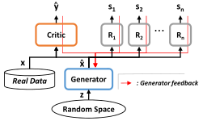

**Fig. 6.2** : Schéma du Multi-Objectives RWGAN, avec la descente de gradient de
l'apprentissage du générateur en flèches rouges.

Nous proposons ici une amélioration du RWGAN présenté dans le chapitre
précédent. Alors que le RWGAN ne comporte qu'un seul objectif d'optimisation –
i.e. un reward – l'architecture présentée ici permet d'implémenter plusieurs
objectifs d'optimisation pour un même générateur. Nous nommons cette nouvelle
architecture Multi-Reward WGAN (M-RWGAN). Comme évoqué dans la section
[6.2.1](#621-données-générées), les données générées dans ce travail sont des
matrices de paramètres de NoC hétérogènes. Notre architecture de M-RWGAN est
donc utilisée pour générer des configurations de NoC hétérogènes à la topologie
fixée (ici, mesh 8x8), optimisées selon différents objectifs.
Par exemple, il est possible d'implémenter un M-RWGAN à deux objectifs
permettant de considérer à la fois le débit et la puissance consommée, via deux
rewards distincts, pour globalement optimiser l'efficacité énergétique.

**Description du M-RWGAN** Le concept de M-RWGAN étend donc l'architecture du
RWGAN en donnant la possibilité d'implémenter plusieurs modules de reward,
permettant un entraînement multi-objectif du générateur (voire figure
[6.2](#fig-6-2)).
Nous restons sur du MLP pour l'architecture du générateur. Nous nous sommes
intéressés au GCN (Graph Convolutional Network
[\[89\]](references.md#ref-89)) pour l'architecture des modules critique et
rewards, puisque ce type de réseau de neurones est spécifique pour le traitement
de données de type graphe. Cependant, nous verrons dans les sections de
résultats que l'architecture CNN peut parfois s'avérer plus efficace dans
l'apprentissage de motifs.
L'entraînement du critique est similaire au WGAN-GP traditionnel.
Il prend en entré $x$ et $\hat{x}$, respectivement les données réelles et
générées, et produit un score $\hat{y}$ relatif au "réalisme" de son entrée
(i.e. pouvant appartenir ou non à l'espace des données réelles). Il est ensuite
entraîné à réduire son erreur de prédiction i.e. minimiser le W-loss.
Le générateur produit $\hat{x}$ à partir d'une entrée aléatoire $z$. $\hat{x}$
est traitée par le critique et les rewards ($R_i$, avec $i \in [1,n]$).
Comme illustré sur la figure [6.2](#fig-6-2), les paramètres du générateur sont
ensuite entraînés à partir de la sorties de ces modules, i.e. $\hat{y}$ venant
du critique, et $s_i$ venant des rewards $R_i$. Cet apprentissage se fait via la
rétro-propagation du gradient des pertes respectives, en considérant les blocs
rewards et le critique en mode inférence. Durant son apprentissage, le
générateur cherche ainsi à minimiser le W-loss provenant du critique, ainsi que
les pertes provenant des rewards. Ces dernières sont obtenues par une mesure de
l'erreur quadratique moyenne par rapport aux objectifs correspondants.
Les rewards sont des modèles ayant suivi un apprentissage supervisé avant d'être
inclus dans l'apprentissage du générateur. Ils sont entraînés sur des datasets
labellisés à l'aide d'un simulateur de NoC, nous permettant d'associer des
mesures de performances à des configurations de NoC. Une fois inclus dans le
M-RWGAN, les rewards ne sont plus entraînés, et sont uniquement utilisés en mode
inférence.

**Fonction de perte multi-objectif** Nous illustrons maintenant le
fonctionnement de notre implémentation multi-objectif avec la fonction de perte
du générateur. En effet, c'est à ce niveau là que l'aspect multi-objectif est
réellement considéré. Comme pour tout réseau de neurones, durant son
entraînement le générateur cherche à minimiser son erreur (i.e. perte). Le
principe de la fonction de perte du générateur d'un RWGAN est rappelé ici:

$$
L_G(z) = (1-\lambda) L_C(\hat{x}) + \lambda [\beta L_R(\hat{x})]
\tag{6.1}
$$

, où $L_G$, $L_C$ et $L_R$ sont respectivement les fonctions de pertes du
générateur, critique et reward. $lambda$ est le coefficient de répartition entre
l'erreur du critique et du reward considérée dans l'entraînement du générateur.
$\beta$ est un coefficient permettant d'équilibrer la différence de grandeur qui
peut apparaître entre les valeurs de perte du critique et du reward.
Étant donnée notre architecture de M-RWGAN, la nouvelle fonction de perte du
générateur est définie comme suit:

$$
L_G(z) = (1-\lambda) L_C(\hat{x}) + \lambda [\sum_{i=1}^{n} \beta_i L_{R_i}(\hat{x})]
\tag{6.2}
$$

, où $\sum_{i=1}^{n} \beta_{i} = \beta$, $\beta$ vient de Eq.
[5.1](05-gannoc.md#eq-5-1) et $L_{R_i}$ la fonction de perte du
$i^{\text{ème}}$ reward.
*Note:* avec $n$ qui augmente, il sera important d'ajuster avec précaution la
valeur de $\beta$ pour éviter une détérioration des valeurs de pertes.

Ainsi, notre architecture fournit une solution pour entraîner un réseau de
neurones génératif selon plusieurs objectifs.
Il est de plus possible d'ajuster comme souhaité l'impact de chacun des
objectifs à l'aide de coefficients (i.e. $\beta_i$), permettant de régler la
fonction multi-objectif global avec précision.

## 6.3 Résultats et analyses

Nous présentons ici différents résultats prometteurs obtenus avec notre outil.
Ces résultats constituent une preuve de concept venant compléter les travaux
présentés dans le [chapitre 5](05-gannoc.md).

### 6.3.1 Conditions expérimentales

**Espace de conception** Nous limitons nos expérimentation à la génération de
matrices de paramètres X, correspondant aux types des routeurs. Les topologies
des NoC sont identiques, et nous considérons des mesh 8x8.

La liste des classes de routeurs est présentée dans le tableau
[6.1](#tab-6-1). Nous avons 3 classes de routeurs, qui se différencient par la
taille des buffers. Ce sont des routeurs homogènes, i.e. tous les buffers ont la
même taille, et de structure classique (5 ports: Nord, Sud, Est, Ouest, Local).

| **Nom** | Big | Medium | Small |
|:--:|:--:|:--:|:--:|
| **Taille des buffers** | 12 | 4 | 2 |

**Tableau 6.1** : Taille des buffers en *flits*.

**Simulateur** Afin d'obtenir, pour différents trafics, les mesures de
performances et de consommation énergétique des NoC produits, nous utilisons
*Omnet++* [\[164\]](references.md#ref-164), un simulateur haut-niveau à
évènements discrets pour les réseaux de communication. Sur ce simulateur, nous
exploitons le framework HNOCS [\[19\]](references.md#ref-19), qui fournit les
modèles de base pour simuler des NoC tels que les canaux virtuels et le routeur
conventionnel avec pipeline de 3 étages.
Nous complétons ce framework avec l'ajout de trafics synthétiques, e.g. hotspot
[\[49\]](references.md#ref-49). Nous ajoutons à framework l'utilisation de la
bibliothèque *Orion3* [\[83\]](references.md#ref-83) pour obtenir des
estimations de la consommation en puissance statique et dynamique. À partir des
paramètres matériels de la technologie ciblée, et du taux de basculement simulé,
cette bibliothèque permet d'estimer la consommation d'un système avec une erreur
faible: inférieur à $10\%$ comparé à des modèles RTL plus bas niveaux.
Le tableau [6.2](#tab-6-2) présente les principaux paramètres de technologie
utilisés dans notre étude.

| **Manufacturing** | **Vdd** | **Frequency** | **Crossbar type** |
|:--:|:--:|:--:|:--:|
| $45nm$ | $1.0V$ | $650MHz$ | Matrix |

**Tableau 6.2** : Orion3.0: paramètres de la technologie

**Architecture et paramètres du M-RWGAN** Notre M-RWGAN est construit avec trois
blocs de rewards: un reward pour le seuil de saturation, un second reward pour
la consommation énergétique au seuil de saturation et un dernier pour la surface
du NoC. Le but de ces rewards est que, en jouant sur leur importance dans
l'entraînement du générateur, il soit possible modifier les spécificités des NoC
générés avec soit une tendance sur l'économie d'énergie, au détriment de la
bande-passante (i.e. seuil de saturation bas), soit une préférence pour un seuil
de saturation élevé mais pour une consommation énergétique plus élevée. Enfin,
il sera intéressant de trouver une configuration qui optimise les deux
objectifs, pour tendre vers une efficacité énergétique optimale – i.e. seuil de
saturation élevé pour une consommation énergétique minimale.

À l'instar du RWGAN dans le chapitre précédent, les dimensions des réseaux ont
été déterminées empiriquement, et ne découlent donc pas d'une méthodologie
particulière d'optimisation. Les détails des différents modules du M-RWGAN sont
donnés dans les tableaux [6.3](#tab-6-3) et [6.4](#tab-6-4).

**Générateur**

| **Couches:** | Entrée | L1 | L2 | Sortie |
|--:|:--:|:--:|:--:|:--:|
| Type | Input | Dense | Dense | Dense |
| Dimensions | 100 | 768 | 1536 | 192 |
| Fonction d'activation | *–* | *LeakyReLU ($\alpha = 0.2$)* | *LeakyReLU ($\alpha = 0.2$)* | *LeakyReLU ($\alpha = 0.2$)* |

**Critique**

| **Couches:** | Entrée A Entrée X | L1 | L2 | L3 | Sortie |
|--:|:--:|:--:|:--:|:--:|:--:|
| Type | Input x2 | GCN | GCN | GCN | Dense |
| Dimensions | A: 64x64 X: 64x3 | 16 | 32 | 64 | 1 |
| Fonction d'activation | *–* | *LeakyReLU ($\alpha = 0.2$)* | *LeakyReLU ($\alpha = 0.2$)* | *LeakyReLU ($\alpha = 0.2$)* | *Linear* |

**Tableau 6.3** : Dimensionnement des modules Générateur et Critique du M-RWGAN

> Rendered as two tables; the printed thesis shows them side by side
> (Table 6.3).

Le générateur est un réseau MLP de 2 couches cachées (voire tableau
[6.3](#tab-6-3)). Il prend en entrée un vecteur aléatoire de 100 unités. Sa
sortie est redimensionnée en une matrice 64x3 pour correspondre aux dimensions
de la matrice $X$ à générer. Enfin, pour forcer l'encodage *one-hot*, la
fonction d'activation *GumbelSoftmax* est appliquée à la sortie du générateur
[\[38\]](references.md#ref-38).

Le critique est un réseau de neurones de type GCN convolutif
[\[89\]](references.md#ref-89). Ses couches de type GCN sont implémentées via la
librairie *Spektral* [\[68\]](references.md#ref-68) basée sur Keras. Le critique
est ainsi composé de 3 couches de type GCN, et d'une couche dense en sortie. Le
critique possède deux entrées, correspondant à la matrice d'adjacence $A$ et la
matrice $X$ des graphes évalués.

**Reward GCN**

| **Couches:** | Entrée A Entrée X | L1 | L2 | L3 | L4 | Sortie |
|--:|:--:|:--:|:--:|:--:|:--:|:--:|
| Type | Input x2 | GCN | GCN | GCN | GCN | Dense |
| Dimensions | A: 64x64 X: 64x3 | 128 | 64 | 64 | 32 | 1 |
| Fonction d'activation | *–* | *LeakyReLU ($\alpha = 0.2$)* | *LeakyReLU ($\alpha = 0.2$)* | *LeakyReLU ($\alpha = 0.2$)* | *LeakyReLU ($\alpha = 0.2$)* | *Sigmoïde* |

**Reward CNN**

| **Couches:** | Entrée | L1 | L2 | L3 | Sortie |
|--:|:--:|:--:|:--:|:--:|:--:|
| Type | Input | CNN | CNN | Dense | Dense |
| Dimensions | X: 8x8x3 | 128 filtre: 3x3 pas: 1 | 32 filtre: 3x3 pas: 2 | 128 | 1 |
| Fonction d'activation | – | *LeakyReLU* *($\alpha = 0.2$)* | *LeakyReLU* *($\alpha = 0.2$)* | *LeakyReLU* *($\alpha = 0.2$)* | *Sigmoïde* |

**Tableau 6.4** : Dimensionnement des différents Rewards du M-RWGAN

> Rendered as two tables; the printed thesis shows them side by side
> (Table 6.4).

Les rewards implémentés peuvent être de deux types: GCN convolutif ou CNN, dont
les détails sont donnés dans le tableau [6.4](#tab-6-4).
Comme pour le critique, les rewards GCN permettent de traiter les matrices $X$
en deux dimensions: 64x3, pour le nombre de routeurs (i.e. 64) et le nombre de
classes de routeurs (i.e. 3 classes possibles). Ils nécessitent également la
matrice d'adjacence $A$ en entrée pour réaliser la convolution.
Ils sont construits avec 4 couches GCN, et une couche dense en sortie avec
*Sigmoïde* comme fonction d'activation (i.e. pour garantir un score $\in$
[0,1]).
Les rewards de type CNN, permettant de traiter les matrices $X$ en trois
dimensions: 8x8x3, pour les dimensions du mesh 8x8 et la dimension de la classe
(i.e. 3, pour les 3 catégories possibles). Ils ne considèrent pas la matrice
$A$. Nous l'utiliserons par exemple pour approximer la fonction de surface, qui
prédit la surface d'un NoC en fonction de ses routeurs, et qui ne nécessite donc
pas de connaissances de la topologie. Les rewards CNN sont implémentés avec 2
couches convolutives, suivies d'une couche dense. La couche de sortie est une
couche dense avec *Sigmoïde* comme fonction d'activation.

L'entraînement de chaque reward est réalisé en amont de l'entraînement du
M-RWGAN, afin de les utiliser uniquement en inférence durant l'entraînement du
M-RWGAN. Leurs apprentissages utilisent l'optimiseur *Adam* et convergent
rapidement (environ 20 époques) vers des erreurs minimales, inférieures à 1% sur
des données de test, ce qui assure une bonne évaluation des sorties du
générateur. L'entraînement global du M-RWGAN est similaire au RWGAN présenté
dans le [chapitre 5](05-gannoc.md).

### 6.3.2 Datasets: pré-analyse

Nous étudions l'apprentissage de notre modèle pour deux trafics différents:
uniforme et hotspot30, circulant sur un NoC de type mesh 8x8. La charge de ces
trafics est représentée sur la figure [6.3](#fig-6-3). Ainsi, l'objectif de
l'entraînement du M-RWGAN sera de générer des matrices X de NoC optimisés pour
ces trafics, selon différents critères d'optimisation. Nos critères
d'optimisation seront le seuil de saturation, la puissance consommée au seuil de
saturation et la surface. Ainsi, en adaptant l'importance de ces critères
d'optimisation, il est possible de faire varier les conditions d'apprentissage
et les caractéristiques finales des NoC générés.

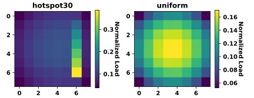

**Fig. 6.3** : Quantité de trafic normalisée reçue par routeur pour 2 trafics
synthétiques exécuté sur un mesh 8x8: hotspot30 (i.e. 30% du trafic est à
destination du routeur 54), et uniforme.

La base de données, ou dataset, joue un rôle majeur dans l'apprentissage
machine. En effet, c'est à partir de ce dataset que l'IA va s'entraîner pour
construire son modèle final. L'analyse du dataset permet donc de vérifier d'une
part que ce dernier ne dispose pas de biais particulier (e.g. déséquilibre dans
les proportions des labels pour une classification), et d'autre part
d'anticiper les motifs pouvant être appris par l'IA. Dans notre cas, le dataset
doit permettre à l'IA d'apprendre à attribuer une taille de routeur en fonction
de sa position, du trafic et des paramètres d'optimisation. Nous proposons donc
ici d'analyser les datasets d'entraînement des M-RWGAN afin de déterminer les
potentiels biais d'apprentissage présents.

Nos datasets contiennent uniquement des matrices $X$ (i.e. type des routeurs)
pour des mesh 8x8. Afin de limiter un premier biais dans la construction du
dataset, ces matrices sont générées de façon aléatoire, assurant à la fois une
homogénéité sur les types de chaque routeur, mais aussi sur la répartition des
types de routeur. Ainsi, nous assurons qu'il n'y ait pas de déséquilibre dans
les datasets, afin d'éviter de se trouver dans un cas d'apprentissage
déséquilibré [\[91\]](references.md#ref-91). Ces datasets contiennent, pour
chaque trafic, 10k matrices $X$, associées aux données de simulation du NoC
correspondant (i.e. latences, puissance, surface, etc.). Ces données de
simulation ne sont utilisées que pour l'entraînement des Rewards. Les modules du
GAN (générateur et critique) ne s'entraînent que sur les matrices X.

Nous analysons donc nos datasets pour le trafic uniforme et le trafic
hotspot30, en nous intéressant plus particulièrement aux données de seuil de
saturation et de puissance, et leur corrélation avec les types des routeurs
(i.e. taille). La donnée de surface n'est pas étudiée ici. En effet, les types
de routeurs sont directement liés à la taille des routeurs (i.e. taille des
buffers). Or, ayant garanti l'homogénéité de la répartition des classes, il en
va de même pour la répartition des surfaces.

#### 6.3.2.1 Trafic Uniforme

Regardons tout d'abord les biais existant dans notre dataset pour le trafic
uniforme. On définit un biais comme une non-uniformité du dataset, en fonction
d'une donnée particulière. La distribution du dataset est présentée figure
[6.4](#fig-6-4), en fonction du seuil de saturation et de la puissance
consommée, respectivement les figures [6.4a](#fig-6-4a) et
[6.4b](#fig-6-4b).

| (a) Distribution des NoC du dataset selon leur seuil de saturation. | (b) Distribution des NoC du dataset selon leur puissance (mW) au seuil de saturation. |
|:--:|:--:|
| 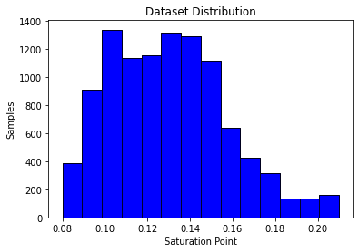 | 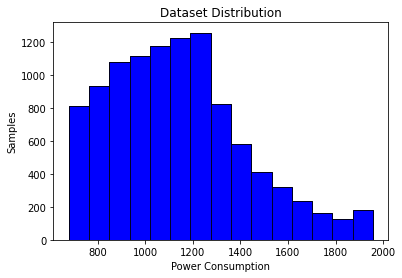 |

**Fig. 6.4** : Distribution du dataset uniforme.

On constate un biais important autour du seuil de saturation de 13% et de la
puissance de 1200mW. On peut donc attendre de l'entraînement du GAN, sans les
rewards, de tendre vers la génération de NoC ayant un seuil de saturation moyen
et une puissance consommée basse. On relève par ailleurs pour ce dataset un
seuil de saturation moyen à 12.88% et une puissance moyenne au seuil de
saturation de 1136mW. De plus, les valeurs extrêmes de seuil de saturation sont
peu présentes, indiquant qu'il y a peu de configurations supportant un taux
d'injection supérieur à 18%. On remarque enfin que les deux distributions sont
similaires, indiquant une corrélation entre le seuil de saturation et la
puissance consommée. Cela correspond aux résultats attendus pour un NoC soumis à
un trafic uniforme. En effet, afin d'améliorer le seuil de saturation d'un NoC
soumis au trafic uniforme, il faut entre autres augmenter la bande passante des
routeurs et donc leur taille, ce qui augmente la consommation globale du NoC.
Cette analyse se confirme logiquement lorsqu'on regarde en détails la taille
moyenne des routeurs des NoC, en fonction de la puissance consommée et du seuil
de saturation, figure [6.5](#fig-6-5). En effet, on peut voire que plus le seuil
de saturation des NoC est élevé, plus la taille des routeurs est grande. Il en
va de même pour la puissance. On remarque cependant que cette simple analyse ne
permet pas d'extraire le motif du trafic, qui doit logiquement être corrélé avec
la taille des routeurs pour optimiser l'efficacité énergétique. Nous verrons par
la suite comment l'apprentissage du GAN se comporte.

| (a) Seuil de saturation. |
|:--:|
| 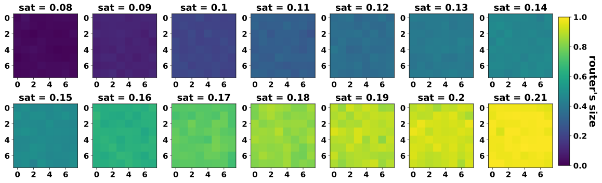 |

| (b) Puissance (mW) au seuil de saturation. |
|:--:|
| 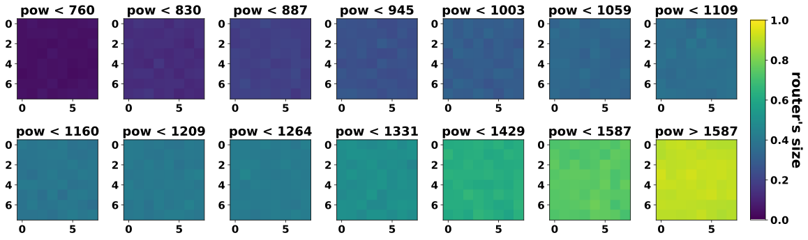 |

**Fig. 6.5** : Taille moyenne des routeurs, en fonction du seuil de saturation
[6.5a](#fig-6-5a) et de la puissance consommée [6.5b](#fig-6-5b) des NoC, pour
le trafic **uniforme**.

#### 6.3.2.2 Trafic Hotspot30

Regardons maintenant les biais existant dans notre dataset pour le trafic
hotspot30. La distribution du dataset est présentée figure
[6.6](#fig-6-6), en fonction du seuil de saturation et de la puissance
consommée, respectivement les figures [6.6a](#fig-6-6a) et
[6.6b](#fig-6-6b).

| (a) Distribution des NoC du dataset selon leur seuil de saturation. | (b) Distribution des NoC du dataset selon leur puissance (mW) au seuil de saturation. |
|:--:|:--:|
| 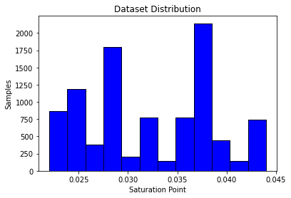 | 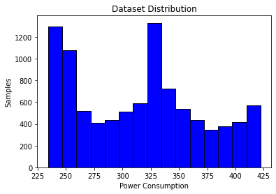 |

**Fig. 6.6** : Distribution du dataset hotspot30.

On remarque la présence de biais sur certaines valeurs. En particulier, on note
une densité plus élevée de NoC ayant une puissance autour de 325mW et 250mW. De
même, deux valeurs de seuil de saturation ressortent avec 2.75% et 3.75%. Ces
points particuliers peuvent être expliqués par le fait que le trafic hotspot va
impacter un nombre limité de routeurs. Ainsi, de fortes différences de valeurs
peuvent apparaître entre des configurations similaires mais dont les quelques
différences se trouvent au niveau du hotspot. Il sera intéressant de voir
comment l'apprentissage du RWGAN sera impacté par ces biais. On note pour ce
dataset un seuil de saturation moyen à 3.22% et une puissance moyenne au seuil
de saturation de 315mW.

De la même façon que pour le trafic uniforme, nous observons figure
[6.7](#fig-6-7) la taille moyenne des routeurs des NoC en fonction du seuil de
saturation et de la puissance consommée. Cette fois-ci, nous remarquons très
clairement la corrélation entre le motif du trafic et la taille des routeurs.
Bien que, de manière intuitive, la tendance reste la même que pour le trafic
uniforme (le seuil de saturation et la consommation augmentent lorsque la taille
des routeurs augmente), on distingue clairement la localisation du point chaud,
confirmant son impact sur les performances du NoC. Ainsi, on peut confirmer que
les performances d'un NoC soumis à un trafic hotspot sont principalement
impactées par l'architecture des routeurs situés aux abords du point chaud (ici
verticalement, de par le routage XY). Plus globalement, cela confirme l'intérêt
à ce que l'architecture des routeurs soit corrélée avec la charge du trafic.

| (a) Seuil de saturation. |
|:--:|
| 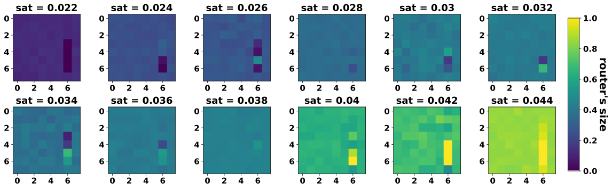 |

| (b) Puissance (mW) au seuil de saturation. |
|:--:|
| 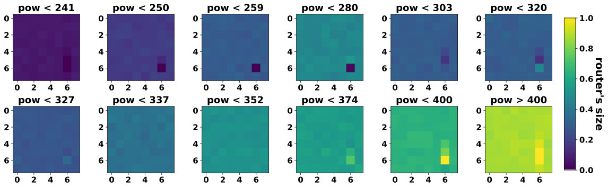 |

**Fig. 6.7** : Taille moyenne des routeurs, en fonction du seuil de saturation
[6.7a](#fig-6-7a) et de la puissance consommée [6.7b](#fig-6-7b) des NoC, pour
le trafic **hotspot30**.

### 6.3.3 Expérimentations

Sur la figure [6.3](#fig-6-3) est représentée la répartition de la charge du
trafic circulant sur un mesh 8x8, pour deux trafics synthétiques. L'objectif ici
est d'entraîner le M-RWGAN à générer des configurations de NoC hétérogènes selon
différents critères d'optimisation, et pour les trafics présentés figure
[6.3](#fig-6-3). Nous rappelons que le générateur produit des matrices X
décrivant la classe de chacun des routeurs, pour un mesh 8x8, et pour 3 classes
possibles décrites dans le tableau [6.1](#tab-6-1).

Pour chaque apprentissage, nous fixons la proportion des rewards impactant
l'entraînement du générateur. Ainsi, dans la suite de ce manuscrit, nous
utiliserons la notation \<reward\>\<proportion\> pour décrire les poids des
blocs reward, avec \<reward\> égal à *Sat*, *Pow*, *Area* respectivement pour
le reward du seuil de saturation, le reward de la puissance au seuil de
saturation et le reward de la surface. La valeur \<proportion\> sera comprise en
0 et 100,
décrivant ainsi la proportion du rewards dans la fonction de loss finale (i.e.
équivalent à $\beta_{i}$ dans l'équation [6.2](#eq-6-2)). Par exemple, un
apprentissage prenant en considération à 90% le seuil de saturation et à 10% la
puissance consommée verra son reward désigné par la notation "Sat90Pow10"
(sous-entendu Area0).

#### 6.3.3.1 Paramètres et Illustration des apprentissages

Les entraînements se font sur 300 époques et $\lambda$ (voire équation
[6.2](#eq-6-2)) décroît progressivement de $1$ vers $0.2$ à partir de l'époque
50. Ces valeurs ont été déterminées de manière empirique, pour garantir une
transition "douce" entre l'apprentissage du générateur lié uniquement au
critique ($\lambda = 1$), et l'apprentissage du générateur principalement guidé
par le reward global ($\lambda = 0.2$).

| (a) $\beta = 1$ | (b) $\beta = 10$ |
|:--:|:--:|
| 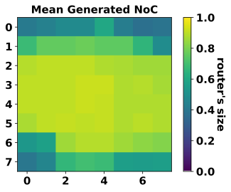 | 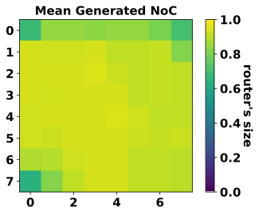 |

**Fig. 6.8** : Taille moyenne des routeurs, en fonction de la valeur de $\beta$,
pour un entraînement de 300 époques sur le trafic uniform, avec le reward
saturation uniquement (Sat100).

La variable $\beta$ est fixée à 10 afin de limiter l'impact du biais lié à la
moyenne du dataset. La figure [6.8](#fig-6-8) illustre cet intérêt. Sur cet
figure sont comparées la taille moyenne des routeurs des NoC générés, après deux
entraînements de M-RWGAN considérant uniquement le reward de seuil de
saturation, pour $\beta = 1$ et $\beta = 10$. Ainsi, les résultats attendus sont
que le générateur produise des NoC ayant des routeurs de grandes tailles afin de
maximiser le seuil de saturation (i.e. maximiser le reward). On constate qu'avec
$\beta = 1$, les routeurs extérieurs sont réduits, ce qui ne correspond pas à
l'analyse du dataset et à l'impact du biais. Or, avec $\beta = 10$ (i.e. le loss
du reward est plus important que le loss du critique), on constate logiquement
un impact plus important du reward, permettant de pallier au biais du critique.

| (a) époque 0 | (b) époque 50 | (c) époque 100 | (d) époque 200 |
|:--:|:--:|:--:|:--:|
| 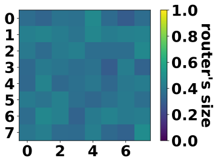 | 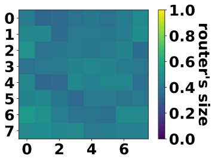 | 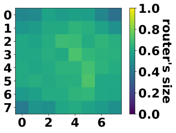 | 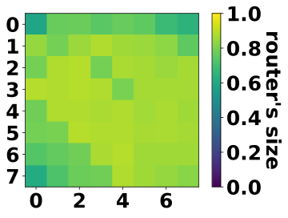 |

| (e) époque 300 |
|:--:|
|  |

**Fig. 6.9** : Taille moyenne des routeurs, en fonction de l'étape
d'entraînement (époque), pour un entraînement de 300 époques sur le trafic
uniforme, avec le reward de saturation uniquement (Sat100).

| (a) Sortie des rewards Sat et Pow. | (b) Fonction de perte du générateur et du critique. |
|:--:|:--:|
| 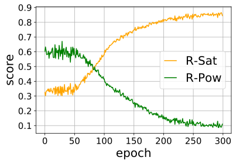 | 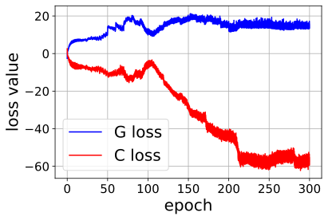 |

| (c) Taux de présence des types de routeurs. |
|:--:|
| 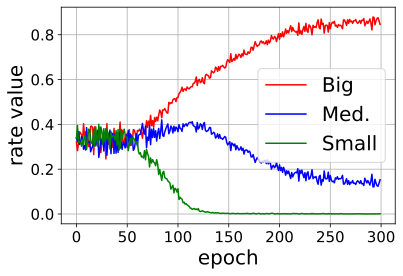 |

**Fig. 6.10** : Évolution des différentes valeurs associées à l'entraînement du
M-RWGAN, pour un entraînement de 300 époques sur le trafic uniforme, avec le
reward saturation uniquement (Sat100).

L'historique de l'entraînement est proposé sur les figures [6.9](#fig-6-9) et
[6.10](#fig-6-10). Sur la figure [6.9](#fig-6-9) est détaillée l'évolution des
NoC générés par notre GAN. On constate une augmentation progressive de la taille
des routeurs, à partir de l'époque 50, soit à partir du moment où le reward est
pris en compte dans l'entraînement du générateur. Cette influence du reward est
confirmée sur la figure [6.10a](#fig-6-10a) qui décrit l'évolution de la sortie
des rewards de saturation et de consommation énergétique. Ces sorties
correspondent à une évaluation des NoC générés, selon leur performances en
termes de seuil de saturation et de puissance consommée. Ainsi, on constate qu'à
partir de l'époque 50 le score associé au reward de saturation augmente
progressivement pour tendre vers 0.9 (le score maximal étant de 1). Cela
correspond bien aux résultats attendus. En contrepartie, le score en termes de
puissance décroît pour tendre vers 0.1, indiquant que les NoC générés consomment
davantage.

L'évolution du loss du générateur et du critique en fonction de l'avancement de
l'entraînement est présenté figure [6.10b](#fig-6-10b). On peut tout d'abord
constater que les deux loss sont symétriques jusqu'à l'époque 50 (début de la
prise en compte du reward), ce qui indique que l'apprentissage est stable.
Ensuite, on constate une bonne adaptation du générateur au reward puisque le
loss du générateur décroît seulement 50 époques après son entrée. Enfin, les
deux loss se stabilisent à nouveau en fin d'entraînement (de l'époque 200 à la
fin), avec un facteur 3 de différence, directement lié à $\beta$ qui favorise la
prise en compte du reward.

Enfin, l'impact de cet apprentissage sur le taux de présence des types de
routeurs est détaillé figure [6.10c](#fig-6-10c). On y constate logiquement une
tendance vers l'implémentation de routeurs de grandes tailles (i.e. type Big),
et une présence quasi nulle des routeurs de plus petite taille. Ainsi, les
routeurs de type Small sont inexistants dans les réseaux produits en fin
d'entraînement, et les Medium sont en large infériorité (12.4%) face aux Big
(87.6%).

**Conclusion:** Nous pouvons donc confirmer le bon fonctionnement de notre
set-up. Nous analyserons par la suite plus en détails la façon dont les rewards
impactent l'apprentissage selon leur poids, et comment notre outil permet de
produire efficacement des NoC optimisés.

#### 6.3.3.2 Résultats pour le trafic uniforme

Nous commençons par analyser les résultats du M-RWGAN pour le trafic uniforme.
Dans le but de produire des NoC optimisés du point de vue de l'efficacité
énergétique, nous analysons tout d'abord les réseaux générés par le générateur
lorsque ce dernier est entraîné avec les rewards Sat et Pow en différentes
proportions. En effet, l'efficacité énergétique étant un ratio entre la
performance et la puissance, la première approche naïve est de mettre en
concurrence les rewards de seuil de saturation et de puissance consommée afin de
guider l'apprentissage du générateur vers la production de NoC optimisant ces
deux caractéristiques (i.e. maximiser le seuil de saturation et minimiser la
puissance consommée).

| (a) Sat100 | (b) Sat90Pow10 | (c) Sat70Pow30 | (d) Sat50Pow50 |
|:--:|:--:|:--:|:--:|
| 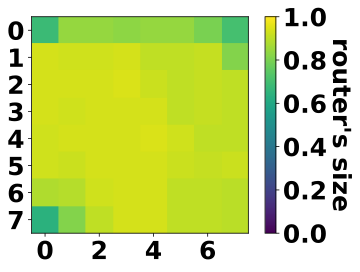 | 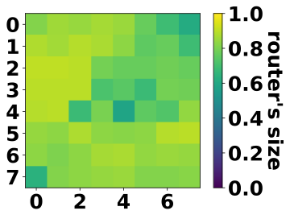 | 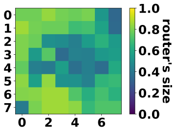 | 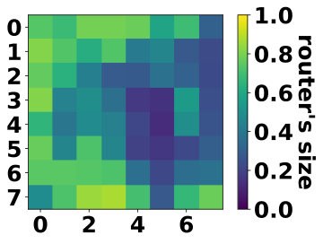 |

| (e) Sat30Pow70 | (f) Sat10Pow90 | (g) Pow100 |
|:--:|:--:|:--:|
| 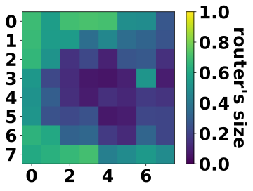 | 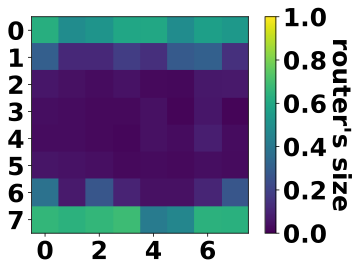 | 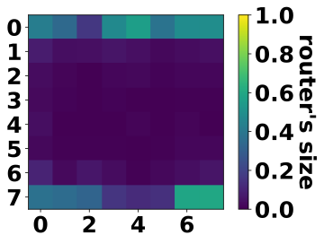 |

**Fig. 6.11** : Taille moyenne des routeurs, en fonction de la proportion entre
les rewards Sat et Pow, pour un entraînement de 300 époques sur le trafic
uniforme.

| **Valeurs** |  | R-Sat | R-Pow | t-Big | t-Medium | t-Small |
|---|---|---|---|---|---|---|
| **Rewards** | Sat100 | 0.86 | 0.09 | 87.6% | 12.4% | 0% |
|  | Sat90Pow10 | 0.81 | 0.22 | 76.5% | 23.5% | 0% |
|  | Sat70Pow30 | 0.67 | 0.38 | 55.2% | 42.8% | 2% |
|  | Sat50Pow50 | 0.52 | 0.54 | 40% | 49.9% | 10.1% |
|  | Sat30Pow70 | 0.35 | 0.70 | 26.2% | 43.7% | 30.1% |
|  | Sat10Pow90 | 0.18 | 0.86 | 15.2% | 33.3% | 51.5 |
|  | Pow100 | 0.08 | 0.95 | 5.3% | 23.7% | 71% |

**Tableau 6.5** : Valeurs des différentes variables d'entraînement. R-Sat et
R-Pow correspondent respectivement aux scores du reward de seuil de saturation
et du reward de consommation. t-Big, t-Medium et t-Small sont les taux de
présence (i.e. répartition) des types de routeur respectifs dans les NoC
générés. Trafic uniforme.

Sur la figure [6.11](#fig-6-11) sont affichées les tailles moyennes des routeurs
généré par le générateur, pour différents entraînements correspondant à
différentes proportions des rewards Sat et Pow. Ainsi, de la figure
[6.11a](#fig-6-11a) à la figure [6.11g](#fig-6-11g), la proportion du reward de
la puissance est augmentée, tout en diminuant la proportion du reward de
performance (seuil de saturation). Les valeurs détaillées des sorties de reward
(i.e. scores) et des taux de présence des types de routeurs dans les NoC générés
sont disponibles dans le tableau [6.5](#tab-6-5). Nous observons comme attendue
une réduction globale de la taille des routeurs, à mesure que la proportion du
reward Pow est augmentée. En effet, la proportion de routeurs de type Big
décroît de 87.6% à 5.3%, alors que la proportion des routeurs de type Small
augmente de 0% à 71%. Nous observons ensuite une réduction plus importante de la
taille des routeurs centraux. Ce résultat s'explique par le fait que la
puissance dynamique du routeur est dominante dans sa puissance totale, lorsque
soumis à un trafic important. Or, le reward Pow est entraîné pour attribuer un
score correspondant à la consommation au seuil de saturation du NoC évalué.
Ainsi, plus les routeurs soumis à un trafic élevé seront grands, plus ces
derniers consommeront et plus le score du NoC sera bas. Cela explique le fait
que, dès que le reward Pow est considéré, les premiers routeurs réduits sont les
routeurs centraux (i.e. charge de trafic plus élevée, voir figure
[6.3](#fig-6-3)).

Ce résultat est en contradiction avec le résultat attendu pour obtenir un NoC
efficace énergétiquement. En effet, afin d'optimiser les performance et la
consommation énergétique du NoC, l'objectif est que la taille des routeurs suive
une répartition similaire au trafic – i.e. plus la charge du trafic est élevée
sur un routeur, plus ce routeur doit être grand pour supporter la charge. Pour
se rapprocher de ce comportement, ce n'est pas la puissance au seuil de
saturation qui doit être considérée (car largement dominée par la puissance
dynamique), mais la puissance statique, soit la puissance pour un trafic nul.
Cette dernière est corrélée avec notre troisième caractéristique considérée: la
surface du NoC.

Ainsi nous proposons dans un second temps d'étudier les résultats
d'apprentissage du générateur, pour un reward composé du reward Sat et du reward
Area.

Ces résultats sont présentés sur la figure [6.12](#fig-6-12), et le détail des
valeurs des variables d'entraînement (scores en sortie des rewards et taux de
présence des types de routeur) est disponible dans la table
[6.6](#tab-6-6).

| (a) Sat100 | (b) Sat90Area10 | (c) Sat70Area30 | (d) Sat50Area50 |
|:--:|:--:|:--:|:--:|
|  | 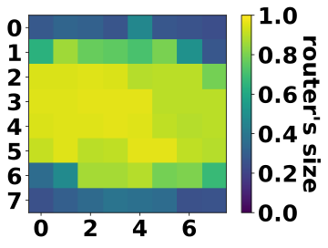 | 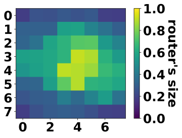 | 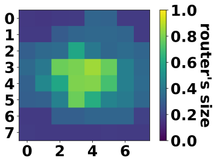 |

| (e) Sat30Area70 | (f) Sat10Area90 | (g) Area100 |
|:--:|:--:|:--:|
| 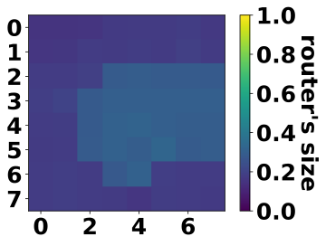 | 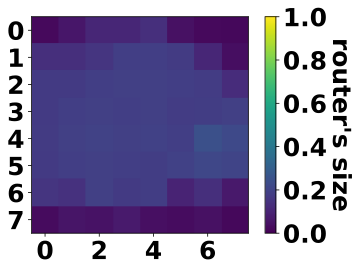 | 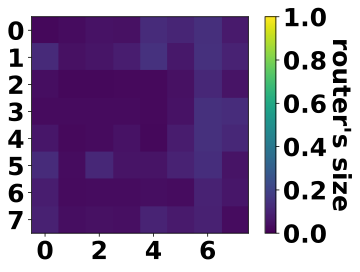 |

**Fig. 6.12** : Taille moyenne des routeurs, en fonction de la proportion entre
les rewards Sat et Ar, pour un entraînement de 300 époques sur le trafic
uniforme.

| **Valeurs** |  | R-Sat | R-Area | t-Big | t-Medium | t-Small |
|---|---|---|---|---|---|---|
| **Rewards** | Sat100 | 0.86 | 0.11 | 87.6% | 12.4% | 0% |
|  | Sat90Area10 | 0.78 | 0.29 | 63.2% | 36.8% | 0% |
|  | Sat70Area30 | 0.66 | 0.54 | 35% | 64% | 1% |
|  | Sat50Area50 | 0.58 | 0.66 | 20% | 78% | 2% |
|  | Sat30Area70 | 0.49 | 0.78 | 4.6% | 88.1% | 7.3% |
|  | Sat10Area90 | 0.33 | 0.86 | 0.8% | 66.3% | 32.9% |
|  | Area100 | 0.12 | 0.93 | 0% | 32.8% | 67.2% |

**Tableau 6.6** : Valeurs des différentes variables d'entraînement. Reward Sat
et Area, trafic uniforme.

Comme attendu, on constate une réduction globale de la taille des routeurs.
Cependant, cette fois-ci ce sont bien les routeurs centraux qui conservent une
taille plus grande que la moyenne. L'utilisation du reward Area permet ainsi
d'approcher de notre optimal théorique en faisant correspondre la taille des
routeurs avec la charge du trafic considéré.

On remarque ainsi que le choix des rewards utilisés est primordial pour que
notre générateur puisse produire des NoC compris dans un espace de conception
optimisé. Il est aussi important de noter que l'entraînement de notre R-WGAN
permet au générateur d'extraire des motifs du dataset qui n'était pas visibles à
partir de notre pré-analyse. En effet, sur la figure [6.4](#fig-6-4), le motif
du trafic uniforme n'est pas détectable. Or, en fonction des rewards utilisés,
et notamment lorsqu'on combine un reward de performance (i.e. Sat) à un reward
de consommation (i.e. Pow et Area), on reconnaît clairement ce motif dans les
NoC générés.

**Comparaison globale avec le dataset:** Pour revenir à notre objectif de
générer un ensemble de NoC optimisés, nous proposons de comparer les
performances des NoC générés avec les NoC du dataset.
Pour chacun des apprentissages correspondant à une combinaison de rewards, nous
évaluons 100 NoC générés avec le simulateur OMNET++, et récupérons la moyenne
des résultats. Sur la figure [6.13](#fig-6-13) sont positionnées les moyennes
pour chacune des configurations et la moyenne du dataset, pour les valeurs de
seuil de saturation, puissance consommée et surface. Ainsi, deux graphiques sont
proposés: figure [6.13a](#fig-6-13a) pour le positionnement en fonction du seuil
de saturation et de la puissance consommée, et figure [6.13b](#fig-6-13b) pour
le seuil de saturation et la surface des NoC. En noire sont représentées les
données du dataset de départ, partitionnées selon leur seuil de saturation. Ces
dernières permette de tracer une frontière où tout point "en-dessous" de cette
frontière (i.e. seuil de saturation plus élevé et/ou puissance/surface
inférieure) peut être considéré comme un NoC ayant une meilleure efficacité
énergétique.

| (a) Seuil de saturation et puissance. | (b) Seuil de saturation et surface. |
|:--:|:--:|
| 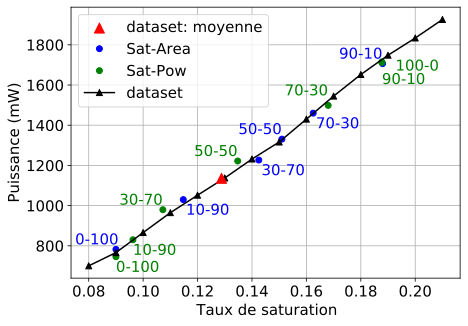 | 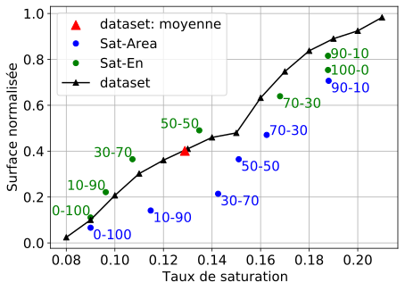 |

**Fig. 6.13** : Comparaison des NoC générés et du dataset selon différentes
métriques (seuil de saturation, énergie consommée, surface), lorsque soumis à un
trafic uniforme.

Nous remarquons tout d'abord de très légères variations sur le graphique
[6.13a](#fig-6-13a) en comparaison avec le dataset. Certaines configurations
sont effectivement meilleures que le dataset, mais il est difficile d'extraire
la meilleure configuration. Sur le graphique [6.13b](#fig-6-13b) positionnant
les différents résultats selon la surface moyenne et le seuil de saturation
moyen, on note logiquement que l'ensemble des configurations issues d'un
entraînement possédant le reward Area sont en-dessous de la frontière et
possèdent donc une meilleure efficacité énergétique que le dataset.

**Gains en efficacité énergétique:** Nous proposons d'extraire la meilleure
configuration pour chaque type de combinaison (Sat-Pow et Sat-Area). Pour cela
nous procédons au calcul suivant: pour chaque configuration, un ratio
représentant l'efficacité énergétique au seuil de saturation est calculé, soit
$\frac{\text{Taux de Saturation}}{Puissance}$. Les configurations ayant le
meilleur score sont les suivantes: Sat0Pow100 pour le type de reward Sat-Pow, et
Sat30Area70 pour le type Sat-Area.

- *Sat0Pow100:*
  Les NoC produits par le générateur après un entraînement avec le reward
  Sat0Pow100 ont en moyenne un seuil de saturation inférieur de 3.88% à la
  moyenne du dataset (seuil de saturation à 12.88% pour la moyenne du dataset
  contre 9% pour les NoC générés) soit une diminution de 30.1%. Pour ce qui est
  de la puissance consommée au seuil de saturation, cette dernière est de 746mW
  contre 1136mW pour la moyenne du dataset, ce qui représente une réduction de
  34.3%. Enfin, si on mesure l'efficacité énergétique comme la performance (i.e.
  seuil de saturation) divisée par la puissance consommée, on obtient une
  amélioration d'environ 6.45% de l'efficacité énergétique des NoC générés, en
  comparaison avec la moyenne du dataset de départ.
- *Sat30Area70:*
  Les NoC produits par le générateur après un entraînement avec le reward
  Sat30Area70 ont en moyenne un seuil de saturation 14.25%, similaire à la
  moyenne du dataset. Pour ce qui est de la puissance au seuil de saturation,
  cette dernière est de 1000mW contre 1136mW pour la moyenne du dataset, ce qui
  représente une diminution de 12%. Enfin, on obtient une amélioration d'environ
  14.6% de l'efficacité énergétique des NoC générés, en comparaison avec la
  moyenne du dataset de départ.

#### 6.3.3.3 Résultats pour le trafic hotspot30

Les mêmes expérimentations sont menées sur le dataset hotspot30. Les résultats
obtenus pour les combinaisons de reward Sat et Pow sont présentés figure
[6.14](#fig-6-14). Des conclusions similaires aux expérimentations sur le trafic
uniforme peuvent être tirées. En effet, une nouvelle fois ce sont les routeurs
soumis à la plus grande charge de trafic qui sont minimisés en priorité.
L'apprentissage lié aux rewards est validé aux vues des scores présenté table
[6.7](#tab-6-7). En effet, le score en sortie du reward Sat décroît de 0.86 à
0.12 avec la proportion de reward Sat qui décroît de 100% vers 0%. À l'inverse,
le reward de la puissance augmente de 0.16 à 0.92 avec l'augmentation de la
proportion du reward Pow de 0% à 100%.

| (a) Sat100 | (b) Sat90Pow10 | (c) Sat70Pow30 | (d) Sat50Pow50 |
|:--:|:--:|:--:|:--:|
| 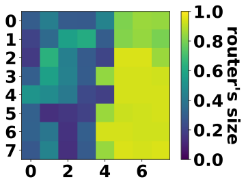 | 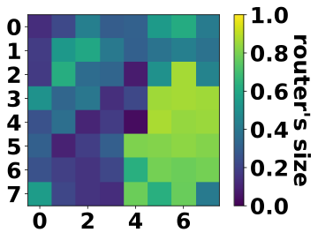 | 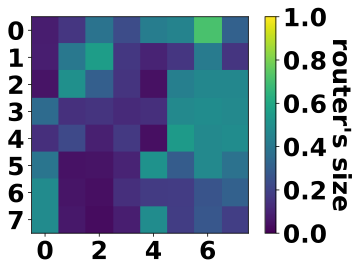 | 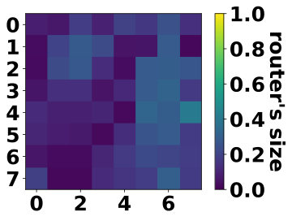 |

| (e) Sat30Pow70 | (f) Sat10Pow90 | (g) Pow100 |
|:--:|:--:|:--:|
| 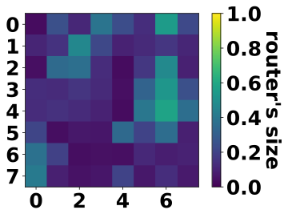 | 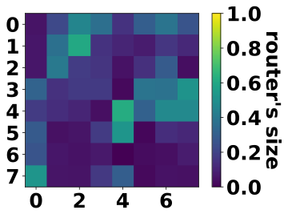 | 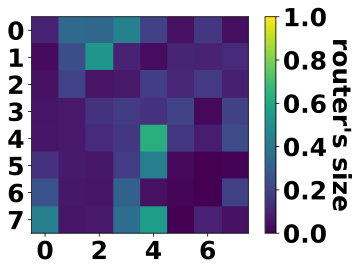 |

**Fig. 6.14** : Taille moyenne des routeurs, en fonction de la proportion entre
les rewards Sat et Pow, pour un entraînement de 300 époques sur le trafic
hotspot30.

| **Valeurs** |  | R-Sat | R-Pow | t-Big | t-Medium | t-Small |
|---|---|---|---|---|---|---|
| **Rewards** | Sat100 | 0.9 | 0.16 | 52% | 34.9% | 13.1% |
|  | Sat90Pow10 | 0.83 | 0.29 | 35% | 41.5% | 23.5% |
|  | Sat70Pow30 | 0.71 | 0.50 | 16% | 54% | 30% |
|  | Sat50Pow50 | 0.64 | 0.58 | 5.8% | 51% | 43.2% |
|  | Sat30Pow70 | 0.45 | 0.75 | 11% | 47% | 42% |
|  | Sat10Pow90 | 0.28 | 0.9 | 12.5% | 40% | 47.5% |
|  | Pow100 | 0.13 | 0.92 | 8.5% | 34.1% | 57.4% |

**Tableau 6.7** : Valeurs des différentes variables d'entraînement. Reward Sat
et Pow, trafic hotspot30.

Enfin, nous entraînons notre M-RWGAN avec des combinaisons du reward Sat et du
reward Area. Comme pour le trafic uniforme, on voit sur la figure
[6.15](#fig-6-15) que le générateur produit des NoC dont la taille des routeurs
est directement corrélée à la charge du trafic. En effet, même pour la
combinaison Sat30Area70 dont le score donné par le reward Area est de 0.85
(voire table [6.8](#tab-6-8)), les routeurs autour du hotspot sont les seuls à
ne pas être totalement minimisés. Ainsi, la réduction de la surface du NoC est
optimisée afin de ne pénaliser au minimum les performances du NoC.

| (a) Sat100 | (b) Sat90Area10 | (c) Sat70Area30 | (d) Sat50Area50 |
|:--:|:--:|:--:|:--:|
|  | 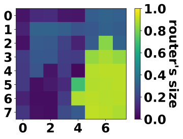 | 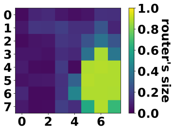 | 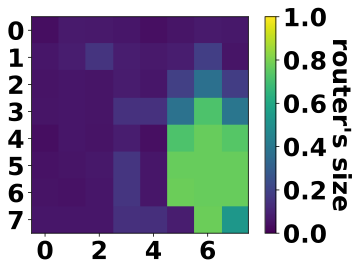 |

| (e) Sat30Area70 | (f) Sat10Area90 | (g) Area100 |
|:--:|:--:|:--:|
| 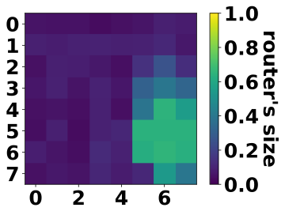 | 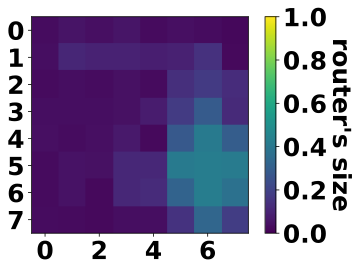 | 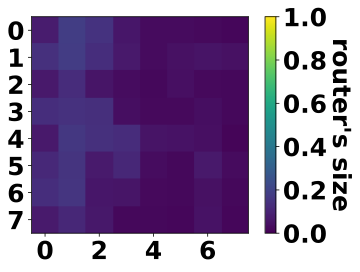 |

**Fig. 6.15** : Taille moyenne des routeurs, en fonction de la proportion entre
les rewards Sat et Ar, pour un entraînement de 300 époques sur le trafic
hotspot30.

| **Valeurs** |  | R-Sat | R-Area | t-Big | t-Medium | t-Small |
|---|---|---|---|---|---|---|
| **Rewards** | Sat100 | 0.9 | 0.41 | 52% | 34.9% | 13.1% |
|  | Sat90Area10 | 0.84 | 0.63 | 28% | 45% | 27% |
|  | Sat70Area30 | 0.80 | 0.74 | 18.3% | 45% | 36.7% |
|  | Sat50Area50 | 0.76 | 0.8 | 16% | 31.1% | 52.9% |
|  | Sat30Area70 | 0.72 | 0.85 | 10% | 39% | 51% |
|  | Sat10Area90 | 0.66 | 0.9 | 4% | 40% | 56% |
|  | Area100 | 0.21 | 0.94 | 0% | 35% | 65% |

**Tableau 6.8** : Valeurs des différentes variables d'entraînement. Reward Sat
et Area, trafic hotspot30.

On remarque cependant un manque de précision sur le trafic hotspot30. En effet,
on remarque notamment sur l'apprentissage avec les rewards Sat et Area un motif
de croix autour du routeur hotspot, s'éloignant ainsi du motif du trafic. Cela
peut s'expliquer par l'utilisation des GCN pour construire les rewards. Ce type
d'apprentissage repose sur le voisinage des nœuds du graphe. Ainsi, si
l'apprentissage du reward mène à la conclusion qu'un routeur doit être de grande
taille, ce même apprentissage peut se propager sur les routeurs voisins. Cela
expliquerait donc que le reward de seuil de saturation attribue un meilleur
score aux NoC générés avec des routeurs de grande taille voisins du réel
hotspot. De futurs travaux devront éclaircir ce comportement, en étudiant plus
en détails les paramètres du GCN.

Avant d'analyser les différents ensembles de NoC produits par les générateurs en
fonction de la combinaison de rewards attribuée durant l'apprentissage, nous
proposons d'implémenter les rewards du seuil de saturation et de la puissance
avec un CNN. En effet, bien que le GCN se soit montré plus efficace pour le
trafic uniforme, il semblerait que ce ne soit pas le cas pour le motif
particulier du hotspot.

**Supplément CNN:** Nous commençons par analyser les apprentissages avec les
rewards Sat et Pow à base de CNN. Les tailles des routeurs des NoC générés pour
chaque entraînement sont présentées sur la figure [6.16](#fig-6-16), et les
valeurs des scores et taux de présence sont détaillées dans la table
[6.9](#tab-6-9). La différence majeure avec les précédentes expérimentations est
l'apparition du motif du trafic hotspot, plus précisément que lors des
apprentissages avec les rewards GCN. Ensuite, les conclusions sur les tailles
des routeurs des NoC générés restent inchangés: pour optimiser la puissance
consommée au seuil de saturation des NoC générer, les routeurs soumis aux
charges de trafic les plus élevés (i.e. hotspot) sont réduits.

| (a) Sat100 | (b) Sat90Pow10 | (c) Sat70Pow30 | (d) Sat50Pow50 |
|:--:|:--:|:--:|:--:|
| 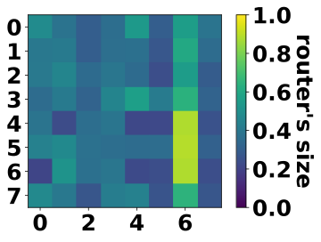 | 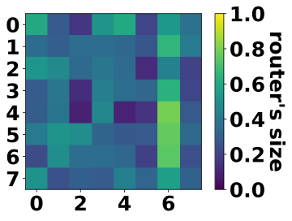 |  |  |

| (e) Sat30Pow70 | (f) Sat10Pow90 | (g) Pow100 |
|:--:|:--:|:--:|
|  |  |  |

**Fig. 6.16** : Taille moyenne des routeurs, en fonction de la proportion entre
les rewards Sat et Pow, pour un entraînement de 300 époques sur le trafic
hotspot30. Rewards reposant sur un CNN.

| **Valeurs** |  | R-Sat | R-Pow | t-Big | t-Medium | t-Small |
|---|---|---|---|---|---|---|
| **Rewards** | Sat100 | 0.97 | 0.26 | 33.6% | 32% | 34.4% |
|  | Sat90Pow10 | 0.93 | 0.32 | 29.8% | 37.1% | 33.1% |
|  | Sat70Pow30 | 0.80 | 0.47 | 31.1% | 31.5% | 37.4% |
|  | Sat50Pow50 | 0.74 | 0.61 | 7.5% | 37% | 55.5% |
|  | Sat30Pow70 | 0.48 | 0.82 | 14.4% | 40% | 45.6% |
|  | Sat10Pow90 | 0.37 | 0.9 | 14.7% | 35.9% | 49.4% |
|  | Pow100 | 0.10 | 0.95 | 21% | 36.3% | 42.7% |

**Tableau 6.9** : Valeurs des différentes variables d'entraînement. Reward Sat
et Pow, trafic hotspot30. Rewards reposant sur un CNN.

Enfin, les dernières expérimentations étudiées sont pour les rewards Sat et Area
en CNN. Les résultats affichés figure [6.17](#fig-6-17) présentent un motif
similaire au motif du trafic hotspot30, suggérant une optimisation quasi idéale
de l'architecture des NoC générés. Cette conclusion est renforcée par les
valeurs des scores attribués par les rewards, table [6.10](#tab-6-10). En effet,
alors que le score du reward Sat (i.e. performance) est de 0.97 pour un reward
Sat100, ce score reste élevé malgré l'augmentation de la proportion du reward
Area, pour se maintenir à 0.89 pour le reward Sat10Area90. Bien entendu, ce
score chute avec le reward Area100 puisque l'influence du reward Sat n'est plus
présente dans l'entraînement du générateur. Ainsi, le reward Sat10Area90 retient
particulièrement notre attention puisque ce dernier affiche des scores élevés
pour chacun des rewards (0.89 pour le score Sat et 0.91 pour le score Area) tout
en minimisant au maximum la taille des routeurs avec seulement 5% de routeurs
Big et jusqu'à 68.4% de routeurs Small.

| (a) Sat100 | (b) Sat90Area10 | (c) Sat70Area30 | (d) Sat50Area50 |
|:--:|:--:|:--:|:--:|
|  |  |  |  |

| (e) Sat30Area70 | (f) Sat10Area90 | (g) Area100 |
|:--:|:--:|:--:|
|  |  |  |

**Fig. 6.17** : Taille moyenne des routeurs, en fonction de la proportion entre
les rewards Sat et Area, pour un entraînement de 300 époques sur le trafic
hotspot30. Rewards reposant sur des CNN.

| **Valeurs** |  | R-Sat | R-Area | t-Big | t-Medium | t-Small |
|---|---|---|---|---|---|---|
| **Rewards** | Sat100 | 0.97 | 0.60 | 33.6% | 32% | 34.4% |
|  | Sat90Area10 | 0.97 | 0.8 | 14% | 36% | 50% |
|  | Sat70Area30 | 0.96 | 0.87 | 7% | 38.9% | 54.1% |
|  | Sat50Area50 | 0.96 | 0.88 | 5.5% | 34.5% | 60% |
|  | Sat30Area70 | 0.94 | 0.89 | 5.5% | 30% | 64.5% |
|  | Sat10Area90 | 0.89 | 0.91 | 5% | 27.6% | 68.4% |
|  | Area100 | 0.20 | 0.94 | 0% | 33.4% | 66.6% |

**Tableau 6.10** : Valeurs des différentes variables d'entraînement. Reward Sat
et Area, trafic hotspot30. Rewards reposant sur un CNN.

| (a) Seuil de saturation et puissance. | (b) Seuil de saturation et surface |
|:--:|:--:|
|  |  |

**Fig. 6.18** : Comparaison des NoC générés et du dataset selon différentes
métriques (seuil de saturation, énergie consommée, surface), lorsque soumis à un
trafic hotspot30, pour les rewards GCN.

| (a) | (b) |
|:--:|:--:|
|  |  |

**Fig. 6.19** : Comparaison des NoC générés et du dataset selon différentes
métriques (seuil de saturation, énergie consommée, surface), lorsque soumis à un
trafic hotspot30, pour les rewards CNN.

**Comparaison globale avec le dataset:** Nous analysons ici les NoC générés par
les générateurs entraînés avec les différentes combinaisons de rewards (GCN et
CNN) pour extraire les combinaisons produisant les NoC avec la meilleure
efficacité énergétique.

Tout d'abord les résultats de simulation des générations liées aux rewards GCN
sont présentés sur la figure [6.18](#fig-6-18). On remarque directement que
l'ensemble des résultats montrent une meilleure efficacité énergétique que le
dataset. En effet, les données de simulation des ensembles générés sont toutes
positionnées en-dessous des données du dataset.

Ensuite les résultats de simulation des générations liées aux rewards CNN sont
présentés sur la figure [6.19](#fig-6-19). Excepté pour le reward Pow100 sur le
graphique [6.19b](#fig-6-19b), l'ensemble des résultats montrent une meilleure
efficacité énergétique que le dataset. En effet, les données de simulation des
ensembles générés sont une nouvelle fois toutes positionnées en-dessous des
données du dataset.

**Gains en efficacité énergétique:** Les meilleures combinaisons de rewards sont
déterminées comme précédemment, donnant Sat70Pow30 et Sat70Area30 comme les
meilleures combinaisons de rewards GCN respectivement pour les types Sat-Pow et
Sat-Area. Pour les rewards CNN, nous obtenons Sat50Pow50 et Sat70Area30 comme
meilleures combinaisons, respectivement pour les types Sat-Pow et Sat-Area.

- *Sat70Pow30_GCN:*
  Les NoC produits par le générateur après un entraînement avec le reward
  Sat70Pow30 en GCN ont en moyenne un seuil de saturation supérieur de 0.58% à
  la moyenne du dataset (seuil de saturation de 3.8% contre 3.22% pour la
  moyenne du dataset), soit une augmentation de 18%. Pour ce qui est de la
  puissance consommée au seuil de saturation, cette dernière est de 332mW contre
  315mW pour la moyenne du dataset, ce qui représente une augmentation de 5.4%.
  Enfin, comme pour le trafic uniforme, on mesure l'efficacité énergétique comme
  la performance (i.e. seuil de saturation) divisée par la puissance consommée.
  On obtient une amélioration d'environ 12.2% de l'efficacité énergétique des
  NoC générés, en comparaison avec la moyenne du dataset de départ.
- *Sat70Area30_GCN:*
  Les NoC produits par le générateur après un entraînement avec le reward
  Sat70Area30 en GCN ont en moyenne un seuil de saturation supérieur de 1%
  (seuil de saturation à 3.22% pour la moyenne du dataset contre 4.22% pour les
  NoC générés) soit une augmentation de 31%. Pour ce qui est de la puissance au
  seuil de saturation, cette dernière est de 366mW contre 315mW pour la moyenne
  du dataset, ce qui représente une augmentation de 16.2%. Enfin, on obtient une
  amélioration d'environ 12.55% de l'efficacité énergétique des NoC générés, en
  comparaison avec la moyenne du dataset de départ.
- *Sat50Pow50_CNN:*
  Les NoC produits par le générateur après un entraînement avec le reward
  Sat50Pow50 en CNN ont en moyenne un seuil de saturation supérieur de 0.54% à
  la moyenne du dataset (3.76% contre les 3.22% du dataset), soit une
  augmentation de 16.8%. Pour ce qui est de la puissance au seuil de saturation,
  cette dernière est de 318mW contre 315mW pour la moyenne du dataset, ce qui
  représente une augmentation inférieure à 1%. Enfin, on obtient une
  amélioration d'environ 15.5% de l'efficacité énergétique des NoC générés, en
  comparaison avec la moyenne du dataset de départ.
- *Sat70Area30_CNN:*
  Les NoC produits par le générateur après un entraînement avec le reward
  Sat70Area30 en CNN ont en moyenne un seuil de saturation supérieur de 0.96%
  (seuil de saturation à 3.2% pour la moyenne du dataset contre 4.16% pour les
  NoC générés), soit une augmentation de 29.8%. Pour ce qui est de la puissance
  au seuil de saturation, cette dernière est de 360mW contre 315mW pour la
  moyenne du dataset, ce qui représente une augmentation de 14.3%. Enfin, on
  obtient une amélioration d'environ 12.9% de l'efficacité énergétique des NoC
  générés, en comparaison avec la moyenne du dataset de départ.

#### 6.3.3.4 Qualité d'optimisation: une analyse préliminaire

Dans les sections précédentes, nous avons montré que notre outil permet de
rapidement balayer un espace de données de dimension importante en variant les
combinaisons de rewards. Nous nous sommes concentrés sur l'intérêt d'un tel
outil pour extraire un sous-ensemble optimisé en terme d'efficacité énergétique.
Cependant, notre outil est plus globalement un outil d'optimisation
multi-objectif.

Dans cette dernière section, nous proposons d'évaluer les qualités
d'optimisation de notre outil, en fonction des réels objectifs modélisés par les
rewards (i.e. seuil de saturation, puissance et surface). Pour cela, nous
choisissons la métrique IGD (Inverted Generational Distance
[\[45\]](references.md#ref-45)) pour déterminer la qualité d'optimisation de
notre outil. La métrique IGD se définit comme la distance euclidienne moyenne
entre le vrai front Pareto et le front Pareto des données générées par l'outil.
Globalement, l'IGD permet de mesurer la convergence d'un ensemble $A$ de
solutions obtenues vers un ensemble de référence $R$, qui est dans l'idéal le
vrai front Pareto. Elle est formulée par l'équation [6.3](#eq-6-3).

$$
IGD(A,R) = \frac{1}{\lvert R \rvert} \sum_{r \in R} \bigl(\min\{\, dist(r,a) \mid a \in A \,\}\bigr)
\tag{6.3}
$$

avec $\lvert R \rvert$ le nombre de solutions contenues dans R et dist(r, a) la
distance euclidienne entre les solutions r et a.

Dans notre cas, nous souhaitons évaluer la qualité des données générées en
fonction du vrai front Pareto. Cela nécessite de connaître l'intégralité de
l'espace de conception, pour en extraire le front. Ainsi, nous nous plaçons dans
un espace réduit et considérons la génération de NoC de type mesh 4x3, composés
de 12 routeurs pouvant être de 3 types. Cela représente un espace de 531 441
combinaisons possibles, que nous simulons intégralement pour le trafic
hotspot30.

**Fig. 6.20** : Distance euclidienne entre le meilleur NoC généré de chaque
apprentissage et le vrai front Pareto, ainsi que le détail pour chaque objectif.
Mesure de l'IGD - i.e. moyenne.

L'ensemble des résultats (saturation, puissance et surface de chaque NoC) est
normalisé entre 0 et 1 en fonction des minimum et maximum de chaque mesure.
Ainsi, la valeur optimale du seuil de saturation est 1 (i.e. on souhaite le
maximiser), et la valeur optimale de surface et de puissance est 0 (i.e. on
souhaite minimiser ces métriques). Nous déterminons ensuite $R$ à partir des
données normalisées.

De cet espace de conception, nous extrayons 10k données pour construire notre
dataset d'entraînement. À partir de ce dataset, nous entraînons nos trois
rewards (seuil de saturation, puissance, surface), puis nous entraînons notre
M-RWGAN avec $x$ combinaisons de rewards. Pour chaque entraînement, nous
générons un ensemble $N$ de 100 NoC, et nous calculons
$a_i = \min\{\, dist(r,n) \mid n \in N \,\}$, le meilleur NoC généré par le
$i^{\text{ème}}$ apprentissage. Finalement, nous calculons l'IGD, en appliquant
la formule [6.3](#eq-6-3) avec $A = \{\, a_i \mid i \in [1..x] \,\}$.

Les résultats sont affichés sur la figure [6.20](#fig-6-20). Pour chaque
entraînement (i.e. combinaison de rewards), les mesures de la meilleure solution
sont affichées, soient: la distance euclidienne au vrai front Pareto
(multi-objectif) i.e. $a_i$ , et le détail des distances euclidiennes pour
chaque objectif. Enfin, nous affichons l'IGD calculé pour l'optimisation
multi-objectif ainsi que le détail des distances moyennes pour chaque objectif.
Ces derniers résultats sont décrits dans la suite, et comparés avec la moyenne
de l'espace de conception:

- multi-objectif (i.e. IGD): 0.06, moyenne de l'espace de conception: 0.373
- Seuil de saturation: 0.013, moyenne de l'espace de conception: 0.044
- Puissance: 0.028, moyenne de l'espace de conception: 0.053
- Surface: 0.043, moyenne de l'espace de conception: 0.367

En comparant notre IGD avec la distance moyenne de l'ensemble des points de
l'espace de conception, nous constatons que notre outil possède d'importantes
performances d'optimisation. En effet, nous obtenons une réduction de la
distance au front Pareto de 85% (de 0.373 pour la moyenne de l'espace de
conception, à 0.06 pour l'IGD de notre outil). De plus, considérant une distance
maximale de $\sqrt{3} \approx 1.73$ (i.e. 3 objectifs), notre score de 0.06
démontre une grande qualité d'optimisation. Enfin, nous obtenons également une
réduction des distances pour chaque objectif de 70%, 47% et 88% respectivement
pour le seuil de saturation, la puissance et la surface, en comparaison avec la
moyenne de l'espace de conception.
Ainsi, ces derniers résultats soulignent le potentiel d'optimisation
multi-objectif de notre outil.

## 6.4 Résumé

Dans cette dernière contribution, nous avons proposé une architecture complexe
de réseau de neurones, nommée M-RWGAN. Cette architecture se différencie du
RWGAN du chapitre précédent par le niveau complexité possible de la fonction de
récompense servant d'optimisation du générateur. En effet, nous montrons que,
via l'utilisation de plusieurs rewards simples, il est possible de créer un
reward hybride approximant une fonction d'optimisation complexe.

Ce travail ouvre des perspectives intéressantes sur le développement d'outils de
CAO. De futurs travaux devront explorer les capacités du M-RWGAN et combiner la
génération de matrice d'adjacence $A$ du chapitre précédent, avec la génération
de matrice de caractéristiques $X$ de ce dernier chapitre pour proposer une
génération complète de NoC. Par extension, cet outil se généralise à la
production de graphes optimisés, et n'est donc pas restreint au domaine des NoC.

Les pistes pour de futurs travaux sont développées plus en détails dans les
perspectives de cette thèse, [chapitre 7](07-conclusion.md).
